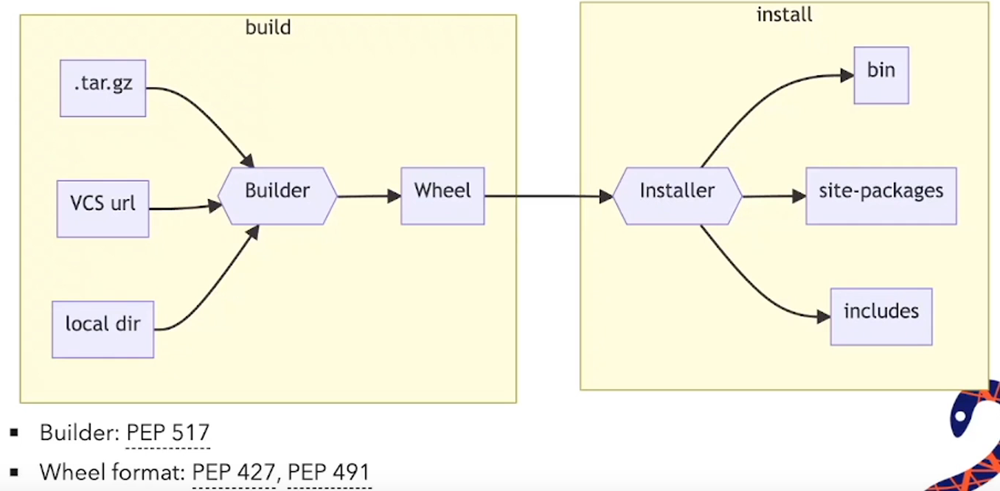
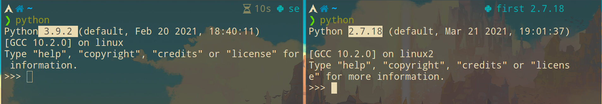
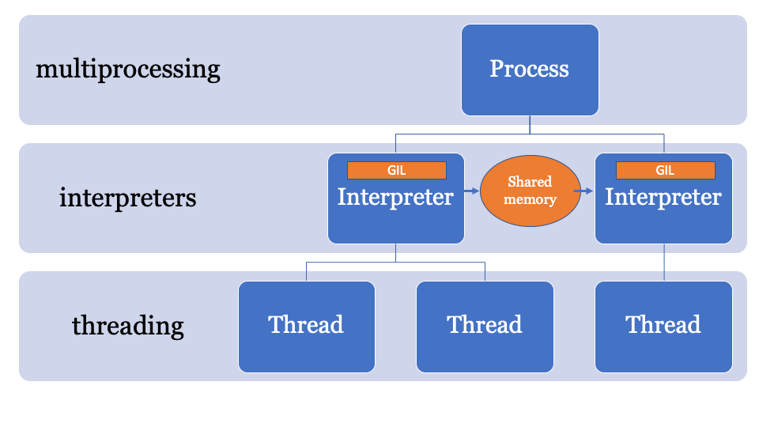

<!-- vim-markdown-toc GFM -->

* [python](#python)
    * [环境配置](#环境配置)
        * [交互更友好的解释器](#交互更友好的解释器)
        * [pip 包管理器](#pip-包管理器)
        * [pyenv](#pyenv)
        * [常用命令:](#常用命令)
    * [python 慢的原因](#python-慢的原因)
    * [import and from](#import-and-from)
    * [if](#if)
        * [PEP 572: 海象运算符(:=)](#pep-572-海象运算符)
    * [while, for(循环)](#while-for循环)
        * [`enumerate()` index的语法糖](#enumerate-index的语法糖)
        * [yield](#yield)
            * [send() 类似协程](#send-类似协程)
    * [match case(模式匹配): 需要python 3.10](#match-case模式匹配-需要python-310)
    * [函数式编程](#函数式编程)
        * [fib(斐波那契)](#fib斐波那契)
            * [循环 while, for](#循环-while-for)
            * [迭代](#迭代)
            * [泛函](#泛函)
            * [tuple(元组)](#tuple元组)
        * [pi(圆周率)](#pi圆周率)
        * [黄金分割](#黄金分割)
        * [树形递归](#树形递归)
        * [平方根](#平方根)
        * [rlist(序列)](#rlist序列)
    * [数据类型](#数据类型)
        * [基本概念](#基本概念)
        * [动态类型](#动态类型)
        * [str(字符串)](#str字符串)
            * [4种字符串格式化方法](#4种字符串格式化方法)
            * [string模块](#string模块)
        * [list(列表)](#list列表)
            * [Deque列表](#deque列表)
        * [tuple(元组)](#tuple元组-1)
            * [namedtuple](#namedtuple)
        * [Dictionaries(字典)](#dictionaries字典)
            * [collections模块](#collections模块)
        * [set(集合)](#set集合)
        * [静态类型](#静态类型)
            * [静态类型检查工具:mypy](#静态类型检查工具mypy)
            * [静态类型检查工具:pytype](#静态类型检查工具pytype)
            * [基本使用](#基本使用)
    * [def(函数)](#def函数)
        * [参数`*argv`, `**kwargs`](#参数argv-kwargs)
        * [内置函数,属性](#内置函数属性)
        * [装饰器(decorater)](#装饰器decorater)
    * [class(类)](#class类)
        * [@dataclass(简化类的定义)](#dataclass简化类的定义)
        * [setattr(添加实例化后的属性)](#setattr添加实例化后的属性)
        * [元类(metaclass)](#元类metaclass)
        * [内置函数,属性](#内置函数属性-1)
        * [itertools(迭代器)](#itertools迭代器)
        * [class的内置装饰器](#class的内置装饰器)
        * [`__getitem__` 和 `__class_getitem__` 函数](#__getitem__-和-__class_getitem__-函数)
    * [file](#file)
        * [json](#json)
        * [yaml](#yaml)
        * [pickle](#pickle)
            * [pickletools](#pickletools)
        * [shelve](#shelve)
    * [lib(库)](#lib库)
        * [time](#time)
        * [logging](#logging)
        * [pathlib](#pathlib)
        * [os](#os)
        * [subprocess](#subprocess)
            * [Popen](#popen)
                * [asyncio(异步)](#asyncio异步)
                * [gevent](#gevent)
            * [clipboard](#clipboard)
            * [安全问题:代码注入](#安全问题代码注入)
        * [bandit安全测试](#bandit安全测试)
        * [argparse(参数)](#argparse参数)
        * [optparse(参数)](#optparse参数)
        * [re(正则表达式)](#re正则表达式)
        * [fnmatch(列表匹配)](#fnmatch列表匹配)
        * [Image](#image)
        * [pynput.keyboard(自动输入)](#pynputkeyboard自动输入)
        * [pyautogui(自动化键盘, 鼠标)](#pyautogui自动化键盘-鼠标)
        * [psutil](#psutil)
        * [cursesmenu(tui)](#cursesmenutui)
        * [pyinotify](#pyinotify)
        * [itchat: 微信库](#itchat-微信库)
        * [wxpy: 微信自动化](#wxpy-微信自动化)
        * [pyecharts: python ECharts数据可视化](#pyecharts-python-echarts数据可视化)
        * [hashlib](#hashlib)
        * [locust: web自动化压力测试](#locust-web自动化压力测试)
    * [命令行相关](#命令行相关)
        * [typer](#typer)
        * [click](#click)
        * [prompt_toolkit](#prompt_toolkit)
    * [向量计算](#向量计算)
        * [numpy](#numpy)
            * [numpy 处理图片](#numpy-处理图片)
        * [pygal](#pygal)
    * [cython](#cython)
    * [sort(排序)](#sort排序)
    * [暂时还没搞懂的程序](#暂时还没搞懂的程序)
    * [process: 进程, 线程, 协程](#process-进程-线程-协程)
    * [network: 网络](#network-网络)
    * [spider: 网络爬虫和自动化测试](#spider-网络爬虫和自动化测试)
    * [debug: 调试](#debug-调试)
* [reference article(优秀文章)](#reference-article优秀文章)
* [第三方软件资源](#第三方软件资源)

<!-- vim-markdown-toc -->

# python

- 强类型的动态类型语言

## 环境配置

### 交互更友好的解释器

- [ptpython](https://github.com/prompt-toolkit/ptpython)比[ipython](https://github.com/ipython/ipython)更好

- [jupyter notebooks](https://github.com/jupyterhub/jupyterhub)
    > 可以显示plot画的图

- [nbterm](https://github.com/davidbrochart/nbterm)
    > 在终端下的jupter notebooks

- [在线jupyter(需要科学上网)](https://colab.research.google.com/notebooks/intro.ipynb#recent=true)

### pip 包管理器

- `pip install pkg` 普通用户的安装路径:

    `~/.local/lib/python3.9`

- `sudo pip install pkg` sudo表示全局的安装路径:

    - 有些模块像`scapy`需要root权限. 有些模块会破坏依赖, 因此不能使用sudo安装

    `/usr/lib/python3.9/`

- 安装过程:

    - 先`build`, 后`install` 两个阶段是分开的, 可以由不同的工具完成

        - 1.`build`: 把源码构建为wheel(.whl文件)

        - 2.`install`: 把wheel解压, 将文件移动到对应的目录

            - pypi有些包, 操作系统提供wheel的下载(可以跳过build), 而有些则需要build

            - wheel的文件小于源代码

            - `--no-binary=:all:` 参数告诉pip即使有wheel文件, 也要下载源码进行本地构建
            ```py

            pip install \
            --no-binary=:all: \
            package
            ```


        

        [视频:明希 - Python 打包 101](https://www.bilibili.com/video/BV1Db4y1h7Xx/?spm_id_from=333.788.recommend_more_video.0)

- PEP660: editable build backend
    - 修改源代码后不需要构建wheel, 即可使用, 但python程序还需重启(接近热更新)
    ```sh
    pip install -e .
    ```
    - 目前backend使用`pdm` 的代理模式


### pyenv

> 多版本共存或相互隔离

- 安装两个包: `pyenv` `pyenv-virtualenv`

```bash
# 获取可安装的版本
pyenv install --list

# 安装2.7.18版本
pyenv install -v 2.7.18

# 查看当前版本和可选版本
pyenv versions

pyenv global 2.7.18
```

- virtualenv:

    - 能管理纯python库, 但不能管理拓展库

    - 不能管理python本身的编译

    - pip 也是独立的环境

```bash
# 终端1
eval "$(pyenv init -)"
eval "$(pyenv virtualenv-init -)"

pyenv virtualenv 2.7.13 first
pyenv activate first

# 终端2
eval "$(pyenv init -)"
eval "$(pyenv virtualenv-init -)"
pyenv virtualenv system second
pyenv activate second
```

```py
# 删除虚拟环境
pyenv virtualenv-delete first
pyenv virtualenv-delete second
```



### 常用命令:

```bash
# 转换json格式
echo '{"1": "123", "2": "321"}' | python -m json.tool

# 共享当前目录下的文件
python -m http.server 8080

# 浏览器查看文档
python -m pydoc -p 1234

# 监控文件变动
python -m pyinotify -v /tmp

# 打开网页
python -m webbrowser -t "http://www.python.org"

# 生成pem, key证书文件
pip install trustme
python -m trustme -i baidu.com
```

## python 慢的原因

> 官方的 python 版本是 cpython

> CPython 会对代码进行一系列的读取、语法分析、解析、编译、解释和执行的操作。

- GIL(Global Interpreter Lock)全局解释器锁:

  - 解决多线程, 异步编程中变量的死锁问题

  - 变量使用引用计数,次数为 0 时则释放内存

  - 当多个线程共享变量, 每次只能一个线程操作变量, 导致并发效率降低

  - PEP554: 子解释器(subinterpreters) 解决GIL锁低并发问题:

        - 每个进程有独立的解释器以及GIL

        - 子解释器: 进程内部也可以有多个独立的解释器以及GIL

            - 子解释器之间的资源通信: 使用`pickle verison 5` 把资源序列化, 然后通过共享内存进行传输

                

                - 全局变量不能被其它子解释器访问

                - 开销: 子解释器的初始化

                    - 要把模块导入到另一个命名空间

                    - ...

- JIT(Just-in-time):

  - 原理:

    - 1.通过一种中间语言, 将代码拆分成多个块

    - 2.运行时依然使用字节码, JIT并没有提升字节码的运行速度

    - 3.而是分析哪些代码会多次运行, 并标记为热点(hot spots), 最后对这些热点进行优化

  - 缺点:

    - 1.启动时间慢: cpython 本身的启动时间就很慢, 使用了JIT的pypy启动时间还要慢2-3倍

    - 2.动态语言很难优化

        - 比较和转换类型的成本很高，每次读取、写入或引用变量时，都会检查类型

- Cython: 牺牲灵活性, 换取性能

- Jpython: java 实现

  > Jython中的Python线程, 就是Java线程, 由JVM管理

  - [ ] GIL
  - [ ] JIT

- Cpython:库是 C 写的

  - [x] GIL:没有使用引用计数
  - [ ] JIT

- [PyPy](https://doc.pypy.org/en/latest/faq.html):比 cpython2.7 版块 3 倍.库是 RPython 写的

  - [x] GIL
  - [x] JIT

- [Why is Python so slow?](https://medium.com/hackernoon/why-is-python-so-slow-e5074b6fe55b)

- [不同python版本的性能对比](https://hackernoon.com/which-is-the-fastest-version-of-python-2ae7c61a6b2b)

## import and from

file test:

```py
# 文件test
__all__ = ['a']
a = 1
b = 2
```

- `import` 用法

> 创建新namespace, 只会加载一次

> 注意:import只在函数里有效

file test1:

```py
# 文件test1
import test
print(test.a)
print(test.b)
```

- `from module import name, name1` 用法

> 在当前 `namespace` 引用

> 注意:from不能在`class`, `function`里使用

```py
a = 0
from test import *

# a的值会被覆盖
print(a)

# __all__ = ['a']因为导入文件没有指定b,所以会报错
print(b)

# 此时再导入b
from test import b
print(b)
```

- from导入函数应使用`()` 代替`\`

    ```py
    # 两者一样
    from timeit import timeit, repeat, \
                        main, reindent

    from timeit import (timeit, repeat,
                        main, reindent)
    ```
    - 注意只能在from语句可以使用(), import 则会报错

        ```py
        import timeit, sys,\
                time, re

        # 报错
        import (timeit, sys,
                time, re)
        ```

## if

| 正确写法        | 错误写法        |
|-----------------|-----------------|
| `if not v:` or  `if v is None:`| `if v == None:` |
| `if v:`         | `if v != None:` |

判断变量是否定义: `if 'v' in locals():`

- or 赋值

    ```py
    b = None
    c = None

    # v = 1
    v = b or 1 or c
    ```

### [PEP 572: 海象运算符(:=)](https://www.python.org/dev/peps/pep-0572/)

- 1.运行b函数
- 2.赋值a
- 3.判断a是否为`None`

```py
def b():
    return 'not None'

# 普通写法
a = b()
if (a):
    print(a)

# 海象运算符
if (a := b()):
    print(a)
```

```py
def f(x):
    return x + 1


data = [1, 2, 3]

# 普通写法
results = []
for x in data:
    result = f(x)
    if result:
        results.append(result)

# 普通写法1
results = [
    f(x) for x in data
    if f(x)
]

# 海象运算符
results = [
    y for x in data
    if (y := f(x))
]
```

```py
# f(x)赋值y
stuff = [[y := f(x), x * y] for x in range(3)]
```

## while, for(循环)

- python3的 `range` 代替 python2 的`xrange`

- 定义: 起点, 终点, 步进
    ```py
    for i in range(1, 12, 2)
        print(i)

    for i in range(10_000, 1_000_001, 20_000):
        print(i)
    ```

- `*` 运算符
    ```py
    for a, *b in ([1, 2], [3, 4, 5]):
        print(a)
        print(b)
    ```
    - 输出
    ```
    1
    [2]

    3
    [4, 5]
    ```

### `enumerate()` index的语法糖

- 基本使用
    ```py
    list1 = [0, 1, 2]

    # 普通写法. pythonic(这很不python)
    for index in range(len(list1)):
        print(index, n[index])

    # enumerate()语法糖
    for index, n in enumerate(list1):
        print(index, n)
    ```
    输出:
    ```
    0 0
    1 1
    2 2
    ```

- `enumerate(array, 1)` : 第二个参数表示对index + 1

    ```py
    for index, n in enumerate(list1, 1):
        print(index, n)
    ```
    输出:
    ```
    1 0
    2 1
    3 2
    ```


### yield

> 生成器. 像`return`那样返回后,函数会暂停运行,可使用`__next__()`方法让函数继续执行

```py
def grep(pattern, filename):
    with open(filename) as file:
        for line in file.readlines():
            if pattern in line:
                yield line

get_elem = grep('2', '/tmp/test')

# 让函数继续执行
get_elem.__next__()
get_elem.__next__()
```

```py
def count(start, stop):
    while True:
        yield start
        start += stop

yd = count(10, 1)
yd.__next__()
yd.__next__()
```

#### send() 类似协程

> yield,通过send()传递值

```py
def xicheng():
    while True:
        n = (yield)
        print(n)

# test
r = xicheng()

# send之前需要__next__()
r.__next__()
r.send('123')
r.send('hello')

# 通过装饰器包一层函数,让它自动__next__()
def wrapper(func):
    def newxicheng():
        r = func()
        r.__next__()
        return r
    return newxicheng

@wrapper
def xicheng():
    while True:
        n = (yield)
        print(n)

# test
r = xicheng()
r.send('123')

# 生成器
def xicheng():
    r = None
    while True:
        line = (yield r)
        r = line.split(',')

# test
r = xicheng()
r.__next__()
r.send('123,321')
```

## match case(模式匹配): 需要python 3.10

- [PEP634: Specification](https://www.python.org/dev/peps/pep-0634/)

- [PEP635: Motivation and Rationale](https://www.python.org/dev/peps/pep-0635/)

- [视频: 谭啸 - 如何用好 Python 的模式匹配语法](https://www.bilibili.com/video/BV1Nb4y1a7zV?spm_id_from=333.788.dynamic.content.click)

- `switch case`匹配
    ```py
    def http_error(status):
        match status:
            case 400:
                return "Bad request"
            case 401 | 403 | 404:
                return "Not allowed"
            case _:
                return "Something's wrong with the Internet"
    ```

- 参数匹配:
    ```py
    import sys

    match sys.argv[1:]:
        case 'add', k, v:
            print('add', k, v)
        case _:
            print('不合法输入')

    ```
    - 输出
    ```sh
    ./test.py add name tz
    add name tz

    ./test.py abc
    不合法输入
    ```

- 匹配对象:

    - 1.数组
    ```py
    # 以下三种case的语义相同
    match [1, 2 ,3]:
        case x, y, z:
            pass
        case [x, y, z]:
            pass
        case (x, y, z):
            pass

    # _省略单个元素, *_省略后面所有元素
    match [1, 2 ,3]:
        case x, _, _:
            pass
        case x, *_,:
            pass
    ```
    - 2.字典:
    ```py
    # 可以使用**kwargs
    match {'x': x ,'y': y}:
        case {'x': x, 'y': y}:
            pass
        case {'x': x, **kwargs}:
            pass
        case {**kwargs}:
            pass
    ```
    - 3.class:
    ```py
    from dataclasses import dataclass

    class o:
        x: int = 1
        y: int = 1

    class o2:
        __match_args__ = ("x", "y")
        def __init__(self):
            self.x: int = 0
            self.y: int = 0

    @dataclass
    class o2:
        x: int = 0
        y: int = 0

    class o3:
        x: int = 0
        y: int = 0

    def f(subject):
        match subject:
            # 判断subject是不是o类, 以及x, y是否等于1
            case o(x=1, y=1):
                print('1')

            # 需要定义__match_args__ 或者使用@dataclass
            case o2(x, y):
                print('2')

            # object表示duck type(任何class)
            case object(x=x, y=y):
                print('3')

    f(o())
    f(o2())
    f(o3())
    ```
    - 输出
    ```
    1
    2
    3
    ```


- 值匹配:
    
    - 判断类的值
    ```py
    # o类来自上面例子
    a = o()

    match (1, 1):
        case (a.x, a.y):
            pass

    match (1, 1):
        # case先执行, if后执行
        case (a.x, a.y) if a.x > 0:
            pass
    ```

    - 普通变量的值会被改写
    ```py
    x, y = 0, 0

    match (1, 1):
        # 会改写为1
        case (x, y):
            print(x, y)
    ```
    - 输出
    ```
    1 1
    ```

- 类型匹配:
```py
dict1 = {'x': 1, 'y': 1.1}

match dict1:
    # 判断x是否为int, y是否为float
    case {'x': int(), 'y': float()}:
        pass
```


## 函数式编程

lambda:

```py
def mul_add(f, g):
    def h(x):
        return f(g(x, x), g(x, x))
    return h

def mul_add(f, g):
    return lambda x: f(g(x, x), g(x, x))

# test
test = mul_add(mul, add)
test(12)
```

- 字典的value放入函数.注意字典的value不能放入lambda

```py
def plus(x):
    return x + 1

func_list = {1: abs, 2: plus}

def wrapper(value):
    return func_list[value]

# test
func = wrapper(1)
func(-1)

func = wrapper(2)
func(-1)
```

### fib(斐波那契)

#### 循环 while, for

```py
def fib(n):
    x = n
    while n > 1:
        n = n - 1
        x = x + n
    return x

def fib(n):
    prev, curr = 1, 0
    for _ in range(n):
        prev, curr = curr, prev + curr
    return curr

# test
fib(10)

def fib1(f, n):
    x = n
    while n > 1:
        n = n - 1
        x = f(x, n)
        print(x)
    return x

# test
fib1(add,10)
fib1(mul,10)
```

#### 迭代

```py
def fib2(x, n):
    def diedai(x, n, s):
        if n >= x:
            s = diedai(x, n - 1, s + n)
        return s
    return diedai(x, n - 1, n)

# test
fib2(0,10)

# 自选函数: f

def fib2(f, x, n):
    def diedai(f, x, n, s):
        if n >= x:
            s = diedai(f, x, n - 1, f(s, n))
        return s
    return diedai(f, x, n - 1, n)


# test
fib2(add, 0, 10)
fib2(mul, 1, 5)

# 步进: y

def fib2(f, x, n, y):
    def diedai(f, x, n, s):
        if n >= x:
            s = diedai(f, x, n - y, f(s, n))
        return s
    return diedai(f, x, n - y, n)

# test
fib2(add, 0, 10, 2)
fib2(mul, 10, 100, 10)
```

#### 泛函

```py
def sum(n, term, next):
    s, x = 0, 1
    while x <= n:
        s, x = s + term(x), next(x)
    return s

def fib(x):
    def fib_next(x):
        return x + 1
    def fib_term(x):
        return x
    return sum(x, fib_term, fib_next)

fib(100)
```

#### tuple(元组)

```py
def maporder(n):
    return tuple(map(lambda x: x + 10, range(0, n)))

def sumorder(n):
    return sum(map(lambda x: x + 10, range(0, n)))

def mapfib(n):
    return tuple(map(fib, range(2, n + 1)))

def mapfib(n):
    return tuple(x for x in range(1, n + 1))

def sumfib(n):
    return sum(map(fib, range(2, n + 1)))

def sumfib(n):
    return sum(fib(x) for x in range(2, n + 1))

# test
maporder(10)
sumorder(10)
mapfib(10)
sumfib(10)

# odd, even
def exfib(n, culc, f):
    return f(filter(culc, range(1, n)))

def odd(n, f):
    return exfib(n, lambda x: x % 2 != 0, f)

def even(n, f):
    return exfib(n, lambda x: x % 2 == 0, f)

odd(10, tuple)
even(10, sum)
```

### pi(圆周率)

```py
def pi(n):
    s, x = 0, 1
    while x <= n:
        s, x = s + 8 / (x * (x + 2)), x + 4
    return s

def pi(n):
    def pi_sum(s, x, n):
        if n >= x:
            s = pi_sum(s + 8 / (x * (x + 2)), x + 4, n)
        return s
    return pi_sum(0, 1, n)

# test
pi(100)
```

```py
def sum(n, term, next):
    def pi_sum(s, x, n, pi_term, pi_next):
        if n >= x:
            s = pi_sum(s + term(x), next(x), n, pi_term, pi_next)
        return s
    return pi_sum(0, 1, n, pi_term, pi_next)

# pi
def pi(x):
    def pi_next(x):
        return x + 4
    def pi_term(x):
        return 8 / (x * (x + 2))
    return sum(x, pi_term, pi_next)

# test
# 8 / (x * (x + 2))
pi(100)
```

### 黄金分割

```py
def square(x):
    return x * x

def successor(x):
    return x + 1

def near(x, f, g):
    return approx_eq(f(x), g(x))

def approx_eq(x, y, tolerance = 1e-5):
    return abs(x - y) < tolerance

def golden_update(guess):
    return 1 / guess + 1

def golden_test(guess):
    return near(guess, square, successor)

def iter_improve(update, test, guess = 1):
    while not test(guess):
        guess = update(guess)
    return guess

# test
# 1 / guess + 1
iter_improve(golden_update, golden_test)
```

### 树形递归

```py
# 指数增长

def tree(n):
    if n == 1:
        return 0
    if n == 2:
        return 1
    return tree(n - 2) + tree(n - 1)

# test
tree(6)
```

### 平方根

```py
def square(x):
    return x * x

def average(x, y):
    return (x + y) / 2

def approx_eq(x, y, tolerance = 1e-5):
    return abs(x - y) < tolerance

def iter_improve(update, test, guess = 1):
    while not test(guess):
        guess = update(guess)
    return guess

def sqrt_update(guess, x):
    return average(guess, x / guess)

def square_root(x):
    def update(guess):
        return average(guess, x / guess)
    def test(guess):
        return approx_eq(square(guess), x)
    return iter_improve(update, test)

# test
# ((x / guess) + guess) / 2
square_root(256)
```

牛顿法:

```py
def square(x):
    return x * x

def successor(k):
    return k + 1

def approx_eq(x, y, tolerance = 1e-5):
    return abs(x - y) < tolerance

def approx_derivative(f, x, delta = 1e-5):
    df = f(x + delta) - f(x)
    return df / delta

def newton_update(f):
    def update(x):
        return x - f(x) / approx_derivative(f, x)
    return update

def iter_improve(update, test, guess = 1):
    while not test(guess):
        guess = update(guess)
    return guess

def find_root(f, initial_guess = 10):
    def test(x):
        return approx_eq(f(x), 0)
    return iter_improve(newton_update(f), test, initial_guess)

def square_root(a):
    return find_root(lambda x: square(x) - a)

def logarithm(a, base = 2):
    return find_root(lambda x: pow(base, x) - a)


# test
square_root(16)

logarithm(32, 2)
```

### rlist(序列)

```py
def first(rlist):
    return rlist[0]

def rest(rlist):
    return rlist[1]

# insert
def insert(rlist, x):
    return (rlist,x)

def finsert(rlist, x):
    return (x,rlist)

# lengh
def lengh(rlist):
    n = 0
    while rlist != None:
        rlist, n = rest(rlist), n + 1
    return n

# test
rlist = (1, (1, (2, (2, None))))
lengh(rlist)

# get item
def get(rlist, n):
    while n > 0:
        rlist, n = rest(rlist), n - 1
    return first(rlist)

# test
get(rlist, 2)

# nonone
def nonone(rlist):
    if rest(rlist) == None:
        return first(rlist)
    return rlist

# reverse 反转
def reverse(rlist):
    x, rlist = insert(first(rlist),None), rest(rlist)
    while rlist != None:
        x, rlist = insert(first(rlist),x), rest(rlist)
    return x

# 递归
def test(rlist, x):
    if rlist != None:
       x = test(rest(rlist), (first(rlist),x))
    return x

def reverse(rlist):
    return test(rlist, None)

# test
reverse(rlist)

# insert
def ninsert(rlist, x, n):
    len, y, rerlist = lengh(rlist) - n, None, reverse(rlist)
    while rerlist != None:
        y, rerlist = insert(first(rerlist),y), rest(rerlist)
        len = len - 1
        if len == 0:
            y = insert(x, y)
    return y

# test
ninsert(rlist, 0, 2)

def einsert(rlist, x):
    return ninsert(rlist, x, lengh(rlist))

def einsert(rlist, x):
    x = insert(0, None)
    rerlist = reverse(rlist)
    link(x, rerlist)
    return x

# test
einsert(rlist, 0)
```

元组操作序列:

```py
# count 计算一个值,在序列出现的次数
def count(rlist, x):
    n = 0
    while rlist != None:
        if (x == first(rlist)):
            n = n + 1
        rlist = rest(rlist)
    return n

# bug
def count(rlist, x):
    n = 0
    for i in rlist:
        print(i)
        if i == x:
            n = n + 1
    return n

count(rlist, 1)
```
## 数据类型

### 基本概念

- 一切皆是对象

  - 每个对象由 `id(地址)` `type(类型)` `value(值)` 组成

    `a is b` 实际上为 `id(a) == id(b)`. `is` 效率高于 `==`

  - `list` `dict` `set` 为**可变数据**,值的修改**不需要创建新对象**
     ```py
     a = [1, [2], 3]
     b = a
     # 由于b引用a, 所以a和b一样
     b[0] = 2
 
     import copy
     # 浅复制不会复制所有子对象
     b = copy.copy(a)
     # 父对象修改不会影响a
     b [0] = 2
     # 子对象修改会影响a
     b [1][0] = 1

     # 深复制, 两个对象完全不会影响
     b = copy.deepcopy(a)
     ```


  - `int` `str` `tuple` 为**不可变数据**,值的修改**需要创建新对象**

    - `a = 256` `b = 256` 两者 id 相同

      > python 维护一个(0, 256)的常量值, 这范围内的值的变量 id 相同

    - `a = 257` `b = 257` 两者 id 不相同

    - `a = 257` `b = a` 两者 id 相同

    - `str1 = 'string'`

    - `str1.upper()`
        > 此时返回的是一个新字符串对象
- 语法糖
    ```py
    a, b = 1, 2
    a + b 等同于 a.__add__(b)

    list1 = [1, 2]
    list[0] 等同于 a.__getitem__(0)
    ```

### 动态类型

- 字典的 `key`, `value` 可以是其它类型

  - 注意:

    **key** 不能为 `list`, `set`

  - 错误:

    `lv = {['hello', 'nihao']: 1}`

    `lv = {{'hello', 'nihao'}: 1}`

    ```py
    kv = {1: 'hello', 2: 'nihao'}
    kl = {1: ['hello', 'nihao']}
    kt = {1: ('hello', 'nihao')}
    ks = {1: {'hello', 'nihao'}}

    sv = {'hello': 1, 'nihao': 2}
    tv = {('hello', 'nihao'): 1}
    ```

- `list`, `tuple`, `set` 转 `dict`

  ```py
  dict([(3, 9), (4, 16), (5, 25)])
  dict(([3, 9], [4, 16], [5, 25]))
  dict(({3, 9}, {4, 16}, {5, 25}))
  ```

- `dict` 转 `list`, `tuple`, `set` 只能保留 `key`:

  ```py
  tuple({1: 'a', 2: 'b'})
  list({1: 'a', 2: 'b'})
  set({1: 'a', 2: 'b'})
  ```

- 要想同时保留 `key` `value` 可以利用 list 保存 key,再循环赋值

  ```py
  D = {'a':1, 'c':3, 'b':2}
  D1 = list(D.keys())
  D1.sort()
  s = tuple()
  for i in D1:
    s = s + (i, D[i])
  ```

- 循环赋值

  ```py
  (x for x in range(1,5))
  tuple(x * 2 for x in 'abc')
  [x for x in range(1,5) if x % 2 == 0]
  ['x' * 2 for x in 'abc']
  {x: x * x for x in range(1,5)}
  ```

### str(字符串)

- join() : `list`, `tuple`, `dict` 转 `str`

```py
tuple1 = ('hello', 'world')
' '.join(tuple1)

list1 = ['hello', 'world']
' '.join(list1)

# 只保留key
dict1 = {'hello': 1, 'world': 2}
' '.join(dict1)
```

- strip()

```py
# 去除空格符号
'   \t123\n  '.strip()

'####123####'.strip('#')

'####123####'.strip('#13')
```

- startswith()

    > 判断字符串开头

```py
str1 = "my name is tz , age is 24"

x = str1.startswith('my')
print(x)

x = str1.startswith('name')
print(x)

# 查看name是否在第3个字符
x = str1.startswith('name', 3, 20)
print(x)
```
输出
```
True
False
True
```

#### 4种字符串格式化方法

```py
name = 'tz'
age = '24'

str1 = 'name %s age %s' % (name, age)
str1 = 'name ' + name + ' ' + 'age ' + age
str1 = f'name {name} age {age}'
str1 = f'name {0} age {1}'.format(name, age)
```

- `format()`

    ```py
    # 对象
    "my name is {a.name} , age is {a.age}".format(a=people())

    # 小数保留
    "{:.2f}".format(3.1415926)
    ```

- 使用`f'{v=}'` 取代 `f"v = {v}"`

    ```py
    pi = 3.14
    print(f'{pi=}')

    pi=3.14
    ```

- [timeit性能对比: 4种字符串格式化方法](./python-debug.md#str)
    - `{}` >  `+` > `%` > `format`

#### string模块

- `Template()` 模板

```py
from string import Template
str1 = Template("name $name age $age")
print(str1.substitute(name = 'tz', age = '24'))
```

### list(列表)

- [list每个方法的复杂度](https://runestone.academy/runestone/books/published/pythonds3/AlgorithmAnalysis/Lists.html)

- list.append(): 包含类型

- append自身(递归)

```py
# [1, 2, 3, 4, 5]
list1 = list('12345')
list1.append(list1)
```

- 输出:

```py
list1 == list1[5]
['1', '2', '3', '4', '5', [...]]
```

- list.extend() 不包含类型

```py
# [1, 2, 3, 4, 5]
list1 = list('12345')
list1.extend(list1)
```

- 输出:

```py
list1
['1', '2', '3', '4', '5', '1', '2', '3', '4', '5']
```

- 语法糖

```py
# [1, 2, 3, 4, 5]
list1 = list('12345')

# 间隔为2
list1[::2]
[1, 3, 5]

# 反向
list1[-2::]
[4, 5]
```

```
list1 = [1, 2, 3, 4, 5]
', '.join(x for i in list1)
```

- 切割头, 中间, 尾
    ```py
    a1, *a2, a3 = "123456789"
    ```

    - 输出
    ```
    a1
    '1'

    a2
    ['2', '3', '4', '5', '6', '7', '8']

    a3
    '9'
    ```

- 切割头, 尾
    ```py
    list1 = [['name', 'tz', 'zt'], ['age', 24]]
    k, *v = list1

    # 生成字典
    {k:v for k, *v in list1}
    ```
    - 输出
    ```
    k
    ['name', 'tz', 'zt']

    v
    [['age', 24]]

    {k:v for k, *v in list1}
    {'name': ['tz', 'zt'], 'age': [24]}
    ```

- 取出列表内的值
    ```py
    list1 = [1, 2, [3, 4], 5]
    [a, b, [c, d], e] = list1

    # *_表示省略后面
    [a, b, [c, *_], *_] = list1
    ```
    - 输出
    ```
    a
    1

    b
    2

    c
    3
    ```

#### Deque列表

- Deque是优化的列表.更快地从两边append()和pop()操作。

    - Deque的时间复杂度O(1); 列表的时间复杂度为O(n)。

```py
from collections import deque

de = deque([1, 2, 3])

de.append(4)
print(de)

# 左边添加
de.appendleft(0)
print(de)

de.pop()
# 左边移除

de.popleft()
print(de)
```
输出
```
deque([1, 2, 3, 4])
deque([0, 1, 2, 3, 4])
deque([1, 2, 3])
```

### tuple(元组)

```py
word = "hello Worrld ! in Python"

# 字符串传元组
tuple(word.split())
tuple(w[0] for w in word.split())
tuple(w[0] for w in word.split() if w[0].isupper())
tuple(w[0] for w in word.split() if w[0].islower())

def first(list):
    return list[0]

def iscap(word):
    return word[0].isupper()

def acronym(word, f):
    return tuple(map(f, filter(iscap, word.split())))

def acronym1(word, f):
    return tuple(f(w) for w in word.split() if iscap(w))

# 提取首字母为大写的单词
acronym(word, lambda x: x)

# 提取首字母为大写的字母
acronym(word, lambda x: x[0])

# 转换为小写
acronym(word, lambda x: x[0].lower())
```

```py
def insert(s, x):
    s = s + x
    s = s + ' '
    return s

# insert
def ninsert(n, y, x):
    l, s = 0, ''
    for i in n:
        s = insert(s, i)
        l = l + 1
        if l == y:
            s = insert(s, x)
    return tuple(s.split())

n = ('hello', 'Worrld', '!', 'in', 'Python')
ninsert(n, 3, 'test')
```

#### namedtuple

```py
from collections import namedtuple

people = namedtuple('people', ('name', 'age'))

a = people('tz', 24)
print(a.name, a.age)
print(a[0], a[1])

# 字典输出
print(a._asdict())
```
输出
```
tz 24
tz 24
{'name': 'tz', 'age': 24}
```
- 列表输入
```py
from collections import namedtuple

people = namedtuple('people', ('name', 'age'))

# 列表输入
list1 = ['tz', 24]
people._make(list1)
print(list1)
```
输出
```
['tz', 24]
```

### Dictionaries(字典)

- [dict每个方法的复杂度](https://runestone.academy/runestone/books/published/pythonds3/AlgorithmAnalysis/Dictionaries.html)

> key不能重复

- `v | b` instead of `{**v, **v1}` instead of  `v.update(b)`

```py
{**a, **b}

# or
a | b
```

- `|=` instead `dict.update()`

```py
a = {**a, **b}

# or
a.update(b)

# or
a |= b
```

- 通过转换kv, 去除重复value

```py
test_dict = { 'gfg' : 10, 'is' : 15, 'best' : 20, 'for' : 10, 'geeks' : 20}
temp = {val : key for key, val in test_dict.items()}
res = {val : key for key, val in temp.items()}
print(res)
```

- zip()两个数组转换为字典
    ```py
    k = ['k1', 'k2']
    v = ['v1', 'v2']
    kv = dict(zip(k,v))

    # 通过切片交换数组, 形成字典
    old_kv = ['k1', 'v1', 'k2', 'v2']
    old_kv1 = ['k10', 'v10', 'k20', 'v20']
    new_kv = dict(zip(old_kv[0::2], old_kv1[0::2]))
    ```
    - 输出
    ```
    kv
    {'k1': 'v1', 'k2': 'v2'}

    new_kv
    {'k1': 'k10', 'k2': 'k20'}
    ```
- 取出字典内的kv
    ```py
    dict1 = {'k1': 'v1', 'k2': 'v2'}
    (k1, v1), (k2, v2) = dict1.items()
    (i1, i2)  = dict1.items()

    # *_表示省略后面
    (k1, v1), *_  = dict1.items()

    # _表示省略
    (i1, _)  = dict1.items()
    ```
    - 输出
    ```
    k1
    'k1'

    v1
    'v1'

    i1
    ('k1', 'v1')

    i2
    ('k2', 'v2')
    ```

#### collections模块

- [geeksforgeeks文档](https://www.geeksforgeeks.org/python-collections-module/)

- Counter()

    ```py
    from collections import Counter

    print(Counter(['B','B','A','B','C','A','B',
                   'B','A','C']))
    ```
    输出
    ```
    Counter({'B': 5, 'A': 3, 'C': 2})
    ```

    - 统计命令的次数

        ```py
        from collections import Counter

        cmd = []

        # 将所有命令加入list
        with open('/home/tz/.bash_history', 'r') as f:
            for line in f:
                l = line.split()
                if len(l) > 1:
                    cmd.append(l[0])

        # Counter用dict统计list重复的值, 并按顺序排序
        print(Counter(cmd))
        ```

- defaultdict

    - append().  value为列表

        ```py
        from collections import defaultdict

        # 定义list
        d = defaultdict(list)

        for i in range(5):
            d[i].append(i)

        print(d)
        ```
        输出
        ```
        defaultdict(<class 'list'>, {0: [0], 1: [1], 2: [2], 3: [3], 4: [4]})
        ```

    - 统计

        ```py
        from collections import defaultdict

        # 定义int
        d = defaultdict(int)

        list1 = [1, 2, 3, 4, 2, 4, 1, 2]

        for i in list1:
            d[i] += 1

        print(d)
        ```
        输出
        ```
        defaultdict(<class 'int'>, {1: 2, 2: 3, 3: 1, 4: 2})
        ```

    - 统计命令的次数

        ```py
        from collections import defaultdict
        cmd = []

        d = defaultdict(str)
        # 将所有命令加入list
        with open('/home/tz/.bash_history', 'r') as f:
            for line in f:
                l = line.split()
                if len(l) > 1:
                    cmd.append(l[0])

        # 定义int
        d = defaultdict(int)

        for i in cmd:
            d[i] += 1

        # 不会按顺序排序
        print(d)
        ```

### set(集合)

```py

```

### 静态类型

#### [静态类型检查工具:mypy](https://github.com/python/mypy)

- 将代码保存文件后, 使用`mypy` 进行静态类型检查
    ```sh
    mypy ./test.py
    # python2
    mypy --py2 ./test.py
    ```

- 以下代码的**报错**是指静态类型检查阶段

```py
def add(x: int, y: int):
    return x + y

# 报错 不是int
add('1', '2')
```

```py
def test(n: int) -> int:
    return n

test(1)

# 报错 输入值不是int
test(1.1)

def test1(n: int) -> int:
    # 报错 返回值不是int
    n = 1.1
    return n

test1(1)
```

```py
from typing import List

def test(names: List[str]) -> None:
    print(names)

names = ["Alice", "Bob", "Charlie"]
ages = [10, 20, 30]

test(names)

# 报错 输入值不是list
test('123')
```

#### [静态类型检查工具:pytype](https://github.com/google/pytype)

- 自动生成`pyi`文件

    - 相当于解耦

- 源码:
    ```py
    class o:
        def __init__(self, x):
            self.x = []
    ```

- `pyi`文件:
    ```py
    from typing import List

    class o:
        x: List[nothing]
        def __init__(self, x) -> None: ...
    ```

#### 基本使用

- [视频: 丁来强-Python强类型编程最佳实践](https://www.bilibili.com/video/BV185411H7Bc?spm_id_from=333.999.0.0)

- [dropbox 检查400万行代码的过程](https://dropbox.tech/application/our-journey-to-type-checking-4-million-lines-of-python)

- 什么时候需要静态类型检查:
    - 1.sdk, 库, 接口给别人的时候
    - 2.大代码量
    - 3.单元测试

- PEP484: 分两个阶段

    - 1.静态检查阶段

    - 2.运行时阶段

- `TYPE_CHECKING` 只在静态检查阶段导入库
    ```py
    from typing import TYPE_CHECKING

    # 静态检查阶段
    if TYPE_CHECKING:
        import requests
    ```

- `[]` 定义类型:
    ```py
    # 定义元组内的类型, 第一个必须是int, 第二个必须是str
    n = tuple[int, str]

    def f() -> n:
        return (1, '1')

    # 报错 第二个元素不是str类型
    def f() -> n:
        return (1, 1)

    # 报错 多出一个元素
    def f() -> n:
        return (1, '1', 1)
    ```

    - `Literal` 定义一组值
    ```py
    from typing import Literal

    # 定义r, w
    mode = Literal['r', 'w']
    def myopen(path: str, m: mode) ->None:
        pass

    # 不报错
    myopen('/tmp/test', 'r')
    # 报错 rb不在mode列表内
    myopen('/tmp/test', 'rb')
    ```

    - `Union` 定义一组类型, 类型可以不同
    ```py
    from typing import Union

    n = Union[int, str]

    # 不会报错
    def f() -> n:
        return 1

    # 不会报错
    def f() -> n:
        return '1'
    ```

    - `TypeVar` 定义一组类型(泛型), 类型必须相同
    ```
    from typing import TypeVar

    n = TypeVar('n', int, str)

    def f(x: n, y: n):
        pass

    # 没有报错
    f(1, 1)

    # 没有报错
    f('1', '1')

    # 报错 两个参数的类型必须相同
    f('1', 1)
    ```
    - `Iterable` 定义迭代器
    ```py
    from typing import TypeVar, Iterable

    n = TypeVar('n', int, float)
    # 定义迭代器
    n1 = Iterable[tuple[n, n]]

    def f(v: n1[n]):
        pass


    # 不会报错
    f(
      ((1, 1), (2, 2))
            )

    # 不会报错
    f(
      ((1, 1.1), (2.1, 2))
            )

    # 报错
    f(
      (1, 1.1)
            )
    ```

    - 类继承`Generic` , 使类下的方法与`TypeVar`相同
    ```py
    from typing import TypeVar, Generic

    # 初始化泛型
    n = TypeVar('n')

    # 继承泛型
    class o(Generic[n]):
        def f(self, x: n):
            pass

    # 定义泛型为int
    a: o[int] = o()

    # 不会报错
    a.f(1)

    # 报错 参数只能是泛型n, 也就是int类型
    a.f('1')
    ```

- `@no_type_check` 关闭静态类型检查:
    ```py
    from typing import no_type_check

    # 不会报错
    @no_type_check
    def f(x: int) -> int:
        return x + 1

    f(1.1)
    ```

- `Final`变量不能修改
    ```py
    from typing import Final

    x: Final = 1

    # 报错, 变量不能修改
    x += 1
    ```

- `@final` 类, 方法不能继承和重写

    - 类
    ```py
    from typing import final

    @final
    class o: pass

    # 报错, 不能继承
    class o1(o): pass

    # 报错, 不能重写
    class o: pass
    ```

    - 方法:
    ```py
    class o:
        @final
        def f(self): pass

        # 报错, 不能重写
        def f(self): pass
    ```

- `@dataclass` 将类变为数据结构
    ```py
    from dataclasses import dataclass

    @dataclass
    class o:
        x: int
        y: int

    a = o(1, 2)
    ```

    ```py
    from dataclasses import dataclass
    from typing import List

    @dataclass
    class o:
        x: int
        y: int

    @dataclass
    class o1:
        mylist: List[o]

    b = o1([o(1, 2), o(3, 4)])
    print(b.mylist)
    # 获取列表中, 第一个o对象中的, 第一个元素
    print(b.mylist[0].x)
    ```

- `Protocol`实现 duck typing(任何class). 不检查类型, 而是检查方法, 属性是否存在
```py
from typing import Protocol, Iterable

class iresource(Protocol):
    def close(self) -> None:
        pass

# 并不需要继承iresource
class resource():
    def close(self) -> None:
        pass

# close所有列表对象
def close_all(r: Iterable[iresource]):
    for i in r:
        i.close()

f = open('/tmp/test')
r = resource()

# 不管是什么class, 都可以close()
close_all([f, r])
```

## def(函数)

### 参数`*argv`, `**kwargs`

- `*argv`: 表示剩下的元组元素

```py
def myFun(arg1, arg2, *argv):
    print ("First argument :", arg1)
    print ("Second argument :", arg2)
    for arg in argv:
        print("Next argument through *argv :", arg)
 
myFun('Hello', 'Welcome', 'to', 'python')

# 或者
tuple1 = ('Hello', 'Welcome', 'to', 'python')
myFun(*tuple1)
```

- `**kwargs`: 表示剩下的字典kv

```py
def myFun(arg1, arg2, **kwargs):
    print ("First argument :", arg1)
    print ("Second argument :", arg2)
    for key, value in kwargs.items():
        print ("%s == %s" %(key, value))

myFun('hello', 'tz', name = 'tz', age = '24')

# 或者
dict1 = {'name' : 'tz', 'age' : '24'}
myFun('hello', 'tz', **dict1)
```

### 内置函数,属性

```py
# 普通函数和匿名函数
def a (x, y):
    """This is the module docstring."""
    c = {'a': 1, 'b': 2}
    return x + y

b = lambda x, y: x + y

# dir查看方法
dir(a)
dir(b)

# __doc__返回 """This is the module docstring."""
a.__doc__

# 调用是使用内置的方法__call__()
a.__call__(1, 2)
b.__call__(1, 2)
a(1, 2)
b(1, 2)

# __dict__查看内部使用字典保存a.name, a.age属性变量
def test():
    test.a = 1

# 一开始函数没有运行,此时还没有赋值,结果为空
test.__dict__

# 函数运行后可查看
test()
test.__dict__
```

### 装饰器(decorater)

> 输入输出函数

```py
def wrapper(func):
    def newfunc(*args, **kw):
        print("我真的是一个装饰器")
        return func
    return newfunc

@wrapper
def func():
    print("我是原函数")

# @的表达式.个人理解为面向对象遇上函数的表达方法.等同于以下
func = wrapper(func)

# test
# 这里执行的是newfunc
func()
# 执行newfunc后会返回func函数,第二个()就是执行func
func()()

# 再包一层
def wrapper1(func):
    def newfunc(*args, **kw):
        print("我真的是第二个装饰器")
        return func
    return newfunc

def wrapper(func):
    def newfunc(*args, **kw):
        print("我真的是一个装饰器")
        return func
    return newfunc

@wrapper1
@wrapper
def func():
    print("我是原函数")

# 以上等同于
func = wrapper1(wrapper(func))

# test
func()()()

# 类装饰器
def wrapper(cls):
    class newcls:
        def __init__(self):
            self.name = "我真的是一个装饰器"
            self.cls = cls
    return newcls

@wrapper
class cls:
    def __init__(self):
        self.name = "我是原函数"

# test
a = cls()
a.name

b = a.cls()
b.name
```

## class(类)

### @dataclass(简化类的定义)

```py
from dataclasses import dataclass

@dataclass
class people:
    name: str
    age: int

# 以上等同于
class people:
    def __init__(self, name: str, age: int):
        self.name = name
        self.age = age

example = people('tz', 24)
print(example)
```

- `frozen`: 设置只读, 默认为False
```py
@dataclass(frozen=True)
class people:
    name: str
    age: int
```

```py
@dataclass(frozen=True)
class people:
    name: str
    age: int

    def __post_init__(self):
        self.age = self.age.upper()

example = people('tz')
```


- `field(default_factory=function)`变量赋值为函数返回值

```py
from dataclasses import dataclass, field

def f():
    return 24

@dataclass
class people:
  name: str
  age:  int = field(default_factory=f)

example = people(name = 'tz')
print(example)
```

### setattr(添加实例化后的属性)

```py
class people:
    def __init__(self):
       self.name = 'tz'

cls = people

# 添加age属性
setattr(cls, 'age', 24)
cls.age
```

### 元类(metaclass)

- `type()` 是python默认的元类

```py
a = 1
print(a.__class__)
print(a.__class__.__class__)
```
输出
```
<class 'int'>
<class 'type'>
```

- `type()` 装饰类, 类似与装饰器于函数

    - 三个参数
        - 1.返回类型
        - 2.继承的类, 用元组表示
        - 3.类字典: 类的属性, 方法

    ```py
    # creating a base class
    class Base:
        def myfun(self):
            print("This is inherited method!")

    def f(self):
        print("This is Test class method!")

    # 装饰类
    Test = type('Test', (Base, ), dict(x = 1, my_method=f))

    o = Test()

    o.myfun()

    o.my_method()

    print(o.x)
    ```
- 使用`__new__` 元类代替函数装饰器

    - 装饰器例子

    ```py
    def debugmethods(cls):
        # vars() 字典类型:类的方法, 方法对象
        for key, val in vars(cls).items():
            # callable() 判断对象是否可执行, 函数, 类都为True
            if callable(val):
                # setattr() 对类添加属性或方法
                setattr(cls, key, val)
        return cls

    @debugmethods
    class Calc:
        def add(self, x, y):
            return x+y
        def mul(self, x, y):
            return x*y
        def div(self, x, y):
            return x/y

    mycal = Calc()
    print(mycal.add(2, 3))
    print(mycal.mul(5, 2))
    ```

    - 元类例子
    ```py
    def debugmethods(cls):
        for key, val in vars(cls).items():
            if callable(val):
                setattr(cls, key, val)
        return cls

    # 元类
    class Meta(type):
        def __new__(cls, clsname, bases, clsdict):
            obj = super().__new__(cls, clsname, bases, clsdict)
            # 装饰类
            obj = debugmethods(obj)
            return obj

    # 继承元类
    class Base(metaclass=Meta):pass

    # 继承Base
    class Calc(Base):
        def add(self, x, y):
            return x+y

    # 继承Calc
    class Calc_adv(Calc):
        def mul(self, x, y):
            return x*y

    mycal = Calc_adv()
    print(mycal.add(2, 3))
    print(mycal.mul(5, 2))
    ```


### 内置函数,属性

- ` __new__()`创建实例, 并返回实例

    - 在init()之前调用的方法, 可以重写这个方法来控制如何创建实例

- ` __init__()`初始化实例: 将参数传递给已创建的实例


    > 类实例化的内部函数

    ```py
    class cls(object):
        pass

    a = cls.__new__(cls)

    if isinstance(a, cls):
        cls.__new__(a)

    # 以上等同于
    a = cls()
    ```

- `__del__()` destructors(析构函数)

    > 类引用次数为0时,删除资源的内部析构函数

    尽量不要自定义`__del__()`,否则在以下循环引用的例子会导致内存泄漏

    ```py
    class A:
        def __init__(self, b):
            self.b = b

    class B:
        def __init__(self):
            self.a = A(self)
        def __del__(self):
            print("die")

    b = B()
    ```

- `__call__` 像函数那样调用类.class()

    ```py
    class people(object):
        def __init__(self):
            self.name = 'tz'
        def __call__(self):
            print('class call')

    # test
    a = people()
    a()
    ```


- `__file__`查看模块路径

    ```py
    import re

    re.__file__
    ```

- `__dict__` 查看class的self变量

    > clss的self变量,使用字典保存

    ```py
    class people(object):
        height = 180
        __weight = 100
        def __init__(self):
            self.name = 'tz'
        def age(self, n):
            self.age = n

    a = people()
    a.age(24)

    a.__dict__
    # a.name 等同于a.__dict__['name']
    a.__dict__['name']
    ```

-  `__slots__` 不使用dictionary(字典)保存self变量

    > 每个class的dictionary浪费大量内存, 而__slots__是一种减少内存的方法

    > 注意: 依赖__dict__代码将无法使用

    ```py
    class people(object):
        __slots__ = ['name', 'age']
        def __init__(self):
            self.name = 'tz'
            self.age = 24

    a = people()
    print(a.__slots__)
    ```

- `__str__()` 和 ` __repr__()`

    > __str__: 执行print(class_name), 返回字符串

    > __repr__: 执行print([class_name]), 传入列表, 返回包含字符串的列表

    ```py
    # 当使用str(object) 执行 __str__函数
    class people(object):
        height = 180
        def __init__(self, name):
            self.name = name
        def age(self, n):
            self.age = n
        def __str__(self):
            return 'in __str__: my name is %s' % self.name
        def __repr__(self):
            return 'in __repr__: my name is %s' % self.name

    # test
    print(people('tz'))
    print([people('tz')])
    ```

- iterator迭代器:

    `__iter__()` 和 `__ next__()`实现简单的`range()`函数

        ```py
        class range:
            def __init__(self, x, y):
                self.x = x
                self.y = y

            def __iter__(self):
                return self

            def __next__(self):
                if self.x <= self.y:
                    x = self.x
                    self.x += 1
                    return x
                else:
                    raise StopIteration


        a = range(1, 10)
        for i in a:
            print(i)
        ```

### itertools(迭代器)

- [默认迭代函数实现](https://docs.python.org/3/library/itertools.html#itertools.product)


### class的内置装饰器

- @property

    > 类的方法转换成只读属性

    ```py
    class people(object):
        def __init__(self, name = 'tz'):
            self.name = name
        @property
        def age(self):
            return 24

    # test
    a = people().age
    # 实例化后无法修改
    a.age = 23
    ```

    访问私有变量

    ```py
    class people(object):
        __age = 24
        def __init__(self, name = 'tz'):
            self.name = name
        @property
        def age(self):
            return self.__age

    # test
    people().age
    ```

- @setter

    > 可以修改`@property`的属性

    ```py
    class people(object):
        def __init__(self, name = 'tz'):
            self.name = name

        @property
        def age(self):
            return 24

        @age.setter
        def age(self, age):
            # 这里不能是self.age = age
            people.age = age

    a = people()
    a.age
    a.age = 100
    ```

    修改私有变量

    ```py
    class people(object):
        __age = 24
        def __init__(self, name = 'tz'):
            self.name = name

        @property
        def age(self):
            return self.__age

        @age.setter
        def age(self, age):
        # 这里不能是__age = age
            people.__age = age

    a = people()
    a.age
    a.age = 100
    ```

- @classsmethod

    > 不需要实例化,就能访问方法

    ```py
    # 访问私有变量
    class people(object):
        __height = 180
        def __init__(self, name = 'tz'):
            self.name = name

        @classmethod
        def height(cls):
            return cls.__height

    people().height()
    ```

- @staticmethod

    > 类外的函数, 不需要强制传递self参数, 不能对类造成影响

    ```py
    class people(object):
        def __init__(self, name = 'tz'):
            self.name = name

        def inside(self):
            a = 1
            # 可以修改类的属性
            self.name = 'inside_tz'
            return a

        @staticmethod
        # 不需要传递self参数
        def outside():
            a = 1
            return a

    # test
    a = people()
    a.name
    a.outside()
    a.inside()
    a.name
    ```

### `__getitem__` 和 `__class_getitem__` 函数
- `__getitem__` 函数:
    ```py
    class o:
        def __getitem__(self, x):
            print(x)

    class o1(o): pass

    # ()调用__getitem__函数, []表示传入参数
    o()['test']
    o1()['test']
    ```

- `__class_getitem__` 函数:
    ```py
    class o:
        # cls表示类, item表示参数
        def __class_getitem__(cls, item):
            print(f"{cls.__name__}[{item.__name__}]")

    class o1(o): pass

    # []调用__class_getitem__函数, 并传入参数
    o1[int]
    ```

## file

| 权限 | 操作
|------|--------------------------------------|
| r    | 只读                                 |
| w    | 只写                                 |
| r+   | 读写(不会覆盖文件)                   |
| w+   | 读写(如果文件不存在就创建, 覆盖文件) |
| rb+  | 读写二进制文件                       |
| wb+  | 只写二进制文件                       |
| a    | 只写追加尾部                         |
| a+   | 读写追加尾部(如果文件不存在就创建)   |

- 写入文件

```py
with open('/tmp/test', 'w') as file:
    data = "123 321 abc ABC"
    file.write(data)

# 使用print()写入
with open('/tmp/test', 'w') as file:
    print('123 321 abc ABC', file=file)
```

- 读取文件

```py
# 指定编码 file = open('/tmp/test', 'r', encoding='utf-8')

# 文件必须存在
file = open('/tmp/test')
# 只能读取一次
print(file.read())
file.close()

# with格式, 能多次读取, 并且自动close()
with open('/tmp/test') as file:
        data = file.read()
        print(data)

# 简单修改后写入到test1
data = data.swapcase()
with open('/tmp/test1', 'w') as file:
        file.write(data)

# 边读边写,将首字符转为大写
with open('/tmp/test', 'r') as intf, open('/tmp/test1', 'w') as outf:
    for line in intf:
        print([word.capitalize() for word in line.split()], file=outf)

# 读取多文件
file = ('test', 'test1')
for i in file:
    f = open(i)
    print(f.read())

f.close()

# 防止文件不存在, 报错
if not os.path.exists(file):
    os.mknod(file)

# 防止读取空文件
with open(f, 'r') as file:
    try:
        page_dict |= yaml.load(file)
    except:
        pass
```

### json

- 对变量的转换: 带s的方法loads(), dumps()

- 对文件的读写: 不带s的方法load(), dump()

```py
import json

# loads() str内的dict转json.注意:字符串外层必须是',字典内必须是"
str_dict = '{"a": 1, "b": 2}'
json.loads(str_dict)

# dumps() dict转换json.'' 变成 ""
dict1 = {'a': 1, 'b': 2}
json.dumps(dict1)
json.dumps(dict1, indent = 4, sort_keys=True)

# load() 读取json文件
with open('test.json') as file:
  data = json.load(file)

# dump() 写入json文件
with open('test.json', 'w') as file:
  json.dump(dict1, file)

# ensure_ascii=False(默认使用ascii编码) 防止中文乱码
with open('test.json', 'w') as file:
  json.dump(dict1, file, ensure_ascii=False)
```

- 没有代码注入的安全问题

### yaml

> 操作类似json

```py
import yaml
 
# 读取json文件
with open('test.json') as file:
  data = yaml.load(f)

# 使用utf编码, 写入文件
with open('test.yaml', 'w') as file:
  yaml.dump(dict1, file, allow_unicode=True)
```

- `yaml.load()` 和`pickle.loads()`一样有代码注入的安全问题

    ```py
    print(yaml.load('!!python/tuple [1, 2, 3]'))
    ```

    - 解决方法: 使用`yaml.safe_load()`代替

    ```py
    yaml.safe_load(f)
    ```

### pickle

- 安全问题

    - [从零开始python反序列化攻击：pickle原理解析 & 不用reduce的RCE姿势](https://zhuanlan.zhihu.com/p/89132768)

    - [思辨｜浅谈Python的Pickle模块](https://mp.weixin.qq.com/s?src=11&timestamp=1636190790&ver=3420&signature=eUxnKBaczfVeupHnz1AQTW6rKwqztJQovwcukJQGLp1m58IcvKfnyDu-dSLWHJRQkO3yJJE6QbcWa3duD7gEKGdmhRpN1e3HD*kWLmk0DrbeBn0rhB-vz9hl7G7fsqFi&new=1)

    - 数据和指令保存在一起不加区分, 会有代码注入风险, 因此不要对未知来源的数据进行unpickle操作


- 序列化对象

    - 通过pickle将数据和命令, 在进程之间进行传输

- `dumps()`序列化, `loads()`反序列化
```py
import pickle, base64

list1 = [1, 2, 3]

# dumps()6个版本
print(pickle.dumps(list1, protocol=0))
print(pickle.dumps(list1, protocol=1))
print(pickle.dumps(list1, protocol=2))
print(pickle.dumps(list1, protocol=3))
print(pickle.dumps(list1, protocol=4))
print(pickle.dumps(list1, protocol=5))

# 使用base64加密
print(base64.b64encode(pickle.dumps(list1, protocol=0)))

# loads可以自动识别版本
print(pickle.loads(b'(lp0\nI1\naI2\naI3\na.'))

```
输出:
```
b'(lp0\nI1\naI2\naI3\na.'
b']q\x00(K\x01K\x02K\x03e.'
b'\x80\x02]q\x00(K\x01K\x02K\x03e.'
b'\x80\x03]q\x00(K\x01K\x02K\x03e.'
b'\x80\x04\x95\x0b\x00\x00\x00\x00\x00\x00\x00]\x94(K\x01K\x02K\x03e.'
b'\x80\x05\x95\x0b\x00\x00\x00\x00\x00\x00\x00]\x94(K\x01K\x02K\x03e.'
b'KGxwMApJMQphSTIKYUkzCmEu'
[1, 2, 3]
```

- `dump()`, `load()`
```py
import pickle

integers = [1, 2, 3, 4, 5]

# 写入
with open('file', 'wb') as file:
    pickle.dump(integers, file)

# 读取
with open('file', 'rb') as file:
    integers = pickle.load(file)
    print(integers)
```

#### pickletools

- `optimize()`: 优化`dumps()`后的序列化对象

```py
import pickle, pickletools

list1 = [1, 2, 3]

list1_pickle = pickle.dumps(list1,protocol=0)
print(list1_pickle)

# 优化
list1_pickle = pickletools.optimize(list1_pickle)
print(list1_pickle)
```
输出
```
b'(lp0\nI1\naI2\naI3\na.'
b'(lI1\naI2\naI3\na.'
```

- `dis()`反编译序列化对象
```py
pickletools.dis(list1_pickle)
```
输出
```
    0: (    MARK
    1: l        LIST       (MARK at 0)
    2: I    INT        1
    5: a    APPEND
    6: I    INT        2
    9: a    APPEND
   10: I    INT        3
   13: a    APPEND
   14: .    STOP
highest protocol among opcodes = 0
```

### shelve

- [shelve与pickle的区别](https://newbedev.com/what-is-the-difference-between-pickle-and-shelve)

    - 在pickle之上并实现一个序列化dict(字典)

```py
import shelve

file = shelve.open('/tmp/data')
a = ['123', '321']

# 写入
file['a'] = a

# 读取
file['a']

# 关闭
file.close()
```

## lib(库)

### time

| time | 符号 |
|------|------|
| 年   | %Y   |
| 月   | %m   |
| 日   | %d   |
| 时   | %H   |
| 分   | %M   |
| 秒   | %S   |

```py
import time

# 年 月 日 时 分 秒
current_time = time.strftime("%Y%m%d%H%M%S", time.localtime(time.time()))
print(current_time)
```

- 统计函数运行的时间

```py
from time import time, sleep

start = time()
sleep(1)
end = time()
print('%.2f秒' % (end - start))
```

### logging

```py
import logging

logging.basicConfig(format='%(name)s - %(levelname)s - %(message)s')

# 设置日志输出文件
# filemode='w' 为重头输出, 'a' 追加输出
logging.basicConfig(filename='app.log', filemode='w', format='%(name)s - %(levelname)s - %(message)s')

# 设置等级debug以上才输出
logging.basicConfig(level=logging.DEBUG)

# 设置时间格式
logging.basicConfig(filename='app.log', filemode='w',format='%(asctime)s - %(message)s', datefmt='%d-%b-%y %H:%M:%S')

# 禁用等级CRITICAL以下的输出
logging.disable(logging.CRITICAL)
```

### pathlib

- [你应该使用 pathlib 替代 os.path](https://zhuanlan.zhihu.com/p/87940289)

  > 面向对象

```py
from pathlib import Path
p = Path('/home/tz/notes/python.md')

# 查看当前程序的绝对路径
Path(__file__).parent.absolute()

# 当前目录
Path().absolute()

# 父目录
p.parent
p.parents[0]
p.parents[1]
p.parents[2]

p.cwd().is_dir()

# 文件名
p.name
# 去除拓展名
p.stem
# 只显示拓展名
p.suffix

# 以.为分格符返回列表
Path('my.tar.bz2').suffixes

# 文件属性
p.stat()

# touch
p = Path('/tmp/test')
p.touch()

# 写入文件,会删除文件原有内容
p.write_text('123\n123\n')

# 读取文件
p.read_text()
# 或者
with p.open() as f:
    for line in f:
        print(line)

# ls
for i in p.iterdir():
        print(i)

# 返回PosixPath对象
p = Path('.')
[i for i in p.glob('*')]

# 区分文件和目录
for i in p.glob('*'):
    if i.is_file():
        print('file: ' + i)
    elif i.is_dir():
        print('dir: ' + i)

# find .
for i in p.glob('**/*'):
    print(i)
```

### os

```py
import os

# 创建目录
os.mkdir(filepath)

# 创建文件
os.mknod(filepath)

# 创建ipc文件
os.mkfifo(filepath)

# 删除文件
os.unlink(filepath)
```

```py
from os import walk
# 输出文件和目录
for root, dirs, files in os.walk(".", topdown=False):
   for name in files:
      print(os.path.join(root, name))
   for name in dirs:
      print(os.path.join(root, name))

# 将名为BBB的目录,改名为AAA
for root, dirs, files in os.walk(".", topdown=False):
   for name in dirs:
      if name == 'BBB':
          src = (os.path.join(root, name))
          dst = (os.path.join(root, 'AAA'))
          os.rename(src,dst)
```

### subprocess

- 返回值:

    - subprocess.call 返回$?(是否执行成功)

    - subprocess.check_output 返回 str

        - 如果报错则出现subprocess.CalledProcessError

    - subprocess.run 返回对象(subprocess.CompletedProcess)

    - subprocess.Popen 返回对象(subprocess.Popen)

    - 更建议使用 run, Popen

```py
# 默认以列表类型运行
subprocess.call(['echo', '123'])

# shell = True 以字符串类型执行
subprocess.call('echo 123', shell = True)

# 不显示命令执行的输出
subprocess.call('echo 123', shell = True, stdout=subprocess.PIPE):

# check_output 获取stdout
output = subprocess.check_output('echo 123', shell=True)

# 将二进制的输出结果转换为str
output = output.decode('utf-8')
# 或者
# universal_newlines=True 将输出转换为str
output = subprocess.check_output('echo 123', shell=True, universal_newlines=True)
output.rstrip() # 去除换行符\n

# 获取标准stdout, stderr, return code
output = subprocess.run('echo 123', shell=True, universal_newlines=True, stdout=subprocess.PIPE, stderr=subprocess.PIPE)

output.stdout
output.stderr
output.returncode
```

#### Popen

- [Popen](https://queirozf.com/entries/python-3-subprocess-examples)

```py
from subprocess import Popen
# 在后台以子进程运行
p = Popen(["ls","-l"])

# wait()则会阻塞,等待并获取返回值.也就是wait()后才能获取returncode
p.wait()

# pid返回子进程pid
p.pid

# terminate()终止运行
p.terminate()

# 获取stdout, error.注意:必须stdout=subprocess.PIPE,不然output为空
p = Popen("echo 123",shell=True, stdout=subprocess.PIPE, stderr=subprocess.PIPE, universal_newlines=True)
output, error = p.communicate()

# 重定向输入输出
test = '/tmp/test'
file = open(test,'w+')
# stdout=file.重定向输出
p = Popen("echo 123",shell=True, stdout=file, stderr=subprocess.PIPE, universal_newlines=True)

# p2 stdin=p1.stdout.重定向输出

# PIPE ls -lha | grep foo bar
from subprocess import Popen,PIPE
p1 = Popen(["ls","-lha"], stdout=PIPE)
p2 = Popen(["grep", "foo bar"], stdin=p1.stdout, stdout=PIPE)
p1.stdout.close()
```

##### asyncio(异步)

```py
import asyncio

async def command(cmd):
    proc = await asyncio.create_subprocess_shell(
        cmd,
        stdout=asyncio.subprocess.PIPE,
        stderr=asyncio.subprocess.PIPE)

    stdout, stderr = await proc.communicate()
    return stdout.decode().strip()
```

- 执行命令

```py
asyncio.run(command('ls /tmp'))
```

- loop执行命令

```py
loop = asyncio.get_event_loop()

# Gather uname and date commands
commands = asyncio.gather(command('uname'), command('date'))

# Run the commands
uname, date = loop.run_until_complete(commands)

# Print a report
print('uname: {}, date: {}'.format(uname, date))
loop.close()
```

- stdin, stdout通信

```py
import asyncio

async def echo(msg):
    # Run an echo subprocess
    process = await asyncio.create_subprocess_exec(
        'cat',
        # stdin must a pipe to be accessible as process.stdin
        stdin=asyncio.subprocess.PIPE,
        # stdout must a pipe to be accessible as process.stdout
        stdout=asyncio.subprocess.PIPE)

    # Write message
    print('Writing {!r} ...'.format(msg))
    process.stdin.write(msg.encode() + b'\n')

    # Read reply
    data = await process.stdout.readline()
    reply = data.decode().strip()
    print('Received {!r}'.format(reply))

    # Stop the subprocess
    process.terminate()
    code = await process.wait()
    print('Terminated with code {}'.format(code))


loop = asyncio.get_event_loop()
loop.run_until_complete(echo('hello!'))
loop.close()
```
##### gevent
```py
import gevent
from gevent.subprocess import Popen, PIPE

def cron():
    while True:
        print("cron")
        gevent.sleep(0.2)

g = gevent.spawn(cron)
sub = Popen(['sleep 1; uname'], stdout=PIPE, shell=True)
out, err = sub.communicate()
g.kill()
print(out.rstrip())
```

#### clipboard

- 相当于 `pyperclip` 模块

```py
def getClipboard():
    cmd = 'xclip -selection clipboard -o'
    output = subprocess.check_output(cmd, shell=True, universal_newlines=True)
    return output

def setClipboard(data):
    p = subprocess.Popen(['xclip','-selection','clipboard'], stdin=subprocess.PIPE)
    p.stdin.write(data)
    p.stdin.close()
    retcode = p.wait()

setClipboard('data'.encode())
```

#### 安全问题:代码注入

- [Python中的10个常见安全问题](https://medium.com/hackernoon/10-common-security-gotchas-in-python-and-how-to-avoid-them-e19fbe265e03)

- ping例子
```py
import subprocess, sys, re

address = sys.argv[1]

# 匹配是否为ip地址
if not re.match("\d{1,3}\.\d{1,3}\.\d{1,3}\.\d{1,3}", address):
    print('error')
    exit(1)

print(address)
subprocess.call("/bin/ping -c 3 '{0}'".format (address), shell = True)
```

- 注入代码

```sh
 ./test.py "127.0.0.1';/bin/cat /etc/passwd;'"
```

- 解决方法: 使用`shlex` 模块

    - 该模块只适用与unix

```py
import subprocess, sys, re
import shlex

address = sys.argv[1]

# shlex.quote()
address = shlex.quote(address)

# 匹配是否为ip地址
if not re.match("\d{1,3}\.\d{1,3}\.\d{1,3}\.\d{1,3}", address):
    print('error')
    exit(1)

print(address)
subprocess.call("/bin/ping -c 3 '{0}'".format (address), shell = True)
```


### [bandit](https://github.com/PyCQA/bandit)安全测试

```py
bandit -r ./test.py
```


### argparse(参数)

- [文档](https://zetcode.com/python/argparse/)

```py
import argparse
parser = argparse.ArgumentParser()

# 如果有-o, --output参数,有则为true
# 注意: 必须要有参数-o
parser.add_argument('-o', '--output', action='store_true', help="shows output")

# 自定义属性now
parser.add_argument('-a', '--add', dest='now', action='store_true', help="shows output")

# required赋值
parser.add_argument('--name', required=True)

# type定义类型
parser.add_argument('-n', type=int, required=True) 

# default
parser.add_argument('-e', type=int, default=2, help="defines the exponent value")

# append 多个重复参数
parser.add_argument('-n', '--name', dest='names', action='append')

args = parser.parse_args()
print(args)

# 如果有-o, --output参数,就执行
if args.output:
    print("This is some output")
    print(f'Hello {args.name}')

# 如果没有-o, --output参数,就执行
if not args.output:
    print("This is some output")
    print(f'Hello {args.name}')

if args.now:
    print("This is add")
```

### optparse(参数)

> 允许未add的参数

`argparse` 模块如果遇上没有`add_argument`的参数会报错`error: unrecognized arguments`

`optparse` 这不会有这个问题:

```py
from optparse import OptionParser
parser = OptionParser()
parser.add_option('-n', '--nmap', action='store_true',
                  help="nmap mode")

# positional是没有add_option的其他参数
args, positional = parser.parse_args()
```

### re(正则表达式)

- 注意:判断字符串开头应使用`str.startswith()`, 而不是re

```py
a = '123abc 192.168.1.1 ABC\n1.1.1.1\nabc ABC\n999.999.999.999\n<meta name="user-login" content="ztoiax">'

# findall() 返回列表. 匹配ip地址
re.findall('\d{1,3}\.\d{1,3}\.\d{1,3}\.\d{1,3}', a)

# match() 从头匹配. 成功则返回对象, 匹配失败则返回false
aa = re.match('\d{1,3}', a)
# group() 返回匹配后的字符串
ip = aa.group()

# search() 返回第一个符合匹配
aa = re.search('\d+', a)
ip = aa.group()

# group(1)提取
match = re.search(r'"user-login" content="(.*?)"', a)
name = match.group(1)

# sub 替换
# 所有数字替换成0
aa = re.sub('\d','0', a)

# split 拆分
aa = re.split('[\n\b.]',a)
```

- `compile()` 生成对象

```py
pattern = re.compile('\d{1,3}')

# search() 只返回第一个匹配
pattern.search(a).group()

# finall() 返回所有匹配
re.findall(pattern, a)
```

- flags

```py
# re.DOTALL 换行符
re.compile('.*', re.DOTALL)

# re.I 不区分大小写
re.compile('regex', re.I)

# re.VERBOSE 忽略空格等字符,需要'''
re.compile('''\d{1,3}\.
              \d{1,3}\.
              \d{1,3}\.
              \d{1,3}''', re.VERBOSE)

# 多flags
re.compile('.*', re.DOTALL | re.I | re.VERBOSE)
```
- 剪切板匹配并连接在一起

```py
import pyperclip, re
phoneRegex = re.compile(r'something')

text = str(pyperclip.paste())
for groups in phoneRegex.findall(text):
    phoneNum = '-'.join([groups[1], groups[3], groups[5]])
```

### fnmatch(列表匹配)

```py
import fnmatch
import os

pattern = '*py*'
files = os.listdir('.')
print ('Matches :', fnmatch.filter(files, pattern))
```

### Image

```py
from PIL import Image
image = Image.open('/tmp/test.jpg')

# 裁剪
rect = 80, 20, 500, 550
image.crop(rect).show()

# 缩略
size = (128, 128)
# image.thumbnail(size)

# 旋转
image.rotate(180).show()

# 翻转
image.transpose(Image.FLIP_LEFT_RIGHT).show()

# 滤镜
from PIL import ImageFilter
image.filter(ImageFilter.CONTOUR).show()
```
### pynput.keyboard(自动输入)

```py
# 键盘
from pynput.keyboard import Key, Controller

keyboard = Controller()

# 按一下enter
keyboard.press(Key.enter)

# 按住c
keyboard.release('c')


# 鼠标
from pynput.mouse import Button, Controller as MouseController
mouse = MouseController()
```

### pyautogui(自动化键盘, 鼠标)

- 键盘

```py
import pyautogui

# 输入
pyautogui.typewrite('Hello world!')
pyautogui.typewrite(['a', 'b', 'left', 'left', 'X', 'Y'])

# keyDown()按住, keyUp()送开
pyautogui.keyDown('shift'); pyautogui.press('4'); pyautogui.keyUp('shift')

# 输入Ctrl-C
pyautogui.hotkey('ctrl', 'c')
```

- 鼠标

```py
# 获取分辨率
pyautogui.size()

# 获取鼠标坐标
pyautogui.position()

# 在100, 150位置,点击左键
pyautogui.click(100,150,button='left')

# 在100, 150位置,点击右键
pyautogui.click(100,150,button='right')

# 双击
pyautogui.doubleClick()

# 鼠标滚动
pyautogui.scroll(200)

# 鼠标向右移动100
pyautogui.moveRel(100, 0, duration=0)

# 拖住移动0.25秒
pyautogui.dragRel(100, 0, duration=0.25)

# 鼠标向下移动100
pyautogui.moveRel(0, 100, duration=0)

# 鼠标向左移动100
pyautogui.moveRel(-100, 0, duration=0)

# 鼠标向上移动100
pyautogui.moveRel(0, -100, duration=0)
```

- 图片

```py
# 获取图片, 需要安装scrot
im = pyautogui.screenshot()

# 读取本地图片
pyautogui.locateOnScreen('123.png')

# 获取像素RGB
im.getpixel((0, 0))
```

### [psutil](https://github.com/giampaolo/psutil)

- [官方文档](https://psutil.readthedocs.io/en/latest/)

psutil.Popen:

```py
import psutil
from subprocess import PIPE
p = psutil.Popen(["/usr/bin/python", "-c", "print('hello')"], stdout=PIPE)
p.name()
p.communicate()
p.wait(timeout=2)
```

bytes2human():

```py
def bytes2human(n):
    # http://code.activestate.com/recipes/578019
    # >>> bytes2human(10000)
    # '9.8K'
    # >>> bytes2human(100001221)
    # '95.4M'
    symbols = ('K', 'M', 'G', 'T', 'P', 'E', 'Z', 'Y')
    prefix = {}
    for i, s in enumerate(symbols):
        prefix[s] = 1 << (i + 1) * 10
    for s in reversed(symbols):
        if n >= prefix[s]:
            value = float(n) / prefix[s]
            return '%.1f%s' % (value, s)
    return "%sB" % n
```

```py
# 统计time_wait的连接
cons =psutil.net_connections()
len([c for c in cons if c.status == 'TIME_WATI'])
```

### cursesmenu(tui)

### pyinotify

- [官方文档](https://github.com/seb-m/pyinotify/wiki)

- [Events-types(mask)](https://github.com/seb-m/pyinotify/wiki/Events-types)
```py
import pyinotify

wm = pyinotify.WatchManager()

# mask = delete, create
mask = pyinotify.IN_DELETE | pyinotify.IN_CREATE

# 自定义类
class EventHandler(pyinotify.ProcessEvent):
    def process_IN_CREATE(self, event):
        print("Creating: ", event.pathname)

    def process_IN_DELETE(self, event):
        print("Deleting: ", event.pathname)

# handler可单独call: handler(new_event)
handler = EventHandler()

notifier = pyinotify.Notifier(wm, handler)
# 不使用自定义类
notifier = pyinotify.Notifier(wm)

# timeout周期性监控
# notifier = pyinotify.Notifier(wm, handler, timeout=10)

# wdd 所有监控的路径: 字典类型
# rec 是否递归
wdd = wm.add_watch('/tmp', mask, rec=True)
wdd = wm.add_watch('/tmp', pyinotify.ALL_EVENTS, rec=True)

# 取消某个监控路径
wm.rm_watch(wdd['/tmp/dir'])
wm.rm_watch(wdd['/tmp/dir'], rec=True)

# 开始轮询
notifier.loop()
```

开启新线程:

```py
notifier = pyinotify.ThreadedNotifier(wm, EventHandler())
notifier.start()
# 关闭
notifier.stop()
```

异步:

```py
notifier = pyinotify.AsyncNotifier(wm, EventHandler())
wdd = wm.add_watch('/tmp', mask, rec=True)
import asyncore
asyncore.loop()
```

### [itchat: 微信库](https://github.com/littlecodersh/itchat)

### [wxpy: 微信自动化](https://github.com/youfou/wxpy)

- [官方文档](https://wxpy.readthedocs.io/zh/latest/)

- 好友

```py
from wxpy import *
# 登陆微信
bot = Bot()

# 查看所有好友
bot.friends()

# 查看所有好友信息
bot.friends().stats_text()

# 查找好友
my_friend = bot.friends().search('name')[0]

# 发送信息
my_friend.send('Hello, WeChat!')
# 发送图片
my_friend.send_image('my_picture.png')
# 发送视频
my_friend.send_video('my_video.mov')
# 发送文件
my_friend.send_file('my_file.zip')
# 以动态的方式发送图片
my_friend.send('@img@my_picture.png')('my_picture.jpg')

# 下载好友头像
img = my_friend.get_avatar()
with open('img.png','wb') as file:
     file.write(img)

# 下载所有好友的头像
for friend in bot.friends():
    img = friend.get_avatar()
    with open(f'{friend.name}.png','wb') as file:
         file.write(img)
```

- 群

```py
# 查看群
bot.groups()

# 查找群
group = bot.groups().search('name')[0]

# 查看群主
group.owner

# 查看群友
for i in group:
    print(i)

# 查看好友是否在群里
my_friend in group

# 查看所有公众号
bot.mps()
```
- 统计好友地区分布

```py
# 获取好友信息
friends_stat = bot.friends().stats()

# 统计好友地区分布
friend_list = []
for province, count in friends_stat["province"].items():
    if province != "":
        friend_list.append([province, count])

# 排序
friend_list.sort(key=lambda x: x[1], reverse=True)

# 打印
for item in friend_list[:10]:
     print(item[0], item[1])
```

- 对以上的统计例子, 使用`pyecharts`生成饼图

```py
from pyecharts.charts import Pie
from pyecharts import options as opts

# 生成饼图
(
    Pie()
    .add("", friend_list)
    .set_colors(["blue", "green", "yellow", "red", "pink", "orange", "purple"])
    .set_global_opts(title_opts=opts.TitleOpts())
    .set_series_opts(label_opts=opts.LabelOpts(formatter="{b}: {c}"))
    .render("name.html")
)
```

- 统计好友男女数量

```py
for sex, count in friends_stat["sex"].items():
    # 1代表MALE, 2代表FEMALE
    if sex == 1:
        print("MALE %d" % count)
    elif sex == 2:
        print("FEMALE %d" % count)
```

- 对以上的统计例子, 使用`pyecharts`生成饼图

```py
friends_stat = bot.friends().stats()

sex_list = []
for sex, count in friends_stat["sex"].items():
    # 1代表男, 2代表女
    if sex == 1:
        sex_list.append(['男', count])
    elif sex == 2:
        sex_list.append(['女', count])

# 生成饼图
from pyecharts.charts import Pie
from pyecharts import options as opts
(
    Pie()
    .add("", sex_list)
    .set_colors(["blue", "red"])
    .set_global_opts(title_opts=opts.TitleOpts())
    .set_series_opts(label_opts=opts.LabelOpts(formatter="{b}: {c}"))
    .render("name.html")
)
```

- 其它功能

```py
# 打印好友, 群公众号信息
@bot.register()
def print_others(msg):
    print(msg)

# 自动回复
@bot.register(mp)
def forward_message(msg):
    return 'received: {} ({})'.format(msg.text, msg.type)

# 指定好友, 自动回复
@bot.register(my_friend)
def reply_my_friend(msg):
    return 'received: {} ({})'.format(msg.text, msg.type)
```

- 图灵机器人自动回复消息

```py
import json
import requests

# 调用图灵机器人API，发送消息并获得机器人的回复
def auto_reply(text):
    url = "http://www.tuling123.com/openapi/api"
    api_key = "你的api key"
    payload = {
        "key": api_key,
        "info": text,
        "userid": "123456"
    }
    r = requests.post(url, data=json.dumps(payload))
    result = json.loads(r.content)
    return "[tuling] " + result["text"]

@bot.register(my_friend)
def reply_my_friend(msg):
    return auto_reply(msg.text)
```

### [pyecharts: python ECharts数据可视化](https://github.com/pyecharts/pyecharts)

- [官方文档](https://gallery.pyecharts.org/#/README)

- Bar(柱形图)
```py
from pyecharts.charts import Bar

bar = Bar()
attr = ["衬衫", "羊毛衫", "雪纺衫", "裤子", "高跟鞋", "袜子"]
v1 = [5, 20, 36, 10, 75, 90]
v2 = [10, 25, 8, 60, 20, 80]

# x轴
bar.add_xaxis(attr)
# y轴
bar.add_yaxis("商家A", v1)
bar.add_yaxis("商家B", v1)

# 生成html
bar.render('name.html')
```

- 链式调用

```py
from pyecharts.charts import Bar

attr = ["衬衫", "羊毛衫", "雪纺衫", "裤子", "高跟鞋", "袜子"]
v1 = [5, 20, 36, 10, 75, 90]
v2 = [10, 25, 8, 60, 20, 80]

(
    Bar()
    # x轴
    .add_xaxis(attr)
    # y轴
    .add_yaxis("商家A", v1)
    .add_yaxis("商家B", v1)

    # 生成html
    .render('name.html')
)
```

- Line(折线图)

```py
from pyecharts.charts import Line
import pyecharts.options as opts

line = Line()
attr = ["衬衫", "羊毛衫", "雪纺衫", "裤子", "高跟鞋", "袜子"]
v1 = [5, 20, 36, 10, 75, 90]
v2 = [10, 25, 8, 60, 20, 80]

(
    # 设置宽度, 高度
    Line(init_opts=opts.InitOpts(width="1600px", height="800px"))
    .add_xaxis(xaxis_data=attr)
    .add_yaxis(series_name="商品A", y_axis=v1,)
    .add_yaxis(series_name="商品B", y_axis=v2,)
    .render("name.html")
)
```

- 画点, 画线

```py
from pyecharts.charts import Line
import pyecharts.options as opts

line = Line()
attr = ["衬衫", "羊毛衫", "雪纺衫", "裤子", "高跟鞋", "袜子"]
v1 = [5, 20, 36, 10, 75, 90]
v2 = [10, 25, 8, 60, 20, 80]

(
    Line()
    .add_xaxis(xaxis_data=attr)
    .add_yaxis(series_name="商品A", y_axis=v1,
        # MarkPointOpts()高亮最大, 最小点
        markpoint_opts=opts.MarkPointOpts(
            data=[
                opts.MarkPointItem(type_="max", name="最大值"),
                opts.MarkPointItem(type_="min", name="最小值"),
            ]
        ),
        # 高亮平均点
        markline_opts=opts.MarkLineOpts(
            data=[opts.MarkLineItem(type_="average", name="平均值")]
        ),
    )
    .add_yaxis(series_name="商品B", y_axis=v2,
        markpoint_opts=opts.MarkPointOpts(
            data=[opts.MarkPointItem(value=-2, name="周最低", x=1, y=-1.5)]
        ),
        # MarkLineOpts()最高点画线
        markline_opts=opts.MarkLineOpts(
            data=[
                opts.MarkLineItem(type_="average", name="平均值"),
                opts.MarkLineItem(symbol="none", x="90%", y="max"),
                opts.MarkLineItem(symbol="circle", type_="max", name="最高点"),
            ]
        ),
    )
    .render("name.html")
)
```
- 图表转换
```py
from pyecharts.charts import Line
import pyecharts.options as opts

line = Line()
attr = ["衬衫", "羊毛衫", "雪纺衫", "裤子", "高跟鞋", "袜子"]
v1 = [5, 20, 36, 10, 75, 90]
v2 = [10, 25, 8, 60, 20, 80]

(
    Line()
    .add_xaxis(xaxis_data=attr)
    .add_yaxis(series_name="商品A", y_axis=v1,
        markpoint_opts=opts.MarkPointOpts(
            data=[
                opts.MarkPointItem(type_="max", name="最大值"),
                opts.MarkPointItem(type_="min", name="最小值"),
            ]
        ),
        markline_opts=opts.MarkLineOpts(
            data=[opts.MarkLineItem(type_="average", name="平均值")]
        ),
    )
    .add_yaxis(series_name="商品B", y_axis=v2,
        markpoint_opts=opts.MarkPointOpts(
            data=[opts.MarkPointItem(value=-2, name="周最低", x=1, y=-1.5)]
        ),
        markline_opts=opts.MarkLineOpts(
            data=[
                opts.MarkLineItem(type_="average", name="平均值"),
                opts.MarkLineItem(symbol="none", x="90%", y="max"),
                opts.MarkLineItem(symbol="circle", type_="max", name="最高点"),
            ]
        ),
    )
    # 图表转换
    .set_global_opts(
        title_opts=opts.TitleOpts(title="标题", subtitle="子标题"),
        tooltip_opts=opts.TooltipOpts(trigger="axis"),
        toolbox_opts=opts.ToolboxOpts(is_show=True),
        xaxis_opts=opts.AxisOpts(type_="category", boundary_gap=False),
    )
    .render("name.html")
)
```

- Pie(饼图)

```py
from pyecharts.charts import Pie
from pyecharts import options as opts

data = [['小米', 65], ['三星', 83], ['华为', 20], ['苹果', 116], ['魅族', 44], ['VIVO', 96], ['OPPO', 92]]

phones = (
    Pie()
    .add("", data)
    .set_colors(["blue", "green", "yellow", "red", "pink", "orange", "purple"])
    .set_global_opts(title_opts=opts.TitleOpts(title="Pie-设置颜色"))
    .set_series_opts(label_opts=opts.LabelOpts(formatter="{b}: {c}"))
    .render("name.html")
)
```

### hashlib

- 内置库

```py
import hashlib

name = 'tz'

# md5
token = hashlib.md5(name.encode(encoding='UTF-8')).hexdigest()

# sha256
token = hashlib.sha256(name.encode(encoding='UTF-8')).hexdigest()

# sha3_512
token = hashlib.sha3_512(name.encode(encoding='UTF-8')).hexdigest()
```

### [locust: web自动化压力测试](https://github.com/locustio/locust)

## 命令行相关

### [typer](https://github.com/tiangolo/typer)

    > 快速构建命令行的帮助信息, 针对函数

### [click](https://github.com/pallets/click)
    > 快速构建命令行的帮助信息, 针对变量. 执行完@click.command()的函数后会自动退出

- [官方文档](https://click.palletsprojects.com/en/7.x/)

- 打开编辑器,并输出编辑器的输入

```py
import click

message = click.edit()
print(message, end='')
```

- 账号, 密码输入

```py
import click

@click.command()
@click.option("--account", prompt="Account", help="The person to greet.")
@click.option('--password', prompt=True, hide_input=True,
              confirmation_prompt=True)
def main(account, password):
    print(f'account:{account}')
    print(f'password:{password}')

main()
```

### [prompt_toolkit](https://github.com/prompt-toolkit/python-prompt-toolkit)

    > 打造像ipython, mycli的交互REPL

## 向量计算

### numpy

- [官方文档](https://numpy.org/doc/stable/user/quickstart.html)

> 默认数据类型是 `float64`

```py
import numpy as np

# zeros() 创建3行2列数组,全0的数组
a = np.zeros((3, 2))

# astype 对现有转换数据类型
a.astype(int)

# 或者 dtype 指定数据类型
a = np.zeros((3, 2), dtype=np.int32)

# random.rand() 创建3行2列的随机数组
np.random.rand(3, 2)

# shape 获取数组行列
a.shape

# arange()创建0到8的数组
np.arange(0, 9)

# arange()创建0到9的数组
np.arange(10)

# arange() 每个元素 * 2
np.arange(10) * 2

# arange() 每个元素平方
np.arange(10) ** 2


# linspace() 创建有步进的数组
np.linspace(0, 9, 4)
np.linspace(0, 1, 5)

# r_ 自定义数组.把0放在中间
np.r_[1:5,0,6:10]

# array()自定义数组

# 1行2列
np.array([2, 4])

# 3行1列
np.array([[10], [20], [30]])

# 配合arange()
np.array([np.arange(1, 9),
          np.arange(0, 8)])
```

- 计算

```py
a = np.arange(10)

# 左右交换
np.append(a[4:],a[:4])

# 或者
b = int(a.size / 2)
np.append(a[b:],a[:b])

# 或者使用split()
b, c = np.split(a, 2)
np.append(c, b)

# 左右交换后,分别翻转
np.append(a[b::-1], a[9:b:-1])

# 以步进为2,左右交换后,分别翻转
np.append(a[b::-1][::2], a[9:b:-1][::2])
```

- 维度变换

```py
a= np.array([[ 0,  1,  2,  3],
               [10, 11, 12, 13],
               [20, 21, 22, 23],
               [30, 31, 32, 33],
               [40, 41, 42, 43]])

# 转换为单行单维
a.ravel()
np.hstack(a)

# 转换成2行
a.reshape(2,-1)
# 或者手动转换,并重新赋值
a.resize((2,10))

# 行列交换
a.T

# column_stack()列表类型转数组,并进行同维度的合并
a = [[0,0],[1,1],[2,2]]
b = [[9,9],[8,8],[7,7]]
np.column_stack((a,b))
# 或者
np.c_[a, b]
```

- 以数组i,j的行列分布,获取数组a值

```py
a = np.arange(10)
i = np.array([0,1])
j = np.array([[0],[1]])
a[i]
a[j]
a[l]

# 以i为行, j为列截取数组b(像截图一样)
b = np.arange(12).reshape(3,4)
l = (i, j)
b[l]

i = np.array([[0, 1],[1, 2]])
j = np.array([[2, 1],[3, 3]])
b[:,i]
b[:,j]
```

```py
a = np.arange(2, 4)
b = np.arange(3, 5)
```

- a + b

    ```py
    [2, 3]
      +
    [3, 4]
      =
    [5, 7]
    ```

- np.dot(a, b)

    ```py
    ??
    ```

- np.sum()

    ```py
    a = np.array([np.arange(1, 9),
              np.arange(0, 8)])

    # axis=0 行相加
    a.sum(axis=0)

    # axis=1 列相加
    a.sum(axis=1)
    ```

- 不同尺寸也能计算

    > 自动扩展相同尺寸

    - a + b

    ```py
    a = np.array([2, 4])
    b = np.array([[10], [20], [30]])
    ```

    ```py
    [2, 4] + [10, 10] = [12, 14]
    [2, 4] + [20, 20] = [22, 24]
    [2, 4] + [30, 30] = [32, 34]
    ```
#### numpy 处理图片

- [Image Processing with Numpy](https://www.degeneratestate.org/posts/2016/Oct/23/image-processing-with-numpy/)

```py
import numpy as np
from PIL import Image

# 打开图片并转换数组
image = np.array(Image.open('/tmp/test.jpg'))
image.shape

# 提取红色
image_red = image[:,:,0]
# 显示
Image.fromarray(image_blue).show()
```

- 合并图片

```py
image1 = Image.open('/home/tz/1.jpg')
image2 = Image.open('/home/tz/2.jpg')

# 裁剪为800 * 600
rect = 0, 0, 600, 800
image1 = image1.crop(rect)
image2 = image2.crop(rect)
image1 = np.array(image1)
image2 = np.array(image2)

# 合并
image_merge = image1 * 0.5 + image2 * 0.5
# 转换整数
image_merge = image_merge.astype(np.uint8)

image.fromarray(image_merge).show()
```

### pygal

## cython

- [官方文档](https://cython.readthedocs.io/en/latest/src/tutorial/cython_tutorial.html)

- 编译:

    - file: `helloworld.pyx`

    ```py
    print('hello world')
    ```
    - file: `setup.py`
    ```py
    from setuptools import setup
    from Cython.Build import cythonize
    import numpy

    setup(
        ext_modules = cythonize("helloworld.pyx"),
        include_dirs=[numpy.get_include()]
    )
    ```
    - 编译生成文件: `helloworld.c`, `helloworld.cpython-39-x86_64-linux-gnu.so`
    ```sh
    python setup.py build_ext --inplace
    ```
    - 运行
    ```py
    import helloworld
    ```

- [timeit性能对比: 使用cython vs 不使用](./python-debug.md#cython)

    - 使用cython快1.8倍

    - 使用cython静态类型快16倍

## sort(排序)

- [算法实现](https://zhuanlan.zhihu.com/p/49271189)

## 暂时还没搞懂的程序

- 函数转为key,然后进行排序:

```py
from functools import cmp_to_key

# function to sort according to last character
def cmp_fun(a, b):
    if a[-1] > b[-1]:
        return 1
    elif a[-1] < b[-1]:
        return -1
    else:
        return 0

list1 = ['geeks', 'for', 'geeks']
l = sorted(list1, key = cmp_to_key(cmp_fun))
print('sorted list :', l)
```

## [process: 进程, 线程, 协程](./python-process.md)

## [network: 网络](./python-network.md)

## [spider: 网络爬虫和自动化测试](./python-spider.md)

## [debug: 调试](./python-debug.md)

# reference article(优秀文章)

- [python官方文档](https://docs.python.org/)

- [PEP 20: python之禅](https://www.python.org/dev/peps/pep-0020/)
    ```py
    import this
    ```

- [Problem Solving with Algorithms and Data Structures using Python: 此书可以在线交互式运行代码](https://runestone.academy/runestone/books/published/pythonds3/index.html)

- [Python Built-in Functions: 内置函数用法](https://www.programiz.com/python-programming/methods/built-in)

- [free-python-books](https://github.com/pamoroso/free-python-books)

- [python - 100 天从新手到大师](https://github.com/jackfrued/Python-100-Days)

- [python-cheatsheet](https://github.com/gto76/python-cheatsheet)

- [pandas中文教程](http://joyfulpandas.datawhale.club/Content/index.html)

- [Python/Golang Web 入坑指南](https://python-web-guide.readthedocs.io/zh/latest/)

- [新潮小众的 Python 最新语法合集](https://zhuanlan.zhihu.com/p/363157743)

# 第三方软件资源

- [Best-of Python: python资源分类](https://github.com/ml-tooling/best-of-python)

- [awesome-python-cn: Python资源大全](https://github.com/jobbole/awesome-python-cn)

- [Awesome Python: python资源分类排行](https://python.libhunt.com/)

- [awesome-jupyter](https://github.com/markusschanta/awesome-jupyter)

- [rich: 可以很容易的在终端输出添加各种颜色和不同风格](https://github.com/willmcgugan/rich)

- [rembg: 一键扣图](https://github.com/danielgatis/rembg)

- [mitmproxy: http抓包](https://github.com/mitmproxy/mitmproxy)
