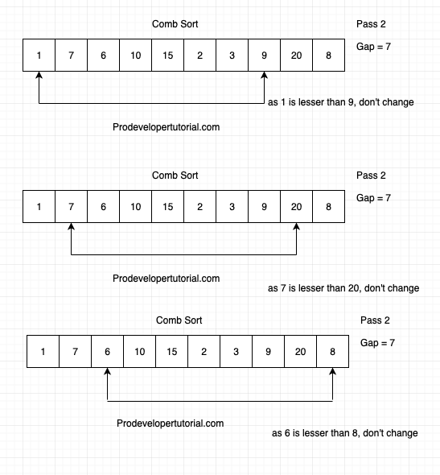
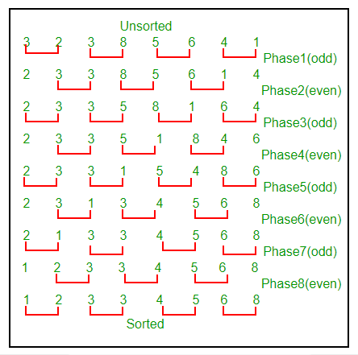
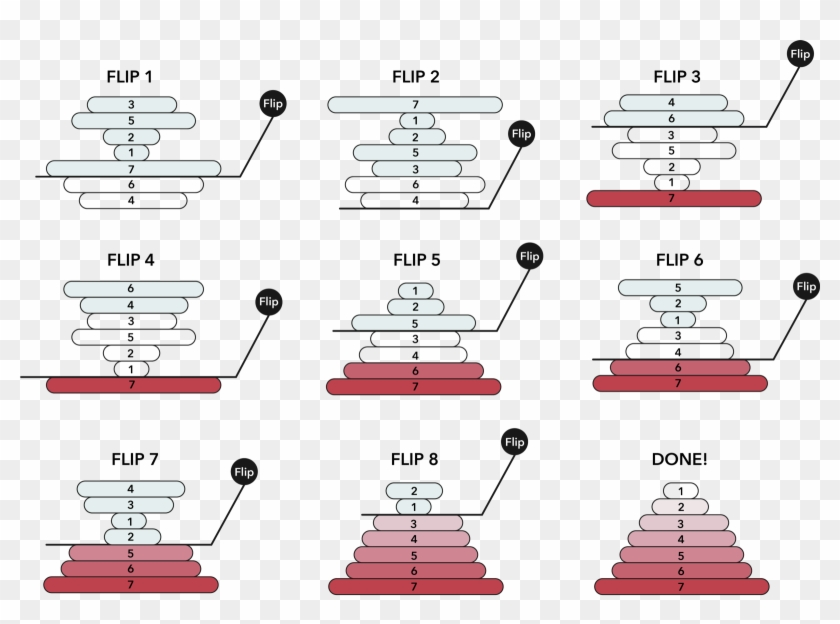
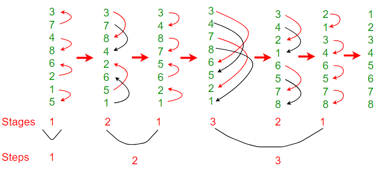
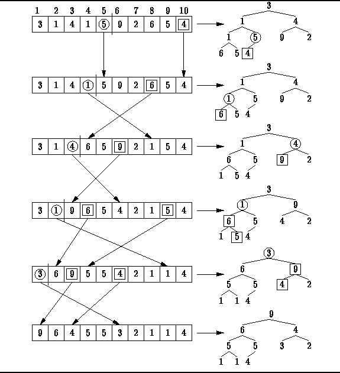
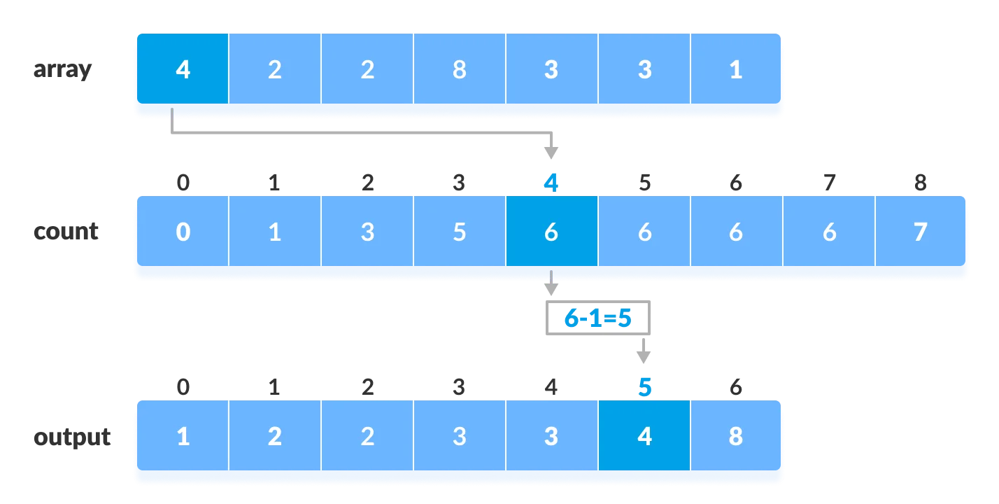
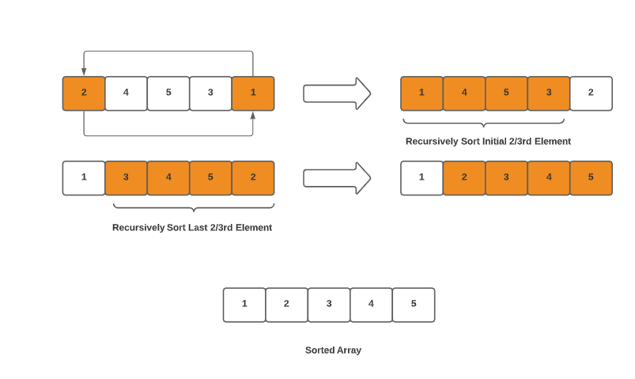
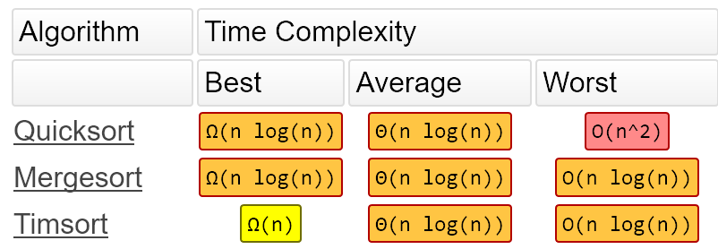

# algorithms(算法)

## 复杂度

- Big oh (O) : 最坏的情况
- Big Omega (Ω) : 最好的情况
- Big Theta (Θ) : 平均

- n 表示数据量的大小

| f(n)    | Name                 |
| ------- | -------------------- |
| 1       | Constant(常数)       |
| log n   | Logarithmic(对数)    |
| n       | Linear(线性)         |
| n log n | Log Linear(线性对数) |
| n^2     | Quadratic(平方)      |
| n^3     | Cubic(立方)          |
| 2^n     | Exponential(指数)    |


- 如果n=1000时需要花费1秒

    - O(n)线性复杂度: n = 5000时就需要5秒

    - O(n^2)线性复杂度: n = 5000时就需要25秒

- 大O标记法, 并没告诉我们实际花费的时间, 而是n值(数据量)发生变化时, 所对应的运行时间的变化

    - 复杂度越高并不代表一定更慢: 同一个问题, 有的O(n^2)的算法可能只需0.1秒, 有的O(n)的算法可能要1秒

### O(n): 线性复杂度

- 递归

    ```py
    def iter(x):
        if x == 0:
            return
        iter(x - 1)
    ```

    - 时间复杂度是`x`的大小O(n)

    - 但递归调用,都会在内存分配一个新的堆栈, 直到调用返回

        - 到最深的递归时, 分配了x个堆栈, 空间复杂度也是O(n)

## sort(排序)


- [geeksforgeeks: sorting-algorithms](https://www.geeksforgeeks.org/sorting-algorithms/)

- [排序算法](https://big-o.io/)

- [zhihu: 算法实现](https://zhuanlan.zhihu.com/p/49271189)

### bubble sort(冒泡排序)


- 正向:

```py
def bubbleSort(list1):
    length = len(list1) - 1
    for i in range(length, 0, -1):
        for j in range(i):
            if list1[j] > list1[j+1]:
                list1[j], list1[j+1] = list1[j+1], list1[j]
```

- 反向:

    ```py
    def exchange(list1, j, i):
        list1[j], list1[i] = list1[i], list1[j]
    ```

    - 循环:

    ```py
    def bubbleSort(list1):
        length = len(list1)
        for i in range(1, length):
            for j in range(i, 0, -1):
                if list1[j-1] > list1[j]:
                    exchange(list1, j-1, j)
                else:
                    break
    ```

    - 函数式编程:

    ```py
    def iter(list1, i):
        if i <= 0:
            return

        j = i - 1
        if list1[j] > list1[i]:
            exchange(list1, j, i)
            iter(list1, j)
        else:
            return


    def bubbleSort(list1):
        length = len(list1)
        for i in range(1, length):
            iter(list1, i)
    ```

#### comb sort(梳子排序)

- 优化的冒泡算法: 每个元素并不是传统的与后一个元素(i+1)对比, 而是对比不断缩小的长度系数(i+gap)



```py
def getNextGap(gap):
    # 系数为1.3
    gap = gap / 1.3
    if gap < 1:
        return 1
    else:
        return int(gap)


def combSort(list1):
    length = len(list1)
    gap = length

    while gap > 1:
        gap = getNextGap(gap)

        for i in range(0, length-gap):
            # 对比加上系数的元素
            if list1[i] > list1[i + gap]:
                list1[i], list1[i + gap] = list1[i + gap], list1[i]
```

#### cocktail Sort(混合排序)

- 冒泡排序的变种. 先从左到右, 再从右到左

```py
def cocktailSort(list1):
    length = len(list1)
    start = 0
    end = length - 1

    while length > 1:
        # 从左到右
        for i in range(start, end):
            if (list1[i] > list1[i + 1]):
                list1[i], list1[i + 1] = list1[i + 1], list1[i]

        # 从右到左
        for i in range(end-1, start-1, -1):
            if (list1[i] > list1[i + 1]):
                list1[i], list1[i + 1] = list1[i + 1], list1[i]

        start += 1
        end -= 1
        length -= 2
```

#### oddEvenSort

- 冒泡排序的变种. 奇数排序一次, 偶数排序一次


```py
def oddEvenSort(list1):
    length = len(list1)
    half = length // 2
    while half > 0:
        for i in range(1, length-1, 2):
            if list1[i] > list1[i+1]:
                list1[i], list1[i+1] = list1[i+1], list1[i]

        for i in range(0, length-1, 2):
            if list1[i] > list1[i+1]:
                list1[i], list1[i+1] = list1[i+1], list1[i]
        half -= 1
```

### insertion sort(插入排序)


```py
def insert(list1, j, i):
    tmp = list1[i]
    list1.pop(i)
    list1.insert(j, tmp)
```

- 循环:

```py
def insertionSort(list1):
length = len(list1)
for i in range(1, length):
    for j in range(i, -1, -1):
        if list1[j-1] > list1[i]:
            pass
        else:
            break
    insert(list1, j, i)
```

- 函数式编程:

```py
def iter(list1, j, i):
    # j != -1 表示j迭代到0, 就执行else
    if list1[j] > list1[i] and j != -1:
        j -= 1
        iter(list1, j, i)
    else:
        insert(list1, j + 1, i)


def insertionSort(list1):
    length = len(list1)
    for i in range(1, length):
        iter(list1, i - 1, i)
```
#### 二分插入排序

- 时间复杂度依然是O(n^2)

    - 但比较的复杂度是O(log n)

```py
def insertionSort(list1):
    length = len(list1)
    for i in range(length):
        key = list1[i]
        l = 0
        r = i - 1

        # 二分查找插入的位置
        while l <= r:
            mid = (l + r) // 2
            if list1[mid] <= key:
                l += 1
            elif list1[mid] >= key:
                r -= 1

        # 移动元素
        j = i - 1
        while j >= l:
            list1[j+1] = list1[j]
            j -= 1

        list1[l] = key
```

### select sort(选择排序)

```py
def selectSort(list1):
    length = len(list1)
    for i in range(length):
        index = i
        for j in range(i+1, length):
            if list1[index] > list1[j]:
                index = j

        list1[i], list1[index] = list1[index], list1[i]
```

- 选取最小值, 加入新的列表. 迭代方法
```py
def sort(list1):
    length = len(list1)
    if length > 1:
        small, small_index = list1[0], 0
        for i in range(1, length):
            if list1[i] < small:
                small = list1[i]
                small_index = i

        list2.append(small)
        list1.pop(small_index)
        sort(list1)
    else:
        list2.append(list1[0])


list2 = []
list1 = [9, 7, 8, 10, 1, 5]
sort(list1)
print(list2)
```

#### pancake Sort(煎饼排序)

- 选择排序的变种, 找到最大值, 移动至末尾



```py
# 查询列表内最大值的偏移量
def findMax(list1, length):
    max_index = 0
    for i in range(0, length):
        if list1[i] > list1[max_index]:
            max_index = i
    return max_index


def pancakeSort(list1):
    length = len(list1)
    for i in range(length, 1, -1):
        max_index = findMax(list1, i)

        # 移动至末尾
        if max_index != i - 1:
            list1[0], list1[max_index] = list1[max_index], list1[0]
            list1[0], list1[i-1] = list1[i-1], list1[0]
```

### merge sort(归并排序)


- merge sort由冯诺依曼于1945年发明

- 分治算法: 找到最简单的解, 然后将其组合起来

    - 有一个阈值(也叫递归基): 低于这个值时, 问题就不再分解

        - 大多数情况下是2

    - 分解成多个子集

        - 如果列表的长度是0或1: 低于阈值, 不会分解

        - 如果列表长度大于1: 分解成两个列表


    - 合并子集

        - 对比两个列表的第一个元素, 将小的元素移动(append)到目标列表(result)的末尾

        - 最后将剩余的列表元素, 移动到目标列表末尾

- 时间复杂度是外层的分解 * 内层的合并: O(n log n)

    - 空间复杂度只有内层的合并也就是: O(n)

    - 分解的时间复杂度是O(log n)

    - 合并的时间复杂度是O(n)

```py
def merge(left, right, compare):
    # 目标列表
    result = []

    l = r = 0
    length_left, length_right = len(left), len(right)

    # 对比两个列表的第一个元素, 将小的元素移动到目标列表(result)的末尾
    while l < length_left and r < length_right:
        if compare(left[l], right[r]):
            result.append(left[l])
            l += 1
        else:
            result.append(right[r])
            r += 1

    # 检查剩余元素
    while l < length_left:
        result.append(left[l])
        l += 1

    while r < length_right:
        result.append(right[r])
        r += 1

    return result


def mergeSort(list1, compare=lambda x, y: x < y):
    length = len(list1)
    if length < 2:
        return list1[:]
    else:
        mid = length // 2
        left = mergeSort(list1[:mid], compare)
        right = mergeSort(list1[mid:], compare)
        return merge(left, right, compare)
```
### bitonic Sort(双音排序)



```py
def compAndSwap(list1, i, j, dire):
    if dire==1 and list1[i] > list1[j]\
            or dire==0 and list1[i] < list1[j]:
        list1[i], list1[j] = list1[j], list1[i]


def bitonicMerge(list1, low, length, dire):
    if length > 1:
        mid = length // 2
        for i in range(low, low+mid):
            compAndSwap(list1, i, i+mid, dire)
        bitonicMerge(list1, low, mid, dire)
        bitonicMerge(list1, low+mid, mid, dire)


def bitonic(list1, low, length, dire):
    if length > 1:
          mid = length // 2
          bitonic(list1, low, mid, 1)
          bitonic(list1, low+mid, mid, 0)
          bitonicMerge(list1, low, length, dire)


def bitonicSort(list1):
    up = 1
    bitonic(list1, 0, len(list1), up)


list1 = [3, 7, 4, 8, 6, 2, 1, 5]
bitonicSort(list1)
print(list1)
```


### shell sort(希尔排序)


```py
def shellSort(list1):
    length = len(list1)
    partition = length // 2
    while partition > 0:
        i = 0
        j = partition

        while j < length:
            if list1[i] > list1[j]:
                list1[i], list1[j] = list1[j], list1[i]

            i += 1
            j += 1

            k = i
            while k-length > -1:
                if list1[k-length] > list1[k]:
                    list1[k-length], list1[k] = list1[k], list1[k-length]
                k -= 1

        partition //= 2
```

### quick sort (快速排序)


```py
def partition(start, end, list1):
    pivot_index = start
    pivot = list1[start]

    while start < end:
        length = len(list1)
        while start < length and list1[start] <= pivot:
            start += 1

        while list1[end] > pivot:
            end -= 1

        if(start < end):
            list1[start], list1[end] = list1[end], list1[start]

    list1[end], list1[pivot_index] = list1[pivot_index], list1[end]
    return end

def quick(start, end, list1):
    if (start < end):
        p = partition(start, end, list1)
        quick(start, p - 1, list1)
        quick(p + 1, end, list1)

def quickSort(list1):
    quick(0, len(list1) - 1, list1)
```
#### 0, 1, 2三路快速排序
```py
def quickSort(list1):
    i = l = 0
    length = len(list1)
    r = length - 1

    while i <= r:
        if list1[i] < 1:
            list1[i], list1[l] = list1[l], list1[i]
            l += 1
            i += 1
        elif list1[i] > 1:
            list1[i], list1[r] = list1[r], list1[i]
            r -= 1
        else:
            i += 1


list1 = [0, 2, 2, 1, 0, 1]
quickSort(list1)
print(list1)
```

### heap sort(堆排序)

- 将数组看作是完全二叉树

    - 把最大的元素, 移动到最底层; 最小的数移动到最顶层




```py
def heapify(list1, length, i):
    root = i
    l = 2 * i + 1 # 左节点 = 2*i + 1
    r = 2 * i + 2 # 右节点 = 2*i + 2

    # 查找比root数大的节点
    if l < length and list1[root] < list1[l]:
        root = l

    # 先对比右节点
    if r < length and list1[root] < list1[r]:
        root = r

    # 如果找到比root数大的节点后, 就交换和递归
    if root != i:
        list1[i], list1[root] = list1[root], list1[i]
        heapify(list1, length, root)


def heapSort(list1):
    length = len(list1)
    for i in range(length//2-1, -1, -1):
        heapify(list1, length, i)

    for i in range(length-1, 0, -1):
        list1[i], list1[0] = list1[0], list1[i]  # swap
        heapify(list1, i, 0)
```

#### 使用heapq模块的heapify函数
```py
import heapq

def heapSort(list1):
    result = []
    length = len(list1)
    for i in range(length):
        # 将最小值移动到list1[0]
        heapq.heapify(list1)
        result.append(list1[0])
        list1.remove(list1[0])
    return result
```

### bucket sort(桶排序)

- 小数排序

    

```py
def bucketSort(list1):
    bucket = []
    num = 10

    # 生成桶
    for _ in range(num):
        bucket.append([])

    # 将每个元素加入桶
    for i in list1:
        # 小数乘以桶数
        index = int(i * num)
        bucket[index].append(i)

    # 对每个桶执行插入排序
    for i in range(num):
        bucket[i] = insertionSort(bucket[i])

    # 将桶内的元素加入列表
    k = 0
    for i in range(num):
        for j in range(len(bucket[i])):
            list1[k] = bucket[i][j]
            k += 1


list1 = [0.897, 0.565, 0.656, 0.1234, 0.665, 0.3434]
bucketSort(list1)
print(list1)
```

### counting sort(计数排序)



### radix sort(基数排序)


```py
def countingSort(list1, exp1):
    n = len(list1)

    output = [0] * (n)
    count = [0] * (10)

    # 对list1的重复元素进行计数
    for i in range(0, n):
        index = list1[i] // exp1
        count[index % 10] += 1

    # 累计计数
    for i in range(1, 10):
        count[i] += count[i - 1]

    i = n - 1
    while i >= 0:
        index = list1[i] // exp1
        output[count[index % 10] - 1] = list1[i]
        count[index % 10] -= 1
        i -= 1

    i = 0
    for i in range(0, len(list1)):
        list1[i] = output[i]

def radixSort(list1):
    max1 = max(list1)

    # 位
    exp = 1
    while max1 / exp > 0:
        countingSort(list1, exp)
        exp *= 10
```

### pigeonhole Sort(范围排序)

- 类似于计数排序

```py
def pigeonholeSort(list1):
    my_min = min(list1)
    my_max = max(list1)
    size = my_max - my_min + 1

    # 生成桶
    buckets = [0] * size

    # 每个元素的值减去最小值, 分配对应的桶
    for x in list1:
        buckets[x - my_min] += 1

    # 将桶的值返回给列表
    i = 0
    for count in range(size):
        while buckets[count] > 0:
            buckets[count] -= 1
            # 桶值加上最小值
            list1[i] = count + my_min
            i += 1
```

### stooge sort



```py
def stooge(list1, l, r):
    if l >= r:
        return

    # left 对比 right
    if list1[l]>list1[r]:
        list1[l], list1[r] = list1[r], list1[l]

    if r - l + 1 > 2:
        stooge(list1, l, r-1)
        stooge(list1, l+1, r)


def stoogeSort(list1):
    stooge(list1, 0, len(list1)-1)
```

### Timsort

> 是python, java...等默认的排序算法

- [Timsort — the fastest sorting algorithm you’ve never heard of](https://hackernoon.com/timsort-the-fastest-sorting-algorithm-youve-never-heard-of-36b28417f399)

- [python中的sort之timsort学习](https://zhuanlan.zhihu.com/p/158972725)
    

- 由`Mergesort`(归并排序) 和 `insertion sort`(插入排序) 两种排序组成

- 1.按顺序扫描元素:

    - 如果扫描的元素是递减的, 则反转扫描的元素

        - 遇到不能递减的元素时, 则对刚才扫描过的元素生成切片(也就是概念run)

        ```
        [4, 2, 1, 3, 5, 7]

        # 扫描并反转
        [1, 2, 4, 3, 5, 7]

        # 生成切片
        1, 2, 4
        ```

    - 如果扫描的元素是递增的, 则不变

- `minrun`概念, 防止合并的切片太短, 太长:

    - 当列表元素的个数小于64时: minrun就是列表长度, 也就是log64等于6

    - 当列表元素的个数大于64时: minrun范围为[32, 64]. 具体选取列表长度的前6位 + 最后2位

    - 切片(run)少于`minrun`时: 使用`insertion sort`.  在元素量少的情况下很快, 但在元素量多时却很慢

- 2.使用归并排序合并切片(和扫描是同步进行的):

    - 将切片放入stack里

    - 当最上面的切片长度**不满足**以下两个条件, 就合并切片:

        - `a > b + c`

        - `b > c`

        ```
        [(1, 2, 4,) (3, 5, 7,)]
        # b == c,  不满足b > c. 合并切片
        [(1, 2, 3, 4, 5, 7,)]
        ```
### 煎饼翻转

- 输入一个数n, 对列表内的前n个元素翻转

```py
def switch(list1):
    l = 0
    r = len(list1) - 1

    while l <= r:
        list1[l], list1[r] = list1[r], list1[l]
        l += 1
        r -= 1

def sort(list1, n):
    tmp = list1[:n]
    switch(tmp)
    return tmp + list1[n:]

list1 = [3, 2, 4, 1]
print(sort(list1, 4))
```

## search(搜索)

### binary search(二分搜索)

```py
def binarySearch(list1, x):
    low = 0
    high = len(list1) - 1

    while low <= high:

        mid = low + (high - low)//2

        if list1[mid] == x:
            return mid

        elif list1[mid] < x:
            low = mid + 1

        else:
            high = mid - 1

    return -1


list1 = [3, 4, 5, 6, 7, 8, 9]
result = binarySearch(list1, 5)
print(result)
```

### hash tab(hash表)

- 桶越多, 碰撞次数越少

    - 没有碰撞复杂度为O(1)

    - 完全碰撞复杂度为O(n)

```py
class intdict(object):
    def __init__(self, numBuckets):
        self.buckets = []
        self.numBuckets = numBuckets

        # 一个列表代表一个桶
        for _ in range(numBuckets):
            self.buckets.append([])

    def add(self, key, val):
        hashlist = self.buckets[key%self.numBuckets]
        length = len(hashlist)
        for i in range(length):
            if hashlist[i][0] == key:
                hashlist[i] = (key, val)
                return

        hashlist.append((key, val))

    def get(self, key):
        hashlist = self.buckets[key%self.numBuckets]
        for i in hashlist:
            if i[0] == key:
                return i[1]


# 16个桶
dict1 = intdict(16)

# 20个值
for i in range(20):
    dict1.add(i, i)

for i in dict1.buckets:
    print(i)

```
输出
```
[(0, 0), (16, 16)]
[(1, 1), (17, 17)]
[(2, 2), (18, 18)]
[(3, 3), (19, 19)]
[(4, 4)]
[(5, 5)]
[(6, 6)]
[(7, 7)]
[(8, 8)]
[(9, 9)]
[(10, 10)]
[(11, 11)]
[(12, 12)]
[(13, 13)]
[(14, 14)]
[(15, 15)]
```

## Linked List(链表)

### Linked List(单向链表)

- 时间复杂度O(n)

```py
class Node(object):
    def __init__(self, data):
        self.data = data
        self.next = None


class Linkedlist(object):
    def __init__(self, data=None):
        self.head = Node(data)

    def add(self, data):
        if self.head.data is None:
            self.head = Node(data)
        else:
            node = self.head
            while node.next:
                node = node.next

            new_node = Node(data)
            node.next = new_node

    def insert(self, base_data, data):
        node = self.head
        while node.next:
            if base_data == node.data:
                new_node = Node(data)
                new_node.next,  node.next = node.next, new_node
                return
            node = node.next

        raise ValueError("not search base_data")

    def delete(self, data):
        pre_node = node = self.head
        while node.next:
            if data == node.data:
                pre_node.next = node.next
                return
            pre_node = node
            node = node.next

        raise ValueError("not search delete data")

    def search(self, data):
        node, n = self.head, 1
        while node:
            if data == node.data:
                return n
            node = node.next
            n += 1

        raise ValueError("not search data")

    def print(self):
        if self.head is None:
            raise ValueError("Link is empty")

        node = self.head
        while node:
            print(node.data)
            node = node.next


link1 = Linkedlist()
link1.add(1)
link1.add(2)
link1.add(3)
link1.delete(2)
link1.insert(1, 0)
link1.print()
print(link1.search(0))
```

#### 单向链表归并排序

```py
def getmid(head):
    one = two = head
    if head is None:
        return one
    while two.next and two.next.next:
        one = one.next
        two = two.next.next
    return one


def sort(head):
    if head is None or head.next is None:
        return head
    mid = getmid(head)
    l = head
    r, mid.next = mid.next, None
    return merge(sort(l), sort(r))


def merge(l, r):
    node0 = Node(0)
    node = node0

    while l and r:
        if l.data > r.data:
            node.next = r
            r = r.next
        else:
            node.next = l
            l = l.next

    if l:
        node.next = l
    if r:
        node.next = r

    return node0.next

link1 = Linkedlist()
link1.add(3)
link1.add(2)
link1.add(5)
link1.add(1)
link1.add(6)

node = sort(link1.head)
while node:
    print(node.data)
    node = node.next
```

### DoublyList(双向链表)

```py
class Node(object):
    def __init__(self, data):
        self.data = data
        self.next = None
        self.prev = None


class DoublyList(object):
    def __init__(self, data=None):
        self.head = Node(data)
        self.tail = self.head

    def add(self, data):
        if self.head.data is None:
            self.head = Node(data)
            self.tail = self.head
        else:
            node = self.head
            while node.next:
                node = node.next
            new_node = Node(data)
            node.next, new_node.prev = new_node, node
            self.tail = new_node

    def insert(self, base_data, data):
        node = self.head
        while node.next:
            if base_data == node.data:
                new_node = Node(data)
                new_node.prev, new_node.next = node, node.next
                node.next.prev = new_node
                node.next = new_node
                return
            node = node.next

        raise ValueError("not search base_data")

    def delete(self, data):
        node = self.head
        while node.next:
            if data == node.data:
                node.prev.next = node.next
                node.next.prev = node.prev
                return
            node = node.next

        raise ValueError("not search delete data")

    def search(self, data):
        node, n = self.head, 1
        while node:
            if data == node.data:
                return n
            n += 1
            node = node.next

        raise ValueError("not search data")

    def print(self):
        node = self.head
        while node:
            print(node.data)
            node = node.next

    def print_prev(self):
        node = self.tail
        while node:
            print(node.data)
            node = node.prev


link1 = DoublyList()
link1.add(1)
link1.add(2)
link1.add(3)
link1.delete(2)
link1.insert(1, 0)
link1.print()
link1.print_prev()
link1.search(0)
```

### Blockchain(区块链)

## graph(图)

- [图介绍](https://www.section.io/engineering-education/graph-data-structure-python/)

### 图的应用

- [pagerank](https://en.wikipedia.org/wiki/PageRank)

    > 为网页的每个链接分配权重, 测量网页内部连接的相对重要性

## tree(树)

### binary tree(二叉树)

#### 判断是否为二叉树

```py
class SearchTree(object):
    def __init__(self, small, large):
        self.small = small
        self.large = large

    def search(self, root, small, large):
        if root is None:
            return True

        # 左结点必须小于root, 右结点必须大于root
        if self.small >= root.val or self.large <= root.val:
            return False

        # 递归自身
        return self.search(root.left, self.small, root.val)

    def excute(self, root):
        return self.search(root, self.small, self.large)


class Tree(object):
    def __init__(self, val):
        self.val = val
        self.left = None
        self.right = None


a = Tree(12)
b = Tree(5)
c = Tree(18)
d = Tree(2)
e = Tree(9)
f = Tree(15)
g = Tree(19)

a.left = b
a.right = c
b.left = d
b.right = e
c.left = f
c.right = g

m = SearchTree(a.val, c.val)
print(m.excute(c))
print(m.excute(f))
```
输出
```
False
True
```

### complete binary tree(完全二叉树)

# reference

- [hackerearth: 数据结构](https://www.hackerearth.com/practice/algorithms/sorting/)

    - 支持数据可视化

- [programiz: 数据结构](https://www.programiz.com/dsa)

- [Problem Solving with Algorithms and Data Structures using Python(英文版, 可在线交互运行代码)](https://runestone.academy/runestone/books/published/pythonds3/index.html)

    - [problem-solving-with-algorithms-and-data-structure-using-python(中文版)](https://github.com/facert/python-data-structure-cn)


- [TheAlgorithms: Python](https://github.com/TheAlgorithms/Python)

- [LeetCode 刷题攻略](https://github.com/youngyangyang04/leetcode-master)
