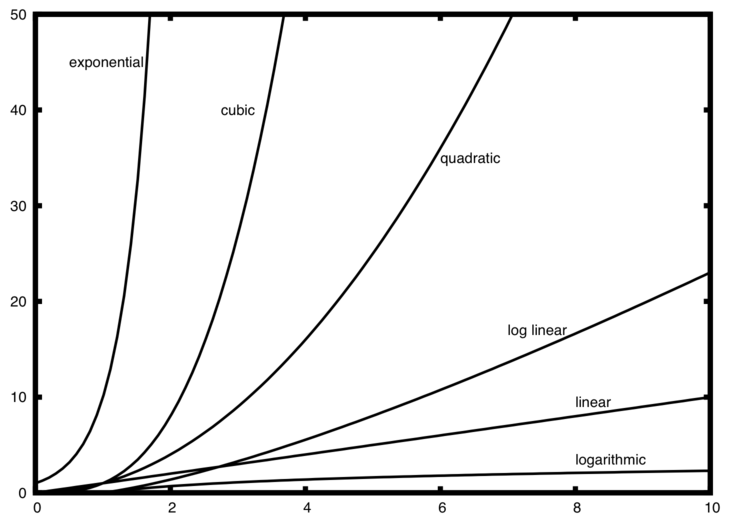

# algorithms(算法)

## 复杂度

| f(n)    | Name                 |
| ------- | -------------------- |
| 1       | Constant(常数)       |
| log n   | Logarithmic(对数)    |
| n       | Linear(线性)         |
| n log n | Log Linear(线性对数) |
| n^2     | Quadratic(平方)      |
| n^3     | Cubic(立方)          |
| 2^n     | Exponential(指数)    |



## 二叉树

### 判断是否为二叉树

```py
class SearchTree(object):
    def __init__(self, small, large):
        self.small = small
        self.large = large

    def search(self, root, small, large):
        if root is None:
            return True

        # 左结点必须小于root, 右结点必须大于root
        if self.small >= root.val or self.large <= root.val:
            return False

        # 递归自身
        return self.search(root.left, self.small, root.val)

    def excute(self, root):
        return self.search(root, self.small, self.large)


class Tree(object):
    def __init__(self, val):
        self.val = val
        self.left = None
        self.right = None


a = Tree(12)
b = Tree(5)
c = Tree(18)
d = Tree(2)
e = Tree(9)
f = Tree(15)
g = Tree(19)

a.left = b
a.right = c
b.left = d
b.right = e
c.left = f
c.right = g

m = SearchTree(a.val, c.val)
print(m.excute(c))
print(m.excute(f))
```
输出
```
False
True
```


# reference

- [Problem Solving with Algorithms and Data Structures using Python: 此书可以在线交互式运行代码](https://runestone.academy/runestone/books/published/pythonds3/index.html)

- [TheAlgorithms: Python](https://github.com/TheAlgorithms/Python)

- [leetcode-master](https://github.com/youngyangyang04/leetcode-master)
