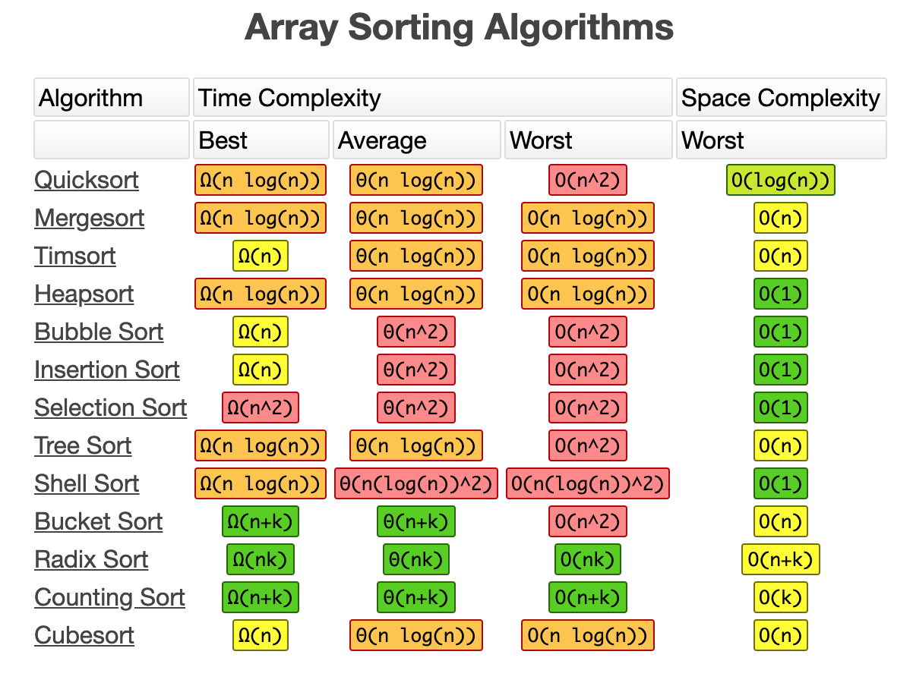
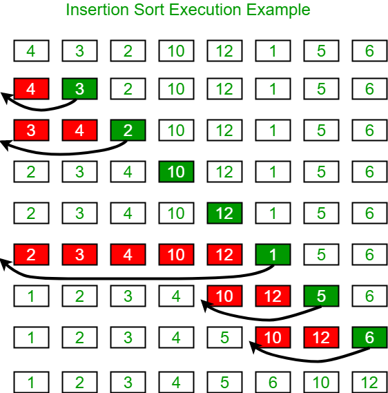
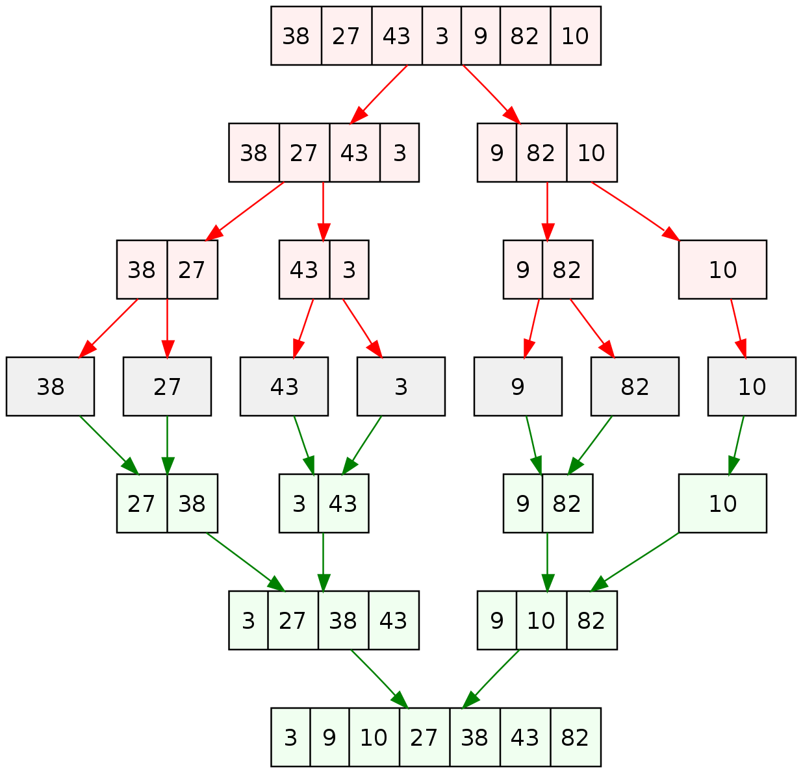
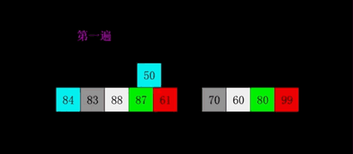
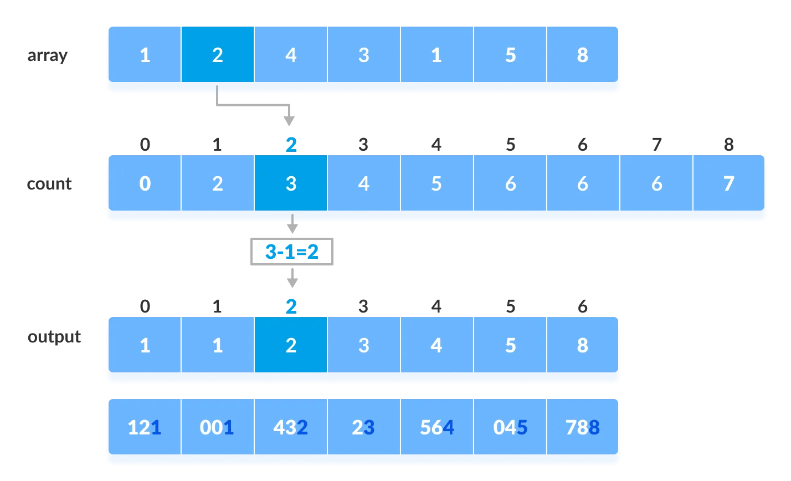
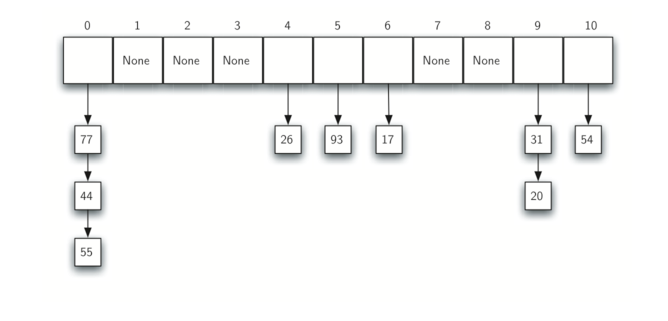
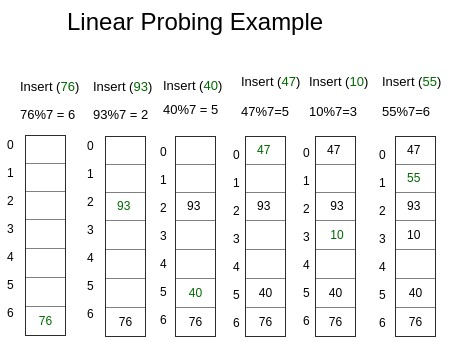
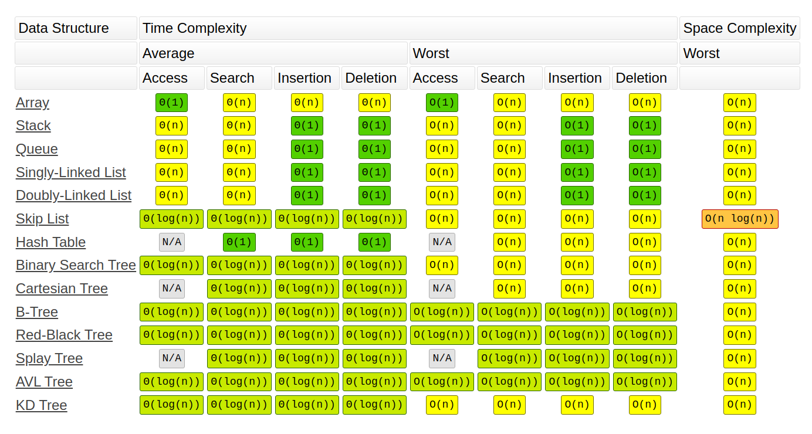
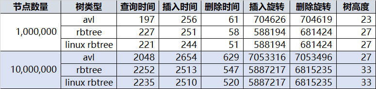

<!-- vim-markdown-toc GFM -->

* [algorithms(算法)](#algorithms算法)
    * [复杂度](#复杂度)
        * [O(n): 线性复杂度](#on-线性复杂度)
    * [sort(排序)](#sort排序)
        * [bubble sort(冒泡排序)](#bubble-sort冒泡排序)
            * [comb sort(梳子排序)](#comb-sort梳子排序)
            * [cocktail Sort(混合排序)](#cocktail-sort混合排序)
            * [oddEvenSort](#oddevensort)
        * [insertion sort(插入排序)](#insertion-sort插入排序)
            * [二分插入排序](#二分插入排序)
        * [select sort(选择排序)](#select-sort选择排序)
            * [pancake Sort(煎饼排序)](#pancake-sort煎饼排序)
        * [merge sort(归并排序)](#merge-sort归并排序)
        * [bitonic Sort(双音排序)](#bitonic-sort双音排序)
        * [shell sort(希尔排序)](#shell-sort希尔排序)
        * [quick sort (快速排序)](#quick-sort-快速排序)
            * [0, 1, 2三路快速排序](#0-1-2三路快速排序)
        * [heap sort(堆排序)](#heap-sort堆排序)
            * [使用heapq模块的heapify函数](#使用heapq模块的heapify函数)
        * [bucket sort(桶排序)](#bucket-sort桶排序)
        * [counting sort(计数排序)](#counting-sort计数排序)
        * [radix sort(基数排序)](#radix-sort基数排序)
        * [pigeonhole Sort(范围排序)](#pigeonhole-sort范围排序)
        * [stooge sort](#stooge-sort)
        * [Timsort](#timsort)
        * [煎饼翻转](#煎饼翻转)
    * [search(搜索)](#search搜索)
        * [binary search(二分搜索)](#binary-search二分搜索)
        * [hash tab(hash表)](#hash-tabhash表)
            * [hash函数](#hash函数)
        * [Bloom Filters(布隆过滤器)](#bloom-filters布隆过滤器)
    * [Linked List(链表)](#linked-list链表)
        * [Linked List(单向链表)](#linked-list单向链表)
            * [单向链表归并排序](#单向链表归并排序)
        * [DoublyList(双向链表)](#doublylist双向链表)
        * [Blockchain(区块链)](#blockchain区块链)
    * [graph(图)](#graph图)
        * [图的应用](#图的应用)
    * [tree(树)](#tree树)
        * [binary tree(二叉树)](#binary-tree二叉树)
        * [full binary tree](#full-binary-tree)
            * [判断是否为full binary tree](#判断是否为full-binary-tree)
        * [perfect binary tree](#perfect-binary-tree)
            * [判断是否为perfect binary tree](#判断是否为perfect-binary-tree)
        * [complete binary tree(完全二叉树)](#complete-binary-tree完全二叉树)
            * [判断是否为complete binary tree](#判断是否为complete-binary-tree)
        * [balanced binary tree(平衡二叉树)](#balanced-binary-tree平衡二叉树)
        * [binary search tree(二叉搜索树)](#binary-search-tree二叉搜索树)
            * [判断是否为二叉搜索树](#判断是否为二叉搜索树)
        * [AVL tree(自平衡二叉搜索树)](#avl-tree自平衡二叉搜索树)
    * [动态规划](#动态规划)
        * [UnlyNum(丑数)](#unlynum丑数)
        * [汉诺塔](#汉诺塔)
        * [进制转换](#进制转换)
        * [最少硬币找零](#最少硬币找零)
    * [string(字符串)](#string字符串)
        * [统计两个字符串中的重复字符](#统计两个字符串中的重复字符)
        * [中叙, 后叙(逆波兰记法), 前叙表达式](#中叙-后叙逆波兰记法-前叙表达式)
* [reference](#reference)

<!-- vim-markdown-toc -->

# algorithms(算法)

- [算法可视化](https://visualgo.net/en)

- [算法可视化](https://www.cs.usfca.edu/~galles/visualization/Algorithms.html)

## 复杂度

- Big oh (O) : 最坏的情况
- Big Omega (Ω) : 最好的情况
- Big Theta (Θ) : 平均

- n 表示数据量的大小

| f(n)    | Name                 |
| ------- | -------------------- |
| 1       | Constant(常数)       |
| log n   | Logarithmic(对数)    |
| n       | Linear(线性)         |
| n log n | Log Linear(线性对数) |
| n^2     | Quadratic(平方)      |
| n^3     | Cubic(立方)          |
| 2^n     | Exponential(指数)    |


- 如果n=1000时需要花费1秒

    - O(n)线性复杂度: n = 5000时就需要5秒

    - O(n^2)线性复杂度: n = 5000时就需要25秒

- 大O标记法, 并没告诉我们实际花费的时间, 而是n值(数据量)发生变化时, 所对应的运行时间的变化

    - 复杂度越高并不代表一定更慢: 同一个问题, 有的O(n^2)的算法可能只需0.1秒, 有的O(n)的算法可能要1秒

### O(n): 线性复杂度

- 递归

    ```py
    def iter(x):
        if x == 0:
            return
        iter(x - 1)
    ```

    - 时间复杂度是`x`的大小O(n)

    - 但递归调用,都会在内存分配一个新的堆栈, 直到调用返回

        - 到最深的递归时, 分配了x个堆栈, 空间复杂度也是O(n)

## sort(排序)



- [geeksforgeeks: sorting-algorithms](https://www.geeksforgeeks.org/sorting-algorithms/)

- [排序算法](https://big-o.io/)

- [zhihu: 算法实现](https://zhuanlan.zhihu.com/p/49271189)

### bubble sort(冒泡排序)


- 正向:

```py
def bubbleSort(list1):
    length = len(list1) - 1
    for i in range(length, 0, -1):
        for j in range(i):
            if list1[j] > list1[j+1]:
                list1[j], list1[j+1] = list1[j+1], list1[j]
```

- 反向:

    - 循环:

    ```py
    def bubbleSort(list1):
        length = len(list1)
        for i in range(length):
            for j in range(length-1, i, -1):
                if list1[j-1] > list1[j]:
                    list1[j], list1[j-1] = list1[j-1], list1[j]
    ```

    - 函数式编程:

    ```py
    def iter(list1, i):
        if i <= 0:
            return

        j = i - 1
        if list1[j] > list1[i]:
            list1[j], list1[i] = list1[i], list1[j]

        iter(list1, j)


    def bubbleSort(list1):
        length = len(list1)
        for i in range(1, length):
            iter(list1, i)
    ```

#### comb sort(梳子排序)

- 优化的冒泡算法: 每个元素并不是传统的与后一个元素(i+1)对比, 而是对比不断缩小的长度系数(i+gap)


```py
def getNextGap(gap):
    # 系数为1.3
    gap = gap / 1.3
    if gap < 1:
        return 1
    else:
        return int(gap)


def combSort(list1):
    length = len(list1)
    gap = length

    while gap > 1:
        gap = getNextGap(gap)

        for i in range(0, length-gap):
            # 对比加上系数的元素
            if list1[i] > list1[i + gap]:
                list1[i], list1[i + gap] = list1[i + gap], list1[i]
```

#### cocktail Sort(混合排序)

- 冒泡排序的变种. 先从左到右, 再从右到左

```py
def cocktailSort(list1):
    length = len(list1)
    start = 0
    end = length - 1

    while length > 1:
        # 从左到右
        for i in range(start, end):
            if (list1[i] > list1[i + 1]):
                list1[i], list1[i + 1] = list1[i + 1], list1[i]

        # 从右到左
        for i in range(end-1, start-1, -1):
            if (list1[i] > list1[i + 1]):
                list1[i], list1[i + 1] = list1[i + 1], list1[i]

        start += 1
        end -= 1
        length -= 2
```

#### oddEvenSort

- 冒泡排序的变种. 奇数排序一次, 偶数排序一次


```py
def oddEvenSort(list1):
    length = len(list1)
    half = length // 2
    while half > 0:
        for i in range(1, length-1, 2):
            if list1[i] > list1[i+1]:
                list1[i], list1[i+1] = list1[i+1], list1[i]

        for i in range(0, length-1, 2):
            if list1[i] > list1[i+1]:
                list1[i], list1[i+1] = list1[i+1], list1[i]
        half -= 1
```

### insertion sort(插入排序)



```py
def insert(list1, j, i):
    tmp = list1.pop(i)
    list1.insert(j, tmp)
```

- 循环:

```py
def sort(list1):
    length = len(list1)
    for i in range(1, length):
        for j in range(i):
            if list1[i] < list1[j]:
                insert(list1, j, i)
```

- 函数式编程:

```py
def iter(list1, j, i):
    if list1[i] < list1[j]:
        insert(list1, j, i)
        return

    if j < i:
        iter(list1, j+1, i)


def sort(list1):
    length = len(list1)
    for i in range(length):
        iter(list1, 0, i)
```

#### 二分插入排序

- 时间复杂度依然是O(n^2)

    - 但比较的复杂度是O(log n)

```py
def insertionSort(list1):
    length = len(list1)
    for i in range(length):
        l = 0
        r = i - 1

        # 二分查找插入的位置
        while l <= r:
            mid = (l + r) // 2
            if list1[mid] <= list1[i]:
                l += 1
            elif list1[mid] >= list1[i]:
                r -= 1

        insert(list1, l, i)
```

### select sort(选择排序)

```py
def selectSort(list1):
    length = len(list1)
    for i in range(length):
        index = i
        for j in range(i+1, length):
            if list1[index] > list1[j]:
                index = j

        list1[i], list1[index] = list1[index], list1[i]
```

- 选取最小值, 加入新的列表. 迭代方法
```py
def sort(list1):
    length = len(list1)
    if length > 1:
        small, small_index = list1[0], 0
        for i in range(1, length):
            if list1[i] < small:
                small = list1[i]
                small_index = i

        list2.append(small)
        list1.pop(small_index)
        sort(list1)
    else:
        list2.append(list1[0])


list2 = []
list1 = [9, 7, 8, 10, 1, 5]
sort(list1)
print(list2)
```

#### pancake Sort(煎饼排序)

- 选择排序的变种, 找到最大值, 移动至末尾


```py
# 查询列表内最大值的偏移量
def findMax(list1, length):
    max_index = 0
    for i in range(0, length):
        if list1[i] > list1[max_index]:
            max_index = i
    return max_index


def pancakeSort(list1):
    length = len(list1)
    for i in range(length, 1, -1):
        max_index = findMax(list1, i)

        # 移动至末尾
        if max_index != i - 1:
            list1[0], list1[max_index] = list1[max_index], list1[0]
            list1[0], list1[i-1] = list1[i-1], list1[0]
```

### merge sort(归并排序)



- merge sort由冯诺依曼于1945年发明

- 分治算法: 找到最简单的解, 然后将其组合起来

    - 有一个阈值(也叫递归基): 低于这个值时, 问题就不再分解

        - 大多数情况下是2

    - 分解成多个子集

        - 如果列表的长度是0或1: 低于阈值, 不会分解

        - 如果列表长度大于1: 分解成两个列表


    - 合并子集

        - 对比两个列表的第一个元素, 将小的元素移动(append)到目标列表(result)的末尾

        - 最后将剩余的列表元素, 移动到目标列表末尾

- 时间复杂度是外层的分解 * 内层的合并: O(n log n)

    - 空间复杂度只有内层的合并也就是: O(n)

    - 分解的时间复杂度是O(log n)

    - 合并的时间复杂度是O(n)

```py
def merge(left, right, compare):
    # 目标列表
    result = []

    l = r = 0
    length_left, length_right = len(left), len(right)

    # 对比两个列表的第一个元素, 将小的元素移动到目标列表(result)的末尾
    while l < length_left and r < length_right:
        if compare(left[l], right[r]):
            result.append(left[l])
            l += 1
        else:
            result.append(right[r])
            r += 1

    # 检查剩余元素
    while l < length_left:
        result.append(left[l])
        l += 1

    while r < length_right:
        result.append(right[r])
        r += 1

    return result


def mergeSort(list1, compare=lambda x, y: x < y):
    length = len(list1)
    if length < 2:
        return list1

    mid = length // 2
    left = mergeSort(list1[:mid], compare)
    right = mergeSort(list1[mid:], compare)
    return merge(left, right, compare)
```
### bitonic Sort(双音排序)


```py
def compAndSwap(list1, i, j, dire):
    if dire==1 and list1[i] > list1[j]\
            or dire==0 and list1[i] < list1[j]:
        list1[i], list1[j] = list1[j], list1[i]


def bitonicMerge(list1, low, length, dire):
    if length > 1:
        mid = length // 2
        for i in range(low, low+mid):
            compAndSwap(list1, i, i+mid, dire)
        bitonicMerge(list1, low, mid, dire)
        bitonicMerge(list1, low+mid, mid, dire)


def bitonic(list1, low, length, dire):
    if length > 1:
          mid = length // 2
          bitonic(list1, low, mid, 1)
          bitonic(list1, low+mid, mid, 0)
          bitonicMerge(list1, low, length, dire)


def bitonicSort(list1):
    up = 1
    bitonic(list1, 0, len(list1), up)


list1 = [3, 7, 4, 8, 6, 2, 1, 5]
bitonicSort(list1)
print(list1)
```


### shell sort(希尔排序)


```py
def shellSort(list1):
    length = len(list1)
    half = length // 2
    while half > 0:
        for i in range(half, length):
            while i >= half:
                if list1[i-half] > list1[i]:
                    list1[i], list1[i-half] = list1[i-half], list1[i]
                i -= half
        half //= 2
```

- 以上代码是指针是从half到lenght. 现在改为指针从0开始到half

    - 这样的修改是致命的

    ```py
    def shellSort(list1):
        length = len(list1)
        half = length // 2
        while half > 0:
            # 指针改为从0开始移动
            for i in range(0, half):
                while i <= half:
                    if list1[i] > list1[i+half]:
                        list1[i], list1[i+half] = list1[i+half], list1[i]
                    i += 1
            half //= 2

    # 结果不准确
    list1 = [1, 3, 7, 4, 8, 6, 2, 1, 5]
    shellSort(list1)
    print(list1)

    # 偶数个元素时会报错
    list1 = [3, 7, 4, 8, 6, 2, 1, 5]
    shellSort(list1)
    print(list1)
    ```

### quick sort (快速排序)


- 分治算法

- 选取一个基准元素, 把比这个基准元素小的移动到左边;大的移动到右边. 这样一轮下来, 就确定了这个基准元素的位置

    - 基准元素一般是取第一个元素

```py
def partition(start, end, list1):
    pivot_index = start
    pivot = list1[start]

    while start < end:
        length = len(list1)
        while start < length and list1[start] <= pivot:
            start += 1

        while list1[end] > pivot:
            end -= 1

        if start < end:
            list1[start], list1[end] = list1[end], list1[start]

    list1[end], list1[pivot_index] = list1[pivot_index], list1[end]
    return end

def quick(start, end, list1):
    if start < end:
        p = partition(start, end, list1)
        quick(start, p - 1, list1)
        quick(p + 1, end, list1)

def quickSort(list1):
    quick(0, len(list1) - 1, list1)
```
#### 0, 1, 2三路快速排序
```py
def quickSort(list1):
    i = l = 0
    length = len(list1)
    r = length - 1

    while i <= r:
        if list1[i] < 1:
            list1[i], list1[l] = list1[l], list1[i]
            l += 1
            i += 1
        elif list1[i] > 1:
            list1[i], list1[r] = list1[r], list1[i]
            r -= 1
        else:
            i += 1


list1 = [0, 2, 2, 1, 0, 1]
quickSort(list1)
print(list1)
```

### heap sort(堆排序)

- 将数组看作是完全二叉树

    - 把最大的元素, 移动到最底层; 最小的数移动到最顶层


```py
def heapify(list1, length, i):
    root = i
    l = 2 * i + 1 # 左节点 = 2*i + 1
    r = 2 * i + 2 # 右节点 = 2*i + 2

    # 查找比root数大的节点
    if l < length and list1[root] < list1[l]:
        root = l

    # 先对比右节点
    if r < length and list1[root] < list1[r]:
        root = r

    # 如果找到比root数大的节点后, 就交换和递归
    if root != i:
        list1[i], list1[root] = list1[root], list1[i]
        heapify(list1, length, root)


def heapSort(list1):
    length = len(list1)
    # 生成堆
    for i in range(length//2-1, -1, -1):
        heapify(list1, length, i)

    # 将第一个值(最大的值), 放到最后面
    for i in range(length-1, 0, -1):
        list1[i], list1[0] = list1[0], list1[i]  # swap
        heapify(list1, i, 0)
```

#### 使用heapq模块的heapify函数
```py
import heapq

def heapSort(list1):
    result = []
    length = len(list1)
    for i in range(length):
        heapq.heapify(list1)
        # pop 第一个值, 也是最小值
        result.append(heapq.heappop(list1))
    return result
```

### bucket sort(桶排序)

- 小数排序

    

```py
def bucketSort(list1):
    bucket = []
    num = 10

    # 生成桶
    for _ in range(num):
        bucket.append([])

    # 将每个元素加入桶
    for i in list1:
        # 小数乘以桶数
        index = int(i * num)
        bucket[index].append(i)

    # 对每个桶执行插入排序
    for i in range(num):
        bucket[i] = insertionSort(bucket[i])

    # 将桶内的元素加入列表
    k = 0
    for i in range(num):
        for j in range(len(bucket[i])):
            list1[k] = bucket[i][j]
            k += 1


list1 = [0.897, 0.565, 0.656, 0.1234, 0.665, 0.3434]
bucketSort(list1)
print(list1)
```

### counting sort(计数排序)


```py
def countingSort(list1):
    # 桶的数量为最大值加1
    size = max(list1) + 1
    count = [0] * size

    # 对桶进行计数
    for i in range(size):
        for j in list1:
            if i == j:
                count[i] += 1

    # 排列
    j = 0
    for i in range(size):
        while count[i] > 0:
            list1[j] = i
            count[i] -= 1
            j += 1
```

### radix sort(基数排序)



```py
def countingSort(list1, exp1):
    length = len(list1)

    output = [0] * length
    count = [0] * 10

    # 对个位数相同的元素进行计数
    for i in range(0, length):
        index = list1[i] // exp1
        count[index % 10] += 1

    # 加上前面的计数, 得到累计位置
    for i in range(1, 10):
        count[i] += count[i-1]

    # 对个位数进行排列
    i = length - 1
    while i >= 0:
        index = list1[i] // exp1
        output[count[index % 10] - 1] = list1[i]
        count[index % 10] -= 1
        i -= 1

    for i in range(0, length):
        list1[i] = output[i]

def radixSort(list1):
    max1 = max(list1)

    # 位
    exp = 1
    while max1 / exp > 0:
        countingSort(list1, exp)
        exp *= 10
```

### pigeonhole Sort(范围排序)

- 类似于计数排序

```py
def pigeonholeSort(list1):
    my_min = min(list1)
    my_max = max(list1)
    size = my_max - my_min + 1

    # 生成桶
    buckets = [0] * size

    # 每个元素的值减去最小值, 分配对应的桶
    for x in list1:
        buckets[x - my_min] += 1

    # 将桶的值返回给列表
    i = 0
    for count in range(size):
        while buckets[count] > 0:
            buckets[count] -= 1
            # 桶值加上最小值
            list1[i] = count + my_min
            i += 1
```

### stooge sort


```py
def stooge(list1, l, r):
    if l >= r:
        return

    # left 对比 right
    if list1[l]>list1[r]:
        list1[l], list1[r] = list1[r], list1[l]

    if r - l + 1 > 2:
        stooge(list1, l, r-1)
        stooge(list1, l+1, r)


def stoogeSort(list1):
    stooge(list1, 0, len(list1)-1)
```

### Timsort

> 是python, java...等默认的排序算法

- [Timsort — the fastest sorting algorithm you’ve never heard of](https://hackernoon.com/timsort-the-fastest-sorting-algorithm-youve-never-heard-of-36b28417f399)

- [python中的sort之timsort学习](https://zhuanlan.zhihu.com/p/158972725)
    

- 由`Mergesort`(归并排序) 和 `insertion sort`(插入排序) 两种排序组成

- 1.按顺序扫描元素:

    - 如果扫描的元素是递减的, 则反转扫描的元素

        - 遇到不能递减的元素时, 则对刚才扫描过的元素生成切片(也就是概念run)

        ```
        [4, 2, 1, 3, 5, 7]

        # 扫描并反转
        [1, 2, 4, 3, 5, 7]

        # 生成切片
        1, 2, 4
        ```

    - 如果扫描的元素是递增的, 则不变

- `minrun`概念, 防止合并的切片太短, 太长:

    - 当列表元素的个数小于64时: minrun就是列表长度, 也就是log64等于6

    - 当列表元素的个数大于64时: minrun范围为[32, 64]. 具体选取列表长度的前6位 + 最后2位

    - 切片(run)少于`minrun`时: 使用`insertion sort`.  在元素量少的情况下很快, 但在元素量多时却很慢

- 2.使用归并排序合并切片(和扫描是同步进行的):

    - 将切片放入stack里

    - 当最上面的切片长度**不满足**以下两个条件, 就合并切片:

        - `a > b + c`

        - `b > c`

        ```
        [(1, 2, 4,) (3, 5, 7,)]
        # b == c,  不满足b > c. 合并切片
        [(1, 2, 3, 4, 5, 7,)]
        ```
### 煎饼翻转

- 输入一个数n, 对列表内的前n个元素翻转

```py
def switch(list1):
    l = 0
    r = len(list1) - 1

    while l <= r:
        list1[l], list1[r] = list1[r], list1[l]
        l += 1
        r -= 1

def sort(list1, n):
    tmp = list1[:n]
    switch(tmp)
    return tmp + list1[n:]

list1 = [3, 2, 4, 1]
print(sort(list1, 4))
```

## search(搜索)

### binary search(二分搜索)

- 循环:
```py
def binarySearch(list1, x):
    low = 0
    high = len(list1) - 1

    while low <= high:

        mid = (low + high)//2

        if list1[mid] == x:
            return mid

        elif list1[mid] < x:
            low = mid + 1

        else:
            high = mid - 1

    return -1


list1 = [3, 4, 5, 6, 7, 8, 9]
result = binarySearch(list1, 5)
print(result)
```

- 函数式编程:
```py
def iter(low, high, n):
    if low >= high:
        return -1

    mid = (high - low) // 2
    if list1[mid] == n:
        return mid
    elif list1[mid] > n:
        iter(low, mid-1, n)
    else:
        iter(mid+1, high, n)


def binarySearch(list1, n):
    return iter(0, len(list1), n)
```

- 递归
```py
def binarySearch(list1, x):
    length = len(list1)
    if length == 0:
        return False
    else:
        mid = length // 2
        if list1[mid] == x:
            return True
        else:
            if list1[mid] > x:
                return binarySearch(list1[:mid], x)
            else:
                return binarySearch(list1[mid+1:], x)
```

### hash tab(hash表)

- 链地址法(chaining)

    - 遇到冲突时, 放如链表里

    - 优点:
        - 删除方便

    - 缺点:
        - 需要额外空间

    

- 开放地址法(open addressing)

    - 遇到冲突时, 寻找下一个空的桶

        - 最简单的方法就是: 按顺序遍历, 直到找到空的桶

    - 优点:
        - 不需要额外的空间

    - 缺点:
        - 桶快填满时, 冲突的几率大大增加, 寻找空桶的时间也增加

        - 删除比链地址法要麻烦

    

- 桶越多, 冲突次数越少

    - 没有冲突复杂度为O(1)

    - 完全冲突复杂度为O(n)

    - ruby采用链地址法, 在冲突大于5时, 就增加桶的数量

    - python采用开放地址法, 但2/3的桶被填满时, 就增加桶的数量

```py
class Hash:
    def __init__(self, n):
        self.n = n
        self.buckets = []
        # 一个集合代表一个桶. 集合没有重复值
        for _ in range(n):
            self.buckets.append(set())

    # hash函数
    def _hash(self, x):
        return x % self.n

    def add(self, x):
        self.buckets[self._hash(x)].add(x)

    def remove(self, x):
        self.buckets[self._hash(x)].remove(x)

    def list(self):
        print(self.buckets)


if __name__ == '__main__':
    # 5个桶
    hash = Hash(5)

    # 添加
    hash.add(10)
    hash.add(11)
    hash.add(100)
    hash.add(101)
    hash.list()

    # 删除
    hash.remove(10)
    hash.list()
```
输出
```
[{10, 100}, {11, 101}, set(), set(), set()]
[{100}, {11, 101}, set(), set(), set()]
```

- 保存kv值
```py
class intdict(object):
    def __init__(self, numBuckets):
        self.buckets = []
        self.numBuckets = numBuckets

        # 一个列表代表一个桶
        for _ in range(numBuckets):
            self.buckets.append([])

    def add(self, key, val):
        hashlist = self.buckets[key%self.numBuckets]
        length = len(hashlist)
        for i in range(length):
            # 如果key存在, 就更换key值
            if hashlist[i][0] == key:
                hashlist[i] = (key, val)
                return

        # 如果key不存在, 就添加
        hashlist.append((key, val))

    def get(self, key):
        hashlist = self.buckets[key%self.numBuckets]
        for i in hashlist:
            if i[0] == key:
                return i[1]

    def list(self):
        print(self.buckets)


if __name__ == '__main__':
    # 5个桶
    dict1 = intdict(5)

    # 添加
    for i in range(5):
        dict1.add(i, i)
    dict1.list()

    # 修改
    dict1.add(0, 999)
    dict1.list()

    # 获取
    print(dict1.get(0))
```
输出
```
[[(0, 0)], [(1, 1)], [(2, 2)], [(3, 3)], [(4, 4)]]
[[(0, 999)], [(1, 1)], [(2, 2)], [(3, 3)], [(4, 4)]]
999
```

#### hash函数

- 分组求和法:
    - 1. 电话号码436-555-4601, 分成2位数（43,65,55,46,01）
    - 2. 43 + 65 + 55 + 46 + 01得到 210
    - 3. 210 % 桶数

- 平方取中法:
    - 1. 数44, 先平方, 44^2 = 1936
    - 2. 取中间两个数字 93
    - 3. 93 % 桶数

- 字符串ascii值相加法:
    ```py
    def hash(str1, bucket_num):
        sum = 0
        for i in str1:
            sum += ord(i)

        # 最后相加的值 % 桶数
        return sum % bucket_num
    ```

### Bloom Filters(布隆过滤器)

- [介绍](https://llimllib.github.io/bloomfilter-tutorial/zh_CN/)

- [python实现](https://github.com/jaybaird/python-bloomfilter)

## Linked List(链表)

### Linked List(单向链表)

- 时间复杂度O(n)

实现list(列表)的所有方法, 除了`sort()`, `reverse()`

<details><summary>代码实现</summary><p>

---
```py
# 文件: list.py

class Node:
    def __init__(self, data):
        self.data = data
        self.next = None


# 迭代器
class _ListIter():
    def __init__(self, node):
        self.node = node

    def __iter__(self):
        return self

    def __next__(self):
        if self.node:
            data = self.node.data
            self.node = self.node.next
            return data
        else:
            raise StopIteration


class List:
    def __init__(self, data=None):
        self.head = Node(data)
        self.size = 0

    def __len__(self):
        return self.size

    def __iter__(self):
        return _ListIter(self.head)

    def __repr__(self):
        str1 = '['
        for i in self:
            str1 += f'{i}, '
        str1 = str1.rstrip(', ')
        str1 += ']'
        return str1

    # List[0]
    def __getitem__(self, index):
        assert index >= 0 and index < len(self), 'out of range'
        for i, item in enumerate(self):
            if i == index:
                return item

    # List[0] = 10
    def __setitem__(self, index, value):
        assert index >= 0 and index < len(self), 'out of range'
        node = self.head
        i = 0
        while node:
            if i == index:
                node.data = value
                return
            i += 1
            node = node.next

    def __mul__(self, n):
        new_link = self.copy()
        for _ in range(n-1):
            new_link.extend(self)
        return new_link

    def index(self, data):
        for index, item in enumerate(self):
            if item == data:
                return index

        raise ValueError("not search index data")

    def count(self, data):
        i = 0
        for item in self:
            if item == data:
                i += 1
        return i

    def _last(self):
        node = self.head
        while node.next:
            node = node.next
        return node

    def extend(self, link):
        new_link = link.copy()
        node = self._last()
        node.next = new_link.head

    def append(self, data):
        if self.head.data is None:
            self.head = Node(data)
            self.size = 1
        else:
            node = self._last()
            node.next = Node(data)
            self.size += 1

    def remove(self, data):
        if self.head.data == data:
            self.head = self.head.next
            return

        node = self.head
        prev = node
        while node:
            if node.data == data:
                prev.next = node.next
                return
            prev = node
            node = node.next

        raise ValueError("not search delete data")

    def pop(self, index=None):
        assert index >= 0 and index < len(self), 'out of range'
        if index is None:
            index = self.size - 1

        if index == 0:
            data = self.head.data
            self.head = self.head.next
            return data

        node = self.head
        i = 0
        prev = node
        while node:
            if i == index:
                prev.next = node.next
                return node.data
            i += 1
            prev = node
            node = node.next

    def insert(self, index, data):
        assert index >= 0 and index < len(self), 'out of range'
        node = self.head
        i = 0
        prev = node
        while node:
            if i == index:
                new_node = Node(data)
                new_node.next = node
                prev.next = new_node
                return
            i += 1
            prev = node
            node = node.next

    def copy(self):
        list = List()
        for item in self:
            list.append(item)
        return list
```
---

</p></details>

<details><summary>测试代码</summary><p>

---
```py
import pytest

# 导入上面的代码
from list import List


# 初始化
@pytest.fixture()
def list1():
    list = List()
    for i in range(3):
        list.append(i)
    yield list

def test_size(list1):
    assert 3 == len(list1)

def test_getitem(list1):
    assert 0 == list1[0]

    with pytest.raises(AssertionError, match="out of range"):
        assert 0 == list1[9]

def test_setitem(list1):
    list1[0] = 10
    assert 10 == list1[0]

    with pytest.raises(AssertionError, match="out of range"):
        list1[9] = 10

def test_index(list1):
    assert 1 == list1.index(1)

    with pytest.raises(ValueError, match="not search index data"):
        list1.index(9)

def test_count(list1):
    assert 1 == list1.count(1)
    # 不存在返回0
    assert 0 == list1.count(11)

def test_copy(list1):
    list2 = list1.copy()
    assert id(list2) != id(list1)

def test_iter(capsys, list1):
    def iter(list1):
        for i in list1:
            print(i)

    iter(list1)
    out, err = capsys.readouterr()
    assert out == '0\n1\n2\n'

def test_extend(list1):
    node = List()
    for i in range(3, 6):
        node.append(i)

    list1.extend(node)
    assert list1.__repr__() == '[0, 1, 2, 3, 4, 5]'

def test_remove(list1):
    list1.remove(1)
    assert list1.__repr__() == '[0, 2]'

    with pytest.raises(ValueError, match="not search delete data"):
        list1.remove(9)

def test_pop(list1):
    assert 1 == list1.pop(1)
    assert list1.__repr__() == '[0, 2]'

    with pytest.raises(AssertionError, match="out of range"):
        assert 1 == list1.pop(9)

def test_insert(list1):
    list1.insert(1, 11)
    assert list1.__repr__() == '[0, 11, 1, 2]'

    with pytest.raises(AssertionError, match="out of range"):
        list1.insert(9, 11)

def test_repr(list1):
    assert list1.__repr__() == '[0, 1, 2]'

def test_mul(list1):
    list2 = list1 * 2
    assert list2.__repr__() == '[0, 1, 2, 0, 1, 2]'
```
---

</p></details>

#### 单向链表归并排序

```py
def getmid(head):
    one = two = head
    if head is None:
        return one
    while two.next and two.next.next:
        one = one.next
        two = two.next.next
    return one


def sort(head):
    if head is None or head.next is None:
        return head
    mid = getmid(head)
    l = head
    r, mid.next = mid.next, None
    return merge(sort(l), sort(r))


def merge(l, r):
    node0 = Node(0)
    node = node0

    while l and r:
        if l.data > r.data:
            node.next = r
            r = r.next
        else:
            node.next = l
            l = l.next

    if l:
        node.next = l
    if r:
        node.next = r

    return node0.next

link1 = Linkedlist()
link1.add(3)
link1.add(2)
link1.add(5)
link1.add(1)
link1.add(6)

node = sort(link1.head)
while node:
    print(node.data)
    node = node.next
```

### DoublyList(双向链表)

<details><summary>代码实现</summary><p>

---
```py
class Node:
    def __init__(self, data):
        self.data = data
        self.prev = None
        self.next = None


class _ListIter():
    def __init__(self, node):
        self.node = node

    def __iter__(self):
        return self

    def __next__(self):
        if self.node:
            data = self.node.data
            self.node = self.node.next
            return data
        else:
            raise StopIteration


class Deque:
    def __init__(self, maxlen=-1):
        self.head = None
        self.tail = None
        self.maxlen = maxlen
        self.size = 0

    def __iter__(self):
        return _ListIter(self.head)

    def __repr__(self):
        str1 = '['
        for i in self:
            str1 += f'{i}, '
        str1 = str1.rstrip(', ')
        str1 += ']'
        return str1

    def _isFull(self):
        if self.maxlen == self.size:
            return True

    def _isEmpry(self):
        if self.head is None:
            return True

    def __len__(self):
        return self.size

    def append(self, data):
        if self._isEmpry():
            self.head = Node(data)
            self.tail = self.head
        else:
            if self._isFull():
                self.popleft()
            node = Node(data)
            self.tail.next, node.prev = node, self.tail
            self.tail = node
        self.size += 1

    def appendleft(self, data):
        if self._isEmpry():
            self.head = Node(data)
            self.tail = self.head
        else:
            if self._isFull():
                self.pop()
            node = Node(data)
            self.head.prev, node.next = node, self.head
            self.head = node
        self.size += 1

    def pop(self):
        assert not self._isEmpry(), 'pop from an empty deque'
        data = self.tail.data
        if self.size > 1:
            self.tail = self.tail.prev
            self.tail.next = None
        # 链表只剩1个的时候
        else:
            self.prev = self.head = None
        self.size -= 1
        return data

    def popleft(self):
        assert not self._isEmpry(), 'pop from an empty deque'
        data = self.head.data
        if self.size > 1:
            self.head = self.head.next
            self.head.prev = None
        # 链表只剩1个的时候
        else:
            self.prev = self.head = None
        self.size -= 1
        return data

    def copy(self):
        new_de = Deque()
        for i in self:
            new_de.append(i)
        return new_de

    def reverse(self):
        new_link = Deque(maxlen=self.maxlen)
        node = self.tail
        while node:
            new_link.append(node.data)
            node = node.prev
        self.head, self.tail = new_link.head, new_link.tail

    def extend(self, link):
        # 如果是合并自身, 就复制自身
        if link == self:
            link = link.copy()

        for i in link:
            self.append(i)

    def extendleft(self, link):
        # 如果是合并自身, 就复制自身
        if link == self:
            link = link.copy()

        for i in link:
            self.appendleft(i)

    def rotate(self, n=1):
        '''旋转'''
        for _ in range(n):
            tail = self.pop()
            self.appendleft(tail)

    def clear(self):
        self.tail = self.head = None
        self.size = 0
```
---

</p></details>

<details><summary>测试代码</summary><p>

---
```py
import pytest
# 导入上面的代码
from list import Deque


# 初始化
@pytest.fixture()
def de1():
    de = Deque()
    for i in range(3):
        de.append(i)

    for i in range(3):
        de.appendleft(i)
    yield de

def test_size(de1):
    assert 6 == len(de1)

def test_clear(de1):
    de1.clear()
    assert True == de1._isEmpry()

def test_pop_popleft(de1):
    for i in range(3):
        de1.popleft()
        de1.pop()
    assert True == de1._isEmpry()

def test_extend(de1):
    # 合并自身
    de1.extend(de1)
    assert de1.__repr__() == '[2, 1, 0, 0, 1, 2, 2, 1, 0, 0, 1, 2]'

    # 合并其它链表
    de2 = Deque()
    for i in range(3, 6):
        de2.append(i)

    de1.extend(de2)
    assert de1.__repr__() == '[2, 1, 0, 0, 1, 2, 2, 1, 0, 0, 1, 2, 3, 4, 5]'

def test_extendleft(de1):
    # 合并自身
    de1.extend(de1)
    assert de1.__repr__() == '[2, 1, 0, 0, 1, 2, 2, 1, 0, 0, 1, 2]'

    # 合并其它链表
    de2 = Deque()
    for i in range(3, 6):
        de2.append(i)

    de1.extendleft(de2)
    assert de1.__repr__() == '[5, 4, 3, 2, 1, 0, 0, 1, 2, 2, 1, 0, 0, 1, 2]'

def test_rotate(de1):
    de2 = de1
    de1.rotate(len(de1))
    assert de2 == de1

def reverse(de1):
    for _ in range(3):
        de1.pop()
    de1.reverse()
    assert de1.__repr__() == '[2, 1, 0]'

def test_maxlen():
    de1 = Deque(maxlen=6)
    for i in range(3):
        de1.append(i)

    for i in range(3):
        de1.appendleft(i)

    # 合并自身
    de1.extend(de1)
    assert de1.__repr__() == '[2, 1, 0, 0, 1, 2]'

    de1.extendleft(de1)
    assert de1.__repr__() == '[2, 1, 0, 0, 1, 2]'

    # 合并其它链表
    de2 = Deque()
    for i in range(3, 6):
        de2.append(i)

    de1.extend(de2)
    assert de1.__repr__() == '[0, 1, 2, 3, 4, 5]'

    de1.extendleft(de2)
    assert de1.__repr__() == '[5, 4, 3, 0, 1, 2]'
```
---

</p></details>

### Blockchain(区块链)

## graph(图)

- [图介绍](https://www.section.io/engineering-education/graph-data-structure-python/)

### 图的应用

- [pagerank](https://en.wikipedia.org/wiki/PageRank)

    > 为网页的每个链接分配权重, 测量网页内部连接的相对重要性

## tree(树)




### binary tree(二叉树)

- 列表实现
```py
def BinaryTree(r):
    return [r, [], []]


def insertLeft(root, newBranch):
    t = root.pop(1)
    if len(t) > 1:
        root.insert(1, [newBranch, t, []])
    else:
        root.insert(1, [newBranch, [], []])
    return root


def insertRight(root, newBranch):
    t = root.pop(2)
    if len(t) > 1:
        root.insert(2, [newBranch, [], t])
    else:
        root.insert(2, [newBranch, [], []])
    return root


if __name__ == '__main__':
    r = BinaryTree(0)
    insertLeft(r, 1)
    insertRight(r, 2)
    insertLeft(r, 3)
    insertRight(r, 4)
    print(r)
```
输出
```
[0, [3, [1, [], []], []], [4, [], [2, [], []]]]
```

- class实现
```py
class Node:
    def __init__(self, data):
        self.data = data
        self.left = None
        self.right = None
```

### full binary tree

> 每个结点要么有两个结点, 要么两个结点都是None

#### 判断是否为full binary tree
```py
def isFullTree(root):

    if root is None:
        return True

    if root.left is None and root.right is None:
        return True

    if root.left is not None and root.right is not None:
        return (isFullTree(root.left) and isFullTree(root.right))

    return False


root = Node(1)
root.right = Node(3)
root.left = Node(2)

root.left.left = Node(4)
root.left.right = Node(5)
root.left.right.left = Node(6)
root.left.right.right = Node(7)
print(isFullTree(root))
```

### perfect binary tree

> 左右结点高度相等

#### 判断是否为perfect binary tree

```py
# 树的深度
def depth(node):
    d = 0
    while node is not None:
        d += 1
        node = node.left
    return d


def is_perfect(root, d, level=0):

    if root is None:
        return True

    if root.left is None and root.right is None:
        return (d == level + 1)
    elif root.left is None or root.right is None:
        return False

    return (is_perfect(root.left, d, level + 1) and
           is_perfect(root.right, d, level + 1))


root = Node(1)
root.left = Node(2)
root.right = Node(3)

print(is_perfect(root, depth(root)))
```

### complete binary tree(完全二叉树)

> 树向左结点倾斜的

#### 判断是否为complete binary tree

```py
# 结点总数
def count_nodes(root):
    if root is None:
        return 0
    return (1 + count_nodes(root.left) + count_nodes(root.right))


def is_complete(root, index, counts):
    if root is None:
        return True

    if index >= counts:
        return False

    return (is_complete(root.left, 2 * index + 1, counts) and
            is_complete(root.right, 2 * index + 2, counts))


root = Node(1)
root.left = Node(2)
root.right = Node(3)
root.left.left = Node(4)

print(is_complete(root, 0, count_nodes(root)))
```

### balanced binary tree(平衡二叉树)

> 左右结点高度不能超过1

### binary search tree(二叉搜索树)

> 左结点小于根结点; 右结点大于根结点

#### 判断是否为二叉搜索树

```py
class SearchTree(object):
    def __init__(self, small, large):
        self.small = small
        self.large = large

    def search(self, root, small, large):
        if root is None:
            return True

        # 左结点必须小于root, 右结点必须大于root
        if self.small >= root.val or self.large <= root.val:
            return False

        # 递归自身
        return self.search(root.left, self.small, root.val)

    def excute(self, root):
        return self.search(root, self.small, self.large)


class Tree(object):
    def __init__(self, val):
        self.val = val
        self.left = None
        self.right = None


a = Tree(12)
b = Tree(5)
c = Tree(18)
d = Tree(2)
e = Tree(9)
f = Tree(15)
g = Tree(19)

a.left = b
a.right = c
b.left = d
b.right = e
c.left = f
c.right = g

m = SearchTree(a.val, c.val)
print(m.excute(c))
print(m.excute(f))
```
输出
```
False
True
```

### AVL tree(自平衡二叉搜索树)

## 动态规划

### UnlyNum(丑数)

```py
def unlyNum(n):
    dp = [0] * n
    dp[0] = 1
    p2 = p3 = p5 = 0
    for i in range(1, n):
        dp[i] = min(2*dp[p2], 3*dp[p3], 5*dp[p5])
        if dp[i] == 2*dp[p2]:
            p2 += 1
        if dp[i] == 3*dp[p3]:
            p3 += 1
        if dp[i] == 5*dp[p5]:
            p5 += 1

    return dp[-1]


print(unlyNum(8))
```

### 汉诺塔

- 2的n次方-1
```py
def func(n):
    if n == 0:
        return 0
    return 2*func(n-1) + 1
```

### 进制转换
```py
def toStr(n, base):
    convertString = "0123456789ABCDEF"
    if n < base:
        return convertString[n]
    else:
        return toStr(n // base, base) + convertString[n % base]


# 16进制
print(toStr(65535, 16))

# 2进制
print(toStr(255, 2))
```

- stack实现
```py
from queue import LifoQueue

def toStr(n, base):
    stack = LifoQueue()
    convertString = "0123456789ABCDEF"
    while n > 0:
        if n < base:
            stack.put(convertString[n])
        else:
            stack.put(convertString[n % base])
        n = n // base
    res = ""
    while not stack.empty():
        res = res + str(stack.get())
    return res

print(toStr(65535, 16))
print(toStr(255, 2))
```

### 最少硬币找零

- 循环
```py
def coin(list1, n):
    list2 = [0] * (n + 1)

    def f(list1, n, list2):
        for i in range(n + 1):
            coinCount = i
            for j in [c for c in list1 if c <= i]:
                if list2[i - j] + 1 < coinCount:
                    coinCount = list2[i - j] + 1
            list2[i] = coinCount
        return list2[n]
    return f(list1, n, list2)


print(coin([1, 5, 10, 20, 50, 100], 106))
```

- 递归
```py
def coin(list1, n):
    list2 = [0] * (n + 1)

    def f(list1, n, list2):
        if n in list1:
            list2[n] = 1
            return 1
        elif list2[n] > 0:
            return list2[n]
        else:
            minCoins = n
            for i in [c for c in list1 if c <= n]:
                numCoins = 1 + f(list1, n - i, list2)
                if numCoins < minCoins:
                    minCoins = numCoins
                    list2[n] = minCoins
        return minCoins

    return f(list1, n, list2)


print(coin([1, 5, 10, 20, 50, 100], 106))
```

## string(字符串)

### 统计两个字符串中的重复字符

```py
def f(s1, s2):
    len1 = len(s1)
    len2 = len(s2)
    # 矩阵. 横是s2, 纵是s1
    array = [[0] * (len2+1) for _ in range(len1+1)]

    for i in range(1, len1 + 1):
        for j in range(1, len2 + 1):
            if s1[i-1] == s2[j-1]:
                array[i][j] = array[i-1][j-1] + 1
            else:
                array[i][j] = max(array[i][j-1], array[i-1][j])

    return array[len1][len2]


s1 = 'abcdefghijk'
s2 = 'defghi'
print(f(s1, s2))
```

### 中叙, 后叙(逆波兰记法), 前叙表达式

> stack实现

- 对比
```
# 中叙
a + b

# 后叙
a b +

# 前叙
+ a b
```

- 中叙表达式转后叙, 前叙表达式
```py
from queue import LifoQueue

def to_lisp(str1):
    # 优先级
    dict1 = {}
    dict1["*"] = 3
    dict1["/"] = 3
    dict1["+"] = 2
    dict1["-"] = 2
    dict1["("] = 1

    list1 = str1.split()
    opStack = LifoQueue()
    res = []

    res.append(')')
    res.append(')')
    for object in list1:
        # 操作数
        if object in "ABCDEFGHIJKLMNOPQRSTUVWXYZ" or object in "0123456789":
            res.append(object)
        # 括号
        elif object == '(':
            opStack.put(object)
        elif object == ')':
            topToken = opStack.get()
            while topToken != '(':
                res.append(topToken)
                res.append('(')
                topToken = opStack.get()
        # 操作符
        else:
            length = opStack.qsize()-1
            # 先处理优先级高的操作符
            while (not opStack.empty()) and \
               (dict1[opStack.queue[length]] >= dict1[object]):
                  res.append(opStack.get())
                  res.append('(')
                  res.append(')')
            opStack.put(object)

    # 处理剩余操作符
    while not opStack.empty():
        res.append(opStack.get())
        res.append('(')

    # 将后叙表达式转换为前叙, 也就是lisp
    res.reverse()
    return " ".join(res)

if __name__ == '__main__':
    print(to_lisp("1 * 2 + 3 * 4"))
    print(to_lisp("( A + B ) * C - ( D - E ) * ( F + G )"))
```
输出
```
( + ( * 4 3 ) ( * 2 1 ) )
( - ( * ( + G F ( - E D ) ( * C ( + B A ) )
```

- 前叙转中叙(不带括号)
```py
from queue import LifoQueue

# 去除指定字符
def remove_char(str1, tuple1):
    res = []
    a = True
    for i in str1:
        for j in tuple1:
            if i == j:
                a = False
                break
        if a is True:
            res.append(i)
        a = True
    return res

# 前叙转中叙
def lisp_to(str1):
    opStack = LifoQueue()
    # 去除(, ), 空格
    list1 = remove_char(str1, ('(', ')', ' '))
    res = []

    for object in list1:
        if object in "+-*/":
            opStack.put(object)
        else:
            res.append(object)
            if not opStack.empty():
                res.append(opStack.get())

    return " ".join(res)


if __name__ == '__main__':
    str1 = '/ + 7 8 + 3 2'
    str2 = '(/ (+ 7 8) (+ 3 2))'
    str3 = '* 3 / + 7 8 + 3 2'
    print(lisp_to(str1))
    print(lisp_to(str2))
    print(lisp_to(str3))
```
输出
```
7 + 8 / 3 + 2
7 + 8 / 3 + 2
3 * 7 + 8 / 3 + 2
```

- 前叙转中叙(带括号)
```py
from queue import LifoQueue

def lisp_to(str1):
    # 操作符
    opStack = LifoQueue()
    # 操作数
    operandStack = LifoQueue()

    list1 = list(str1)
    res = []

    for object in list1:
        if object in "+-*/":
            opStack.put(object)
        elif object in "0123456789":
            operandStack.put(object)
        elif object == ')':
            if operandStack.qsize() >= 2:
                res.append('(')
                res.append(operandStack.get())
                res.append(opStack.get())
                res.append(operandStack.get())
                res.append(')')
            if not opStack.empty():
                res.append(opStack.get())

    # 添加剩余操作数
    while not operandStack.empty():
        res.append(operandStack.get())

    return " ".join(res)

if __name__ == '__main__':
    str1 = '(/ (+ 7 8) (+ 3 2))'
    str2 = '(* 3 (/ (+ 7 8) (+ 3 2)))'

    # 前叙转中叙
    print(lisp_to(str1))
    print(lisp_to(str2), '=', eval(lisp_to(str2)))
```
输出
```
( 8 + 7 ) / ( 2 + 3 )
( 8 + 7 ) / ( 2 + 3 ) * 3 = 9.0
```

- 运行后叙表达式
```py
from queue import LifoQueue

# 去除指定字符
def remove_char(str1, tuple1):
    res = []
    a = True
    for i in str1:
        for j in tuple1:
            if i == j:
                a = False
                break
        if a is True:
            res.append(i)
        a = True
    return res

def doMath(op, op1, op2):
    if op == "*":
        return op1 * op2
    elif op == "/":
        return op1 / op2
    elif op == "+":
        return op1 + op2
    else:
        return op1 - op2

def lisp_to(str1):
    operandStack = LifoQueue()
    # 去除(, ), 空格
    list1 = remove_char(str1, ('(', ')', ' '))

    for object in list1:
        if object in "0123456789":
            operandStack.put(int(object))
        else:
            operand2 = operandStack.get()
            operand1 = operandStack.get()
            result = doMath(object, operand1, operand2)
            operandStack.put(result)
    return operandStack.get()

if __name__ == '__main__':
    str1 = '7 8 + 3 2 + /'
    str2 = '((7 8 +) (3 2 +) /)'
    print(lisp_to(str1))
    print(lisp_to(str2))
```
输出
```
3.0
3.0
```

# reference

- [hackerearth: 数据结构](https://www.hackerearth.com/practice/algorithms/sorting/)

    - 支持数据可视化

- [programiz: 数据结构](https://www.programiz.com/dsa)

- [Problem Solving with Algorithms and Data Structures using Python(英文版, 可在线交互运行代码)](https://runestone.academy/runestone/books/published/pythonds3/index.html)

    - [problem-solving-with-algorithms-and-data-structure-using-python(中文版)](https://github.com/facert/python-data-structure-cn)

- [TheAlgorithms: Python](https://github.com/TheAlgorithms/Python)

- [LeetCode 刷题攻略](https://github.com/youngyangyang04/leetcode-master)
