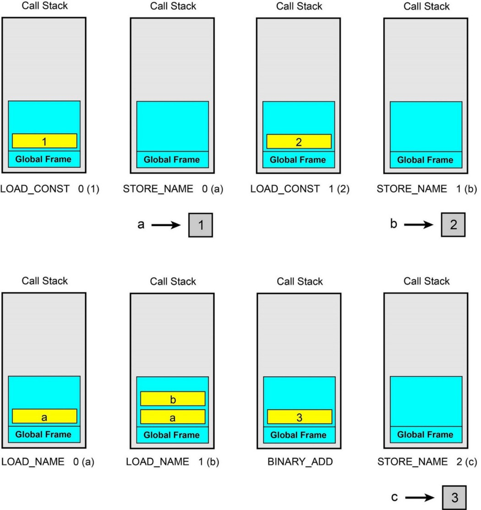

# debug(调试)

## bytecode(字节码)

- [Linux中国:Python 字节码介绍](https://zhuanlan.zhihu.com/p/39259061)

- [Understanding Python Bytecode](https://towardsdatascience.com/understanding-python-bytecode-e7edaae8734d)

- cpython是基于**stack(栈)**的虚拟机上运行bytecode

    - 源代码会编译为bytecode(中间代码)

- `__pycache__` 目录下的`pyc` 文件, 就是字节码

- bytecode使用2个字节:

    - 1.一个字节指令的代码，称为opcode(操作码)

    - 2.一个字节用于其参数，称为oparg

        - 当oparg参数超过255(一个字节)时

            - 会使用`EXTENDED_ARG 1` 向左移8位, 最大只能拓展3次(24位)

- `code`类
    ```py
    import dis

    # compile(), 返回code类
    c = compile("print(1)", "", "single")
    type(c)

    # 函数的__code__属性, 返回code类
    def f(x):
        z = 3
        t = 5
        def g(y):
            return t*x + y
        return g
    type(f.__code__)

    # co_consts 查看参数文本, 默认返回值None(不会检查是否有返回)
    print(c.co_consts)

    # co_names 查看函数或类
    print(c.co_names)

    # co_varnames 查看函数的参数, 局部变量
    print(f.__code__.co_varnames)

    # co_cellvars 查看函数内部的函数变量
    print(f.__code__.co_cellvars)

    # co_code 查看bytecode
    print(c.co_code)
    print(f.__code__.co_code)
    ```
    - 输出
    ```
    (1, None)
    ('a',)
    ('n',)
    ()
    b'e\x00d\x00\x17\x00Z\x00d\x01S\x00'
    b'|\x00S\x00'
    ```

    - 查看操作码(第一个字节)
    ```py
    # 查看bytecode的十进制
    for byte in c.co_code:
        print(byte, end=',')

    # 查看操作码(第一个字节)
    dis.opname[100]
    ```

    - 输出
    ```
    101 0 100 0 131 1 70 0 100 1 83 0
    'LOAD_CONST'
    ```

- `co_lnotab` 存储行号的字节码:
    ```py
    import dis

    def f():
        print('hello world')
        a = 1
        list1 = ['hello', 'world']
        tuple1 = ('hello', 'world')
        dict1 = {'name': 'tz', 'age': 24}


    dis.dis(f)
    ```
    - 输出

    | 行数 | offset(字节偏移量) | opcode(操作码) | 字节码计数器 | oparg(参数) |
    |------|--------------------|----------------|--------------|-------------|
    | 2    | 0                  | LOAD_GLOBAL    | 0            | (print)     |

    ```
    # 第二行代码:4条字节码
      2           0 LOAD_GLOBAL              0 (print)
                  2 LOAD_CONST               1 ('hello world')
                  4 CALL_FUNCTION            1
                  6 POP_TOP

    # 第三行代码:2条字节码
      3           8 LOAD_CONST               2 (1)
                 10 STORE_FAST               0 (a)

      4          12 LOAD_CONST               3 ('hello')
                 14 LOAD_CONST               4 ('world')
                 16 BUILD_LIST               2
                 18 STORE_FAST               1 (list1)

      5          20 LOAD_CONST               5 (('hello', 'world'))
                 22 STORE_FAST               2 (tuple1)

      6          24 LOAD_CONST               6 ('tz')
                 26 LOAD_CONST               7 (24)
                 28 LOAD_CONST               8 (('name', 'age'))
                 30 BUILD_CONST_KEY_MAP      2
                 32 STORE_FAST               3 (dict1)
    # return --> 34 LOAD_CONST               0 (None)
                 36 RETURN_VALUE
    ```

### 解析字节码函数

- 有些opcode操作码不需要参数. 属性`dis.HAVE_ARGUMENT`(值为90)判断opcode是否有参数

    - 大于:有一个参数

    - 小于:忽视oparg

- 当oparg参数大于1个字节时, 会使用特殊字节码`dis.EXTENDED_ARG`(操作码为144), 向左移8位(最多移24位), 然后存储到`extended_arg` 里

```py
def unpack_op(bytecode):
    extended_arg = 0
    for i in range(0, len(bytecode), 2):
        opcode = bytecode[i]
        if opcode >= dis.HAVE_ARGUMENT:
            oparg = bytecode[i+1] | extended_arg

            # extended_arg默认值位0, 当opcode 等于dis.EXTENDED_ARG(144)时, 向左移8位
            extended_arg = (oparg << 8) if opcode == dis.EXTENDED_ARG else 0
        else:
            oparg = None
        yield (i, opcode, oparg)

# 解析上一个例子里的f函数
for i in unpack_op(f.__code__.co_code):
    print(i)
```
- 输出
```
(0, 116, 0)
(2, 100, 1)
(4, 131, 1)
(6, 1, None)
# ...中间省略
(34, 100, 0)
(36, 83, None)
```

### 字节码在stack里的运行

- `heap`:

    - 可以随机访问

    - 存储所有object(对象)

    - 大小受虚拟内存限制

- `stack`

    - lifo(后入先出)

    - 存储参数和返回值的引用(指针), 使用前push, 使用时pop, 使用后push

        - 注意:push和pop的操作是对象的引用(指针), 而不是具体的值和对象

    - 比heap要快一些

#### 变量例子: 赋值, 加减

```py
import dis

s='''a=1
b=2
c=a+b
'''

c=compile(s, "", "exec")
dis.dis(c)
```
- 输出
```
  1           0 LOAD_CONST               0 (1)
              2 STORE_NAME               0 (a)

  2           4 LOAD_CONST               1 (2)
              6 STORE_NAME               1 (b)

  3           8 LOAD_NAME                0 (a)
             10 LOAD_NAME                1 (b)
             12 BINARY_ADD
             14 STORE_NAME               2 (c)
             16 LOAD_CONST               2 (None)
             18 RETURN_VALUE
```

- 解析字节码

    - stack的作用域是global frame(帧)

```
# 将值为1的数, push到stack里. 表示对1这个对象的引用(指针)被push
LOAD_CONST 1

# pop最上面的stack对象的引用(也就是1), 赋值到局部变量a里. b同理
STORE_NAME a

# pop最上面的两个stack对象的引用(也就是1和2), 将计算结果3, push到stack
BINARY_ADD
# pop最上面的stack对象的引用(也就是3), 赋值到局部变量c里
STORE_NAME               2 (c)

# push None值
LOAD_CONST               2 (None)
# pop最上面的stack对象的引用作为函数返回值
RETURN_VALUE
```

- 图里的值, 准确来说是对象引用(指针)


#### 函数例子: 不同的frame stack
```py
import dis

def f():
    a = 1
    def ff(x):
        y = 2
        return y + x

    ff(a)

dis.dis(f)
```
- 输出

```
  6           0 LOAD_CONST               1 (1)
              2 STORE_FAST               0 (a)

  7           4 LOAD_CONST               2 (<code object ff at 0x7f6e578e5500, file "/home/tz/test.py", li
ne 7>)
              6 LOAD_CONST               3 ('f.<locals>.ff')
              8 MAKE_FUNCTION            0
             10 STORE_FAST               1 (ff)

 11          12 LOAD_FAST                1 (ff)
             14 LOAD_FAST                0 (a)
             16 CALL_FUNCTION            1
             18 POP_TOP
             20 LOAD_CONST               0 (None)
             22 RETURN_VALUE

Disassembly of <code object ff at 0x7f6e578e5500, file "/home/tz/test.py", line 7>:
  8           0 LOAD_CONST               1 (2)
              2 STORE_FAST               1 (y)

  9           4 LOAD_FAST                1 (y)
              6 LOAD_FAST                0 (x)
              8 BINARY_ADD
             10 RETURN_VALUE
```
- 解析字节码
```
# 分配一个新的frame(帧), 并在frame内运行该函数的bytecode
CALL_FUNCTION            1

# 完成后pop该frame, 并将返回值push到上一个frame, 如果没有上一个frame, 则会push到global frame
POP_TOP
```
#### if例子
```py
import dis
s='''a = 1
if a>=0:
    b=a
else:
    b=-a
'''

c=compile(s, "", "exec")
dis.dis(c)
```
- 输出
```
  1           0 LOAD_CONST               0 (1)
              2 STORE_NAME               0 (a)

  2           4 LOAD_NAME                0 (a)
              6 LOAD_CONST               1 (0)
              8 COMPARE_OP               5 (>=)
             10 POP_JUMP_IF_FALSE       18

  3          12 LOAD_NAME                0 (a)
             14 STORE_NAME               1 (b)
             16 JUMP_FORWARD             6 (to 24)

  5     >>   18 LOAD_NAME                0 (a)
             20 UNARY_NEGATIVE
             22 STORE_NAME               1 (b)
        >>   24 LOAD_CONST               2 (None)
             26 RETURN_VALUE
```
- 解析字节码
```
# pop 两个对象, 布尔计算后得出true, false结果, 最后将结果push
COMPARE_OP              >=

# pop 如果是false, 跳转至偏移量(18); 如果是true, 就继续执行
POP_JUMP_IF_FALSE       18

# 跳转偏移量(24)
JUMP_FORWARD            to 24
```

#### loop, block stack

- `block stack`: for, with, try/except等语句
```py
import dis
s='''for i in range(3):
    print(i)
'''
c=compile(s, "", "exec")
dis.dis(c)
```
- 输出
```
  1           0 LOAD_NAME                0 (range)
              2 LOAD_CONST               0 (3)
              4 CALL_FUNCTION            1
              6 GET_ITER
        >>    8 FOR_ITER                12 (to 22)
             10 STORE_NAME               1 (i)

  2          12 LOAD_NAME                2 (print)
             14 LOAD_NAME                1 (i)
             16 CALL_FUNCTION            1
             18 POP_TOP
             20 JUMP_ABSOLUTE            8
        >>   22 LOAD_CONST               1 (None)
             24 RETURN_VALUE
```
- 解析字节码
```
# 生成iterable(迭代器)
GET_ITER

# push 刚才生成的iterable. 循环内的产生新值会被push, 直到print函数时再pop
FOR_ITER                to 22
# 跳转到循环开始
JUMP_ABSOLUTE            8
```


#### EXTENDED_ARG特殊指令: oparg大于255(一字节)时

```py
import dis

# 256个字符
s= 'print(' + '"*",' * 256 + ')'
c = compile(s, "", "exec")
dis.dis(c)
```
- 输出
```
  1           0 LOAD_NAME                0 (print)
              2 LOAD_CONST               0 ('*')
              4 LOAD_CONST               0 ('*')
              ...中间爱你省略
            510 LOAD_CONST               0 ('*')
            512 LOAD_CONST               0 ('*')
            514 EXTENDED_ARG             1
            516 CALL_FUNCTION          256
            518 POP_TOP
            520 LOAD_CONST               1 (None)
            522 RETURN_VALUE
```

#### from vs import字节码

- import
    ```py
    import math

    def f():
        math.sqrt(9)

    dis.dis(f)
    ```
    输出
    ```
      7           0 LOAD_GLOBAL              0 (math)
                  2 LOAD_METHOD              1 (sqrt)
                  4 LOAD_CONST               1 (9)
                  6 CALL_METHOD              1
                  8 POP_TOP
                 10 LOAD_CONST               0 (None)
                 12 RETURN_VALUE
    ```

- from
    ```py
    from math import sqrt

    def f():
        sqrt(9)

    dis.dis(f)
    ```
    输出
    ```
      8           0 LOAD_GLOBAL              0 (sqrt)
                  2 LOAD_CONST               1 (9)
                  4 CALL_FUNCTION            1
                  6 POP_TOP
                  8 LOAD_CONST               0 (None)
                 10 RETURN_VALUE
    ```

### marshal模块解析pyc文件

- `pyc` 包含python版本号的元数据

```py
import marshal, sys, dis

header_size = 8
if sys.version_info >= (3, 6):
    header_size = 12
if sys.version_info >= (3, 7):
    header_size = 16

path = r"/home/tz/__pycache__/client.cpython-39.pyc"

with open(path, "rb") as f:
    metadata = f.read(header_size)
    code_obj = marshal.load(f)
    dis.dis(code_obj)

header_size = 8
if sys.version_info >= (3, 6):
    header_size = 12
if sys.version_info >= (3, 7):
    header_size = 16

path = r"/home/tz/__pycache__/client.cpython-39.pyc"

with open(path, "rb") as f:
    metadata = f.read(header_size)
    code_obj = marshal.load(f)
    dis.dis(code_obj)
```

## timeit

- timeit 统计函数执行的总时间

    - 单位微妙

    - 默认执行100万次

```py
from timeit import timeit

mysetup = 'from math import sqrt'

def mycode():
    sqrt(3)

# test
timeit(setup = mysetup,        # 执行函数的预设
               stmt = mycode,  # 执行函数
               number = 10000) # 执行次数
```

- Timer 生成对象

```py
from timeit import Timer

t = Timer("sqrt(3)", "from math import sqrt")

# 执行10000次
t.timeit(number=10000)
```

### 使用timeit进行性能测试

#### 直接初始化 vs 函数初始化

- 直接初始化 比 函数初始化快3倍以上
    ```py
    timeit('a=tuple()')
    timeit('a=()')
    ```
    输出:
    ```
    0.0321451320005508
    0.009014002999720105
    ```

#### 3种字符串格式化对比

- 区别不大

    ```py
    a = '123'
    b = '321'
    print('timeit test {} {}'.format(a,b))
    ```

    ```py
    a = '123'
    b = '321'
    print(f'timeit test {a} {b}')
    ```

    ```py
    a = '123'
    b = '321'
    print('timeit test' + a + b)
    ```
    测试:
    ```py
    timeit('import test')
    timeit('import test1')
    timeit('import test2')
    ```
    输出:
    ```
    0.07623226299995167
    0.076570758999992
    0.07589723899997125
    ```

#### 列表,元组,集合添加元素性能对比:

- 列表 > 集合 > 元组

    ```py
    def list_test():
        list1 = []
        for i in range(10):
            list1.append(i)

    def tuple_test():
        tuple1 = ()
        for i in range(10):
            tuple1 += (i,)

    def set_test():
        set1 = set()
        for i in range(10):
            set1.add(i)

    timeit(stmt = list_test, number = 10000)
    timeit(stmt = tuple_test, number = 10000)
    timeit(stmt = set_test, number = 10000)
    ```
    输出:
    ```
    0.005410605000179203
    0.007548831999883987
    0.006166948000100092
    ```

#### 字典的key, 列表的值.相同情况下的循环对比

- 区别不大

    ```py
    list1 = ['linux', 'xueshu', 'library', 'social', 'waiguosocial', 'video', 'shop', 'search', 'wiki', 'network']

    dict1 = {'linux': 'linux', 'xueshu': 'xueshu', 'library': 'library', 'social': 'social', 'waiguosocial': 'waiguosocial', 'video': 'video', 'shop': 'shop', 'search': 'search', 'wiki': 'wiki', 'network': 'network'}

    def list_test():
        for i in list1:
            print(i)

    def dict_test():
        for i in dict1:
            print(i)

    timeit(stmt = list_test, number = 10000)
    timeit(stmt = dict_test, number = 10000)
    ```

#### 对比3种方法获取字典值: if, get(), try

- 区别不大

    测试文件: test.py
    ```py
    # file test.py

    key = 'a'
    if key in items:
        v = items[key]
    else:
        v = None
    ```
    测试文件: test1.py
    ```py
    # file test1.py
    v = items.get(key)
    ```
    测试文件:test2.py
    ```py
    # file test2.py

    items = {'a': 1, 'b': 2, 'c': 3}
    key = 'n'
    try:
        v = items[key]
    except KeyError:
        v = None
    ```

    测试:
    ```py
    items = {'a': 1, 'b': 2, 'c': 3}
    key = 'a'
    timeit('import test')
    timeit('import test1')
    timeit('import test2')
    ```
    输出:
    ```
    0.07695441999931063
    0.07400108000001637
    0.07423666900012904
    ```

    把key换成字典之外的值
    ```py
    key = 'n'
    ```
    输出:
    ```
    0.07498021500032337
    0.07673525599966524
    0.07963845299946115
    ```

#### from vs import

- from 导入比import 导入要快

    > sqrt() 比 math.sqrt() 快1.5到2倍

    - 使用math.sqrt(), 解释器首先需要找到math模块,再去找对应的sqrt()方法

    - 使用`.`(属性访问操作符时)会触发`__getattribute__()`和`__getattr__()`,这些方法会进行字典操作

    ```py
    timeit('math.sqrt(9)', 'import math')
    timeit('sqrt(9)', 'from math import sqrt')
    ```
    输出:
    ```
    0.06219652999971004
    0.030946962999678362
    ```

#### 全局变量 vs 局部变量

- 局部变量快1.多倍
    ```py
    a = 0
    def global_add():
        global a
        a += 1

    def local_add():
        b = 0
        b += 1


    timeit(global_add)
    timeit(local_add)
    ```
    输出:
    ```
    0.11157561699974394
    0.06823660200006998
    ```

#### 使用`@numba.jit`JIT编译 vs 不使用

- 快424倍
    ```py
    import numba

    @numba.jit
    def with_numba():
        sum = 0
        for i in range(1000):
            sum += i

    def without_numba():
        sum = 0
        for i in range(1000):
            sum += i

    timeit(with_numba)
    timeit(without_numba)
    ```
    输出:
    ```
    0.09106731399970158
    38.623348115000226
    ```

#### class内init赋值 vs class内`__slots__`赋值 vs 直接dict赋值

- dict赋值比class内部赋值快3倍

- `__slots__` 比class内部赋值快15%

    测试文件test.py:
    ```py
    # file test.py
    class test():
        def __init__(self, a, b, c):
            self.a = a
            self.b = b
            self.c = c
    ```
    测试文件test1.py:
    ```py
    # file test1.py
    class test1():
        __slots__ = ['a', 'b', 'c']
        def __init__(self, a, b, c):
            self.a = a
            self.b = b
            self.c = c
    ```

    测试:
    ```py
    timeit("r = test(1, 2, 3)", 'from test import test')
    timeit("r = test1(1, 2, 3)", 'from test1 import test1')
    timeit("r = {'a': 1, 'b': 2, 'c': 3}")
    ```
    输出:
    ```
    0.2395006189999549
    0.20651085099962074
    0.07340252900030464
    ```

- 值计算对比

    > 对象内部的字典快于 __slot__() 和 直接字典计算

    ```py
    # test.py
    code = 'r.a * r.b * r.c'
    setup = '''
    from test import test
    r = test(1, 2, 3)'''

    timeit(setup=setup, stmt=code)

    # test1.py
    code = 'r.a * r.b * r.c'
    setup = '''
    from test1 import test1
    r = test1(1, 2, 3)'''

    timeit(setup=setup, stmt=code)

    # test2.py
    timeit("r['a'] * r['b'] * r['c']", "r = {'a': 1, 'b': 2, 'c': 3}")
    ```
    输出:
    ```
    0.08434765600009086
    0.10209759400004259
    0.10072487599995839
    ```

#### 类型检测 type() vs id() vs isinstance()

- isinstance > id 约等于 type

    ```py
    def type_test():
        type(num)

    def id_test():
        id(num)

    def isinstance_test():
        isinstance(num,(int))

    global num
    num = 1

    print(timeit(stmt = type_test, number = 10000))
    print(timeit(stmt = id_test, number = 10000))
    print(timeit(stmt = isinstance_test, number = 10000))
    ```
    输出:
    ```
    0.0008963440000115952
    0.0009112940000477465
    0.0008376540000654131
    ```

#### len()赋值局部变量 vs 在函数体内len()

- 局部变量 > 在函数体内

    ```py
    def len_test():
        i = 0
        while i < len(num):
            i += 1

    def len1_test():
        i = 0
        while i < sum:
            i += 1

    global num
    global sum

    num = [1, 2, 3]
    sum = len(num)

    print(timeit(stmt = len_test, number = 10000))
    print(timeit(stmt = len1_test, number = 10000))
    ```
    输出:
    ```
    0.002510272000108671
    0.0018054170000141312
    ```

#### 字典赋值 vs if赋值

- 字典 > if
    ```py
    def if_test():
        if a == 1:
            b = 10
        elif a == 2:
            b = 20

    def dict_test():
        b = d[a]

    global a
    global d
    a = 2
    d = {1: 10, 2: 20}

    print(timeit(stmt = if_test, number = 10000))
    print(timeit(stmt = dict_test, number = 10000))
    ```
    输出:
    ```
    0.0009142930000507477
    0.0007546540000475943
    ```

#### iter循环迭代获取元素 vs index循环迭代获取元素

- iter > index
    ```py
    #Iterate indexes
    def index_test():
        for i in range(sum):
           a[i]

    #Iterate elements
    def iter_test():
        for i in a:
            i

    global a
    global sum
    a = [1, 2, 3]
    sum = len(a)

    print(timeit(stmt = index_test, number = 10000))
    print(timeit(stmt = iter_test, number = 10000))
    ```
    输出:
    ```
    0.0022929130000193254
    0.0011368919999767968
    ```

#### 编译对象后运行 vs 直接运行

- 编译后更快
    re模块例子:
    ```py
    import re

    a = '123abc 192.168.1.1 ABC\n1.1.1.1\nabc ABC\n999.999.999.999\n<meta name="user-login" content="ztoiax">'

    # 直接运行
    def no_compile_test():
        aa = re.search('\d+', a)
        ip = aa.group()

    # 生成编译对象
    def compile_test():
        pattern = re.compile('\d{1,3}')
        ip = pattern.search(a).group()

    print(timeit(stmt = no_compile_test, number = 10000))
    print(timeit(stmt = compile_test, number = 10000))
    ```
    输出:
    ```
    0.007418086000143376
    0.007216046999928949
    ```

<span id="cython"></span>
#### 使用cython vs 不使用

- 使用cython快1.8倍

- 使用cython静态类型快16倍

- file: `fib.pyx`

    ```py
    # 不使用静态类型
    def fib():
        a, b, n = 0, 1, 100
        while b < n:
            a, b = b, a + b

    # 使用静态类型
    def fib1():
        cdef int a, b, n
        a, b, n = 0, 1, 100
        while b < n:
            a, b = b, a + b
    ```

- setup.py编译后. 使用以下代码进行测试

    ```py
    from timeit import timeit

    # cython的不使用静态类型fib
    from fib import fib as cpython_fib_test

    # cython的使用静态类型fib
    from fib import fib1 as cpython_fib1_test

    # 本地的fib
    def fib_test():
        a, b = 0, 1
        n = 100
        while b < n:
            a, b = b, a + b

    print(timeit(stmt = fib_test, number = 10000))
    print(timeit(stmt = cpython_fib_test, number = 10000))
    print(timeit(stmt = cpython_fib1_test, number = 10000))
    ```
    输出
    ```
    0.004571270000042205
    0.002575273000047673
    0.0002849779998541635
    ```

## cProfile

```py
import cProfile

a = []
def test():
    for i in range(10000):
        a.append(i)

cProfile.run('test()')
```
输出:能看到一共1004个函数,以及每个函数的执行次数
```
ncalls  tottime  percall  cumtime  percall filename:lineno(function)
    1    0.000    0.000    0.000    0.000 <stdin>:2(test)
    1    0.000    0.000    0.000    0.000 <string>:1(<module>)
    1    0.000    0.000    0.000    0.000 {built-in method builtins.exec}
 1000    0.000    0.000    0.000    0.000 {method 'append' of 'list' objects}
    1    0.000    0.000    0.000    0.000 {method 'disable' of '_lsprof.Profiler' objects}
```

- pstat

    > 查看执行时间

```py
import pstat

profiler = cProfile.Profile()
profiler.enable()
test()              #测试函数
profiler.disable()
stats = pstats.Stats(profiler).sort_stats('ncalls')
stats.print_stats()
```


## [Scalene](https://github.com/emeryberger/scalene)

> 适用于 Python 的高性能，高精度 CPU 和内存分析器

> 注意: gpu的分析,只支持nvidia

```py
import psutil
from subprocess import PIPE
p = psutil.Popen(["/usr/bin/python", "-c", "print('hello')"], stdout=PIPE)
p.name()
```

## tracemalloc: 查看内存使用

- [官方文档](https://docs.python.org/3/library/tracemalloc.html)

```py
import tracemalloc

tracemalloc.start()

# ... run your application ...

# 静态数组(tuple)和动态数组(list), 分别生成100个数
tuple1 = (i for i in range(100))
list1 = [i for i in range(100)]

snapshot = tracemalloc.take_snapshot()
top_stats = snapshot.statistics('lineno')

for stat in top_stats[:10]:
    print(stat)
```
输出:
```
size=152 B, count=2, average=76 B
size=1440 B, count=2, average=720 B
```

## [pysnooper](https://github.com/cool-RR/PySnooper)

## [vardbg](https://github.com/CCExtractor/vardbg)
