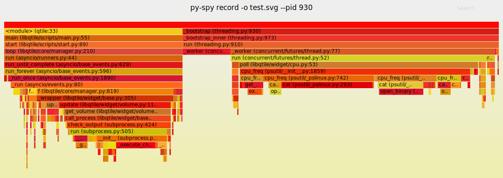

<!-- vim-markdown-toc GFM -->

* [debug(调试)](#debug调试)
    * [代码检测](#代码检测)
        * [flake8](#flake8)
        * [bandit: 安全测试](#bandit-安全测试)
        * [isort代码规范](#isort代码规范)
        * [rope重构](#rope重构)
    * [bytecode(字节码)](#bytecode字节码)
        * [解析字节码函数](#解析字节码函数)
        * [字节码在stack里的运行](#字节码在stack里的运行)
            * [变量例子: 赋值, 加减](#变量例子-赋值-加减)
            * [函数例子: 不同的frame stack](#函数例子-不同的frame-stack)
            * [if例子](#if例子)
            * [loop, block stack](#loop-block-stack)
            * [EXTENDED_ARG特殊指令: oparg大于255(一字节)时](#extended_arg特殊指令-oparg大于255一字节时)
            * [from vs import字节码](#from-vs-import字节码)
        * [marshal模块解析pyc文件](#marshal模块解析pyc文件)
    * [sys.settrace](#syssettrace)
    * [timeit](#timeit)
        * [使用timeit进行性能测试](#使用timeit进行性能测试)
            * [直接初始化 vs 函数初始化](#直接初始化-vs-函数初始化)
            * [3种字符串格式化对比](#3种字符串格式化对比)
            * [列表,元组,集合添加元素性能对比:](#列表元组集合添加元素性能对比)
            * [字典的key, 列表的值.相同情况下的循环对比](#字典的key-列表的值相同情况下的循环对比)
            * [对比3种方法获取字典值: if, get(), try](#对比3种方法获取字典值-if-get-try)
            * [from vs import](#from-vs-import)
            * [全局变量 vs 局部变量](#全局变量-vs-局部变量)
            * [使用`@numba.jit`JIT编译 vs 不使用](#使用numbajitjit编译-vs-不使用)
            * [class内init赋值 vs class内`__slots__`赋值 vs 直接dict赋值](#class内init赋值-vs-class内__slots__赋值-vs-直接dict赋值)
            * [类型检测 type() vs id() vs isinstance()](#类型检测-type-vs-id-vs-isinstance)
            * [len()赋值局部变量 vs 在函数体内len()](#len赋值局部变量-vs-在函数体内len)
            * [字典赋值 vs if赋值](#字典赋值-vs-if赋值)
            * [iter循环迭代获取元素 vs index循环迭代获取元素](#iter循环迭代获取元素-vs-index循环迭代获取元素)
            * [编译对象后运行 vs 直接运行](#编译对象后运行-vs-直接运行)
            * [使用cython vs 不使用](#使用cython-vs-不使用)
            * [字典循环使用keys() vs 不使用](#字典循环使用keys-vs-不使用)
            * [4种字符串格式化方法性能对比](#4种字符串格式化方法性能对比)
            * [list vs deque](#list-vs-deque)
            * [函数内执行 vs 全局内执行](#函数内执行-vs-全局内执行)
            * [for vs while](#for-vs-while)
    * [cProfile: 统计每个函数的执行次数, 时间](#cprofile-统计每个函数的执行次数-时间)
    * [Scalene: cpu, gpu, 内存分析器](#scalene-cpu-gpu-内存分析器)
    * [tracemalloc: 查看内存使用](#tracemalloc-查看内存使用)
    * [py-spy: 查看系统调用](#py-spy-查看系统调用)
    * [objgraph: 对象依赖图](#objgraph-对象依赖图)
    * [line_profiler: 统计每行代码的cpu时间](#line_profiler-统计每行代码的cpu时间)
    * [memory_profiler: 统计每行代码的内存使用量](#memory_profiler-统计每行代码的内存使用量)
    * [guppy3: 查看heap上的对象数量和大小](#guppy3-查看heap上的对象数量和大小)
    * [ipython 分析代码](#ipython-分析代码)
        * [性能测试](#性能测试)
            * [array vs deque vs list](#array-vs-deque-vs-list)
    * [pysnooper](#pysnooper)
    * [viztracer: 可视化多线程堆栈跟踪](#viztracer-可视化多线程堆栈跟踪)
    * [pudb: tui调试](#pudb-tui调试)
    * [vardbg](#vardbg)
    * [code2flow: 函数跟踪生成png图片](#code2flow-函数跟踪生成png图片)
    * [memray:查看内存分配, 并生成火焰图](#memray查看内存分配-并生成火焰图)

<!-- vim-markdown-toc -->

# debug(调试)

## 代码检测

### [flake8](https://github.com/PyCQA/flake8)

- 执行pycodestyle、pyflakes、mccabe的代码检测

### [bandit: 安全测试](https://github.com/PyCQA/bandit)

```py
bandit -r ./test.py
```

### [isort代码规范](https://github.com/PyCQA/isort)

### [rope重构](https://github.com/python-rope/rope)

## bytecode(字节码)

- [Linux中国:Python 字节码介绍](https://zhuanlan.zhihu.com/p/39259061)

- [Understanding Python Bytecode](https://towardsdatascience.com/understanding-python-bytecode-e7edaae8734d)

- cpython是基于**stack(栈)**的虚拟机上运行bytecode

    - 源代码会编译为bytecode(中间代码)

- `__pycache__` 目录下的`pyc` 文件, 就是字节码

- bytecode使用2个字节:

    - 1.一个字节指令的代码，称为opcode(操作码)

    - 2.一个字节用于其参数，称为oparg

        - 当oparg参数超过255(一个字节)时

            - 会使用`EXTENDED_ARG 1` 向左移8位, 最大只能拓展3次(24位)

- `code`类
    ```py
    import dis

    # compile(), 返回code类
    c = compile("print(1)", "", "single")
    type(c)

    # 函数的__code__属性, 返回code类
    def f(x):
        z = 3
        t = 5
        def g(y):
            return t*x + y
        return g
    type(f.__code__)

    # co_consts 查看参数文本, 默认返回值None(不会检查是否有返回)
    print(c.co_consts)

    # co_names 查看函数或类
    print(c.co_names)

    # co_varnames 查看函数的参数, 局部变量
    print(f.__code__.co_varnames)

    # co_cellvars 查看函数内部的函数变量
    print(f.__code__.co_cellvars)

    # co_code 查看bytecode
    print(c.co_code)
    print(f.__code__.co_code)
    ```
    - 输出
    ```
    (1, None)
    ('a',)
    ('n',)
    ()
    b'e\x00d\x00\x17\x00Z\x00d\x01S\x00'
    b'|\x00S\x00'
    ```

    - 查看操作码(第一个字节)
    ```py
    # 查看bytecode的十进制
    for byte in c.co_code:
        print(byte, end=',')

    # 查看操作码(第一个字节)
    dis.opname[100]
    ```

    - 输出
    ```
    101 0 100 0 131 1 70 0 100 1 83 0
    'LOAD_CONST'
    ```

- `co_lnotab` 存储行号的字节码:
    ```py
    import dis

    def f():
        print('hello world')
        a = 1
        list1 = ['hello', 'world']
        tuple1 = ('hello', 'world')
        dict1 = {'name': 'tz', 'age': 24}


    dis.dis(f)
    ```
    - 输出

    | 行数 | offset(字节偏移量) | opcode(操作码) | 字节码计数器 | oparg(参数) |
    |------|--------------------|----------------|--------------|-------------|
    | 2    | 0                  | LOAD_GLOBAL    | 0            | (print)     |

    ```
    # 第二行代码:4条字节码
      2           0 LOAD_GLOBAL              0 (print)
                  2 LOAD_CONST               1 ('hello world')
                  4 CALL_FUNCTION            1
                  6 POP_TOP

    # 第三行代码:2条字节码
      3           8 LOAD_CONST               2 (1)
                 10 STORE_FAST               0 (a)

      4          12 LOAD_CONST               3 ('hello')
                 14 LOAD_CONST               4 ('world')
                 16 BUILD_LIST               2
                 18 STORE_FAST               1 (list1)

      5          20 LOAD_CONST               5 (('hello', 'world'))
                 22 STORE_FAST               2 (tuple1)

      6          24 LOAD_CONST               6 ('tz')
                 26 LOAD_CONST               7 (24)
                 28 LOAD_CONST               8 (('name', 'age'))
                 30 BUILD_CONST_KEY_MAP      2
                 32 STORE_FAST               3 (dict1)
    # return --> 34 LOAD_CONST               0 (None)
                 36 RETURN_VALUE
    ```

### 解析字节码函数

- 有些opcode操作码不需要参数. 属性`dis.HAVE_ARGUMENT`(值为90)判断opcode是否有参数

    - 大于:有一个参数

    - 小于:忽视oparg

- 当oparg参数大于1个字节时, 会使用特殊字节码`dis.EXTENDED_ARG`(操作码为144), 向左移8位(最多移24位), 然后存储到`extended_arg` 里

```py
def unpack_op(bytecode):
    extended_arg = 0
    for i in range(0, len(bytecode), 2):
        opcode = bytecode[i]
        if opcode >= dis.HAVE_ARGUMENT:
            oparg = bytecode[i+1] | extended_arg

            # extended_arg默认值位0, 当opcode 等于dis.EXTENDED_ARG(144)时, 向左移8位
            extended_arg = (oparg << 8) if opcode == dis.EXTENDED_ARG else 0
        else:
            oparg = None
        yield (i, opcode, oparg)

# 解析上一个例子里的f函数
for i in unpack_op(f.__code__.co_code):
    print(i)
```
- 输出
```
(0, 116, 0)
(2, 100, 1)
(4, 131, 1)
(6, 1, None)
# ...中间省略
(34, 100, 0)
(36, 83, None)
```

### 字节码在stack里的运行

- `heap`:

    - 可以随机访问

    - 存储所有object(对象)

    - 大小受虚拟内存限制

- `stack`

    - lifo(后入先出)

    - 存储参数和返回值的引用(指针), 使用前push, 使用时pop, 使用后push

        - 注意:push和pop的操作是对象的引用(指针), 而不是具体的值和对象

    - 比heap要快一些

#### 变量例子: 赋值, 加减

```py
import dis

s='''a=1
b=2
c=a+b
'''

c=compile(s, "", "exec")
dis.dis(c)
```
- 输出
```
  1           0 LOAD_CONST               0 (1)
              2 STORE_NAME               0 (a)

  2           4 LOAD_CONST               1 (2)
              6 STORE_NAME               1 (b)

  3           8 LOAD_NAME                0 (a)
             10 LOAD_NAME                1 (b)
             12 BINARY_ADD
             14 STORE_NAME               2 (c)
             16 LOAD_CONST               2 (None)
             18 RETURN_VALUE
```

- 解析字节码

    - stack的作用域是global frame(帧)

```
# 将值为1的数, push到stack里. 表示对1这个对象的引用(指针)被push
LOAD_CONST 1

# pop最上面的stack对象的引用(也就是1), 赋值到局部变量a里. b同理
STORE_NAME a

# pop最上面的两个stack对象的引用(也就是1和2), 将计算结果3, push到stack
BINARY_ADD
# pop最上面的stack对象的引用(也就是3), 赋值到局部变量c里
STORE_NAME               2 (c)

# push None值
LOAD_CONST               2 (None)
# pop最上面的stack对象的引用作为函数返回值
RETURN_VALUE
```

- 图里的值, 准确来说是对象引用(指针)


#### 函数例子: 不同的frame stack
```py
import dis

def f():
    a = 1
    def ff(x):
        y = 2
        return y + x

    ff(a)

dis.dis(f)
```
- 输出

```
  6           0 LOAD_CONST               1 (1)
              2 STORE_FAST               0 (a)

  7           4 LOAD_CONST               2 (<code object ff at 0x7f6e578e5500, file "/home/tz/test.py", li
ne 7>)
              6 LOAD_CONST               3 ('f.<locals>.ff')
              8 MAKE_FUNCTION            0
             10 STORE_FAST               1 (ff)

 11          12 LOAD_FAST                1 (ff)
             14 LOAD_FAST                0 (a)
             16 CALL_FUNCTION            1
             18 POP_TOP
             20 LOAD_CONST               0 (None)
             22 RETURN_VALUE

Disassembly of <code object ff at 0x7f6e578e5500, file "/home/tz/test.py", line 7>:
  8           0 LOAD_CONST               1 (2)
              2 STORE_FAST               1 (y)

  9           4 LOAD_FAST                1 (y)
              6 LOAD_FAST                0 (x)
              8 BINARY_ADD
             10 RETURN_VALUE
```
- 解析字节码
```
# 分配一个新的frame(帧), 并在frame内运行该函数的bytecode
CALL_FUNCTION            1

# 完成后pop该frame, 并将返回值push到上一个frame, 如果没有上一个frame, 则会push到global frame
POP_TOP
```
#### if例子
```py
import dis
s='''a = 1
if a>=0:
    b=a
else:
    b=-a
'''

c=compile(s, "", "exec")
dis.dis(c)
```
- 输出
```
  1           0 LOAD_CONST               0 (1)
              2 STORE_NAME               0 (a)

  2           4 LOAD_NAME                0 (a)
              6 LOAD_CONST               1 (0)
              8 COMPARE_OP               5 (>=)
             10 POP_JUMP_IF_FALSE       18

  3          12 LOAD_NAME                0 (a)
             14 STORE_NAME               1 (b)
             16 JUMP_FORWARD             6 (to 24)

  5     >>   18 LOAD_NAME                0 (a)
             20 UNARY_NEGATIVE
             22 STORE_NAME               1 (b)
        >>   24 LOAD_CONST               2 (None)
             26 RETURN_VALUE
```
- 解析字节码
```
# pop 两个对象, 布尔计算后得出true, false结果, 最后将结果push
COMPARE_OP              >=

# pop 如果是false, 跳转至偏移量(18); 如果是true, 就继续执行
POP_JUMP_IF_FALSE       18

# 跳转偏移量(24)
JUMP_FORWARD            to 24
```

#### loop, block stack

- `block stack`: for, with, try/except等语句
```py
import dis
s='''for i in range(3):
    print(i)
'''
c=compile(s, "", "exec")
dis.dis(c)
```
- 输出
```
  1           0 LOAD_NAME                0 (range)
              2 LOAD_CONST               0 (3)
              4 CALL_FUNCTION            1
              6 GET_ITER
        >>    8 FOR_ITER                12 (to 22)
             10 STORE_NAME               1 (i)

  2          12 LOAD_NAME                2 (print)
             14 LOAD_NAME                1 (i)
             16 CALL_FUNCTION            1
             18 POP_TOP
             20 JUMP_ABSOLUTE            8
        >>   22 LOAD_CONST               1 (None)
             24 RETURN_VALUE
```
- 解析字节码
```
# 生成iterable(迭代器)
GET_ITER

# push 刚才生成的iterable. 循环内的产生新值会被push, 直到print函数时再pop
FOR_ITER                to 22
# 跳转到循环开始
JUMP_ABSOLUTE            8
```


#### EXTENDED_ARG特殊指令: oparg大于255(一字节)时

```py
import dis

# 256个字符
s= 'print(' + '"*",' * 256 + ')'
c = compile(s, "", "exec")
dis.dis(c)
```
- 输出
```
  1           0 LOAD_NAME                0 (print)
              2 LOAD_CONST               0 ('*')
              4 LOAD_CONST               0 ('*')
              ...中间爱你省略
            510 LOAD_CONST               0 ('*')
            512 LOAD_CONST               0 ('*')
            514 EXTENDED_ARG             1
            516 CALL_FUNCTION          256
            518 POP_TOP
            520 LOAD_CONST               1 (None)
            522 RETURN_VALUE
```

#### from vs import字节码

- import
    ```py
    import math

    def f():
        math.sqrt(9)

    dis.dis(f)
    ```
    输出
    ```
      7           0 LOAD_GLOBAL              0 (math)
                  2 LOAD_METHOD              1 (sqrt)
                  4 LOAD_CONST               1 (9)
                  6 CALL_METHOD              1
                  8 POP_TOP
                 10 LOAD_CONST               0 (None)
                 12 RETURN_VALUE
    ```

- from
    ```py
    from math import sqrt

    def f():
        sqrt(9)

    dis.dis(f)
    ```
    输出
    ```
      8           0 LOAD_GLOBAL              0 (sqrt)
                  2 LOAD_CONST               1 (9)
                  4 CALL_FUNCTION            1
                  6 POP_TOP
                  8 LOAD_CONST               0 (None)
                 10 RETURN_VALUE
    ```

- import需要两次字典查询, 一次查math模块, 一次查sqrt函数

### marshal模块解析pyc文件

- `pyc` 包含python版本号的元数据

```py
import marshal, sys, dis

header_size = 8
if sys.version_info >= (3, 6):
    header_size = 12
if sys.version_info >= (3, 7):
    header_size = 16

path = r"/home/tz/__pycache__/client.cpython-39.pyc"

with open(path, "rb") as f:
    metadata = f.read(header_size)
    code_obj = marshal.load(f)
    dis.dis(code_obj)

header_size = 8
if sys.version_info >= (3, 6):
    header_size = 12
if sys.version_info >= (3, 7):
    header_size = 16

path = r"/home/tz/__pycache__/client.cpython-39.pyc"

with open(path, "rb") as f:
    metadata = f.read(header_size)
    code_obj = marshal.load(f)
    dis.dis(code_obj)
```

## sys.settrace

- settrace是很慢的api, 有计划设计一个能在运行时插入字节码的api

```py
from sys import settrace


def my_tracer(frame, event, arg=None):
    code = frame.f_code
    func_name = code.co_name
    line_number = frame.f_lineno

    print(f"A {event} encountered in \
    {func_name}() at line number {line_number} ")

    return my_tracer


def fun():
    return 0


def check():
    return fun()


settrace(my_tracer)

check()
```

## timeit

- timeit 统计函数执行的总时间

    - 单位微妙

    - 默认执行100万次

```py
from timeit import timeit

mysetup = 'from math import sqrt'

def mycode():
    sqrt(3)

# test
timeit(setup = mysetup,        # 执行函数的预设
               stmt = mycode,  # 执行函数
               number = 10000) # 执行次数
```

- Timer 生成对象

```py
from timeit import Timer

t = Timer("sqrt(3)", "from math import sqrt")

# 执行10000次
t.timeit(number=10000)
```

### 使用timeit进行性能测试

#### 直接初始化 vs 函数初始化

- 直接初始化 比 函数初始化快3倍以上
    ```py
    timeit('a=tuple()')
    timeit('a=()')
    ```
    输出:
    ```
    0.0321451320005508
    0.009014002999720105
    ```

#### 3种字符串格式化对比

- 区别不大

    ```py
    a = '123'
    b = '321'
    print('timeit test {} {}'.format(a,b))
    ```

    ```py
    a = '123'
    b = '321'
    print(f'timeit test {a} {b}')
    ```

    ```py
    a = '123'
    b = '321'
    print('timeit test' + a + b)
    ```
    测试:
    ```py
    timeit('import test')
    timeit('import test1')
    timeit('import test2')
    ```
    输出:
    ```
    0.07623226299995167
    0.076570758999992
    0.07589723899997125
    ```

#### 列表,元组,集合添加元素性能对比:

- 列表 > 集合 > 元组

    ```py
    def list_test():
        list1 = []
        for i in range(10):
            list1.append(i)

    def tuple_test():
        tuple1 = ()
        for i in range(10):
            tuple1 += (i,)

    def set_test():
        set1 = set()
        for i in range(10):
            set1.add(i)

    timeit(stmt = list_test, number = 10000)
    timeit(stmt = tuple_test, number = 10000)
    timeit(stmt = set_test, number = 10000)
    ```
    输出:
    ```
    0.005410605000179203
    0.007548831999883987
    0.006166948000100092
    ```

#### 字典的key, 列表的值.相同情况下的循环对比

- 区别不大

    ```py
    list1 = ['linux', 'xueshu', 'library', 'social', 'waiguosocial', 'video', 'shop', 'search', 'wiki', 'network']

    dict1 = {'linux': 'linux', 'xueshu': 'xueshu', 'library': 'library', 'social': 'social', 'waiguosocial': 'waiguosocial', 'video': 'video', 'shop': 'shop', 'search': 'search', 'wiki': 'wiki', 'network': 'network'}

    def list_test():
        for i in list1:
            print(i)

    def dict_test():
        for i in dict1:
            print(i)

    timeit(stmt = list_test, number = 10000)
    timeit(stmt = dict_test, number = 10000)
    ```

#### 对比3种方法获取字典值: if, get(), try

- 区别不大

    测试文件: test.py
    ```py
    # file test.py

    key = 'a'
    if key in items:
        v = items[key]
    else:
        v = None
    ```
    测试文件: test1.py
    ```py
    # file test1.py
    v = items.get(key)
    ```
    测试文件:test2.py
    ```py
    # file test2.py

    items = {'a': 1, 'b': 2, 'c': 3}
    key = 'n'
    try:
        v = items[key]
    except KeyError:
        v = None
    ```

    测试:
    ```py
    items = {'a': 1, 'b': 2, 'c': 3}
    key = 'a'
    timeit('import test')
    timeit('import test1')
    timeit('import test2')
    ```
    输出:
    ```
    0.07695441999931063
    0.07400108000001637
    0.07423666900012904
    ```

    把key换成字典之外的值
    ```py
    key = 'n'
    ```
    输出:
    ```
    0.07498021500032337
    0.07673525599966524
    0.07963845299946115
    ```

#### from vs import

- from 导入比import 导入要快

    > sqrt() 比 math.sqrt() 快1.5到2倍

    - 使用math.sqrt(), 解释器首先需要找到math模块,再去找对应的sqrt()方法

    - 使用`.`(属性访问操作符时)会触发`__getattribute__()`和`__getattr__()`,这些方法会进行字典操作

    ```py
    timeit('math.sqrt(9)', 'import math')
    timeit('sqrt(9)', 'from math import sqrt')
    ```
    输出:
    ```
    0.06219652999971004
    0.030946962999678362
    ```

#### 全局变量 vs 局部变量

- 局部变量快1.多倍
    ```py
    a = 0
    def global_add():
        global a
        a += 1

    def local_add():
        b = 0
        b += 1


    timeit(global_add)
    timeit(local_add)
    ```
    输出:
    ```
    0.11157561699974394
    0.06823660200006998
    ```

#### 使用`@numba.jit`JIT编译 vs 不使用

- 快424倍
    ```py
    import numba

    @numba.jit
    def with_numba():
        sum = 0
        for i in range(1000):
            sum += i

    def without_numba():
        sum = 0
        for i in range(1000):
            sum += i

    timeit(with_numba)
    timeit(without_numba)
    ```
    输出:
    ```
    0.09106731399970158
    38.623348115000226
    ```

#### class内init赋值 vs class内`__slots__`赋值 vs 直接dict赋值

- dict赋值比class内部赋值快3倍

- `__slots__` 比class内部赋值快15%

    测试文件test.py:
    ```py
    # file test.py
    class test():
        def __init__(self, a, b, c):
            self.a = a
            self.b = b
            self.c = c
    ```
    测试文件test1.py:
    ```py
    # file test1.py
    class test1():
        __slots__ = ['a', 'b', 'c']
        def __init__(self, a, b, c):
            self.a = a
            self.b = b
            self.c = c
    ```

    测试:
    ```py
    timeit("r = test(1, 2, 3)", 'from test import test')
    timeit("r = test1(1, 2, 3)", 'from test1 import test1')
    timeit("r = {'a': 1, 'b': 2, 'c': 3}")
    ```
    输出:
    ```
    0.2395006189999549
    0.20651085099962074
    0.07340252900030464
    ```

- 值计算对比

    > 对象内部的字典快于 __slot__() 和 直接字典计算

    ```py
    # test.py
    code = 'r.a * r.b * r.c'
    setup = '''
    from test import test
    r = test(1, 2, 3)'''

    timeit(setup=setup, stmt=code)

    # test1.py
    code = 'r.a * r.b * r.c'
    setup = '''
    from test1 import test1
    r = test1(1, 2, 3)'''

    timeit(setup=setup, stmt=code)

    # test2.py
    timeit("r['a'] * r['b'] * r['c']", "r = {'a': 1, 'b': 2, 'c': 3}")
    ```
    输出:
    ```
    0.08434765600009086
    0.10209759400004259
    0.10072487599995839
    ```

#### 类型检测 type() vs id() vs isinstance()

- isinstance > id 约等于 type

    ```py
    def type_test():
        type(num)

    def id_test():
        id(num)

    def isinstance_test():
        isinstance(num,(int))

    global num
    num = 1

    print(timeit(stmt = type_test, number = 10000))
    print(timeit(stmt = id_test, number = 10000))
    print(timeit(stmt = isinstance_test, number = 10000))
    ```
    输出:
    ```
    0.0008963440000115952
    0.0009112940000477465
    0.0008376540000654131
    ```

#### len()赋值局部变量 vs 在函数体内len()

- 局部变量 > 在函数体内

    ```py
    def len_test():
        i = 0
        while i < len(num):
            i += 1

    def len1_test():
        i = 0
        while i < sum:
            i += 1

    global num
    global sum

    num = [1, 2, 3]
    sum = len(num)

    print(timeit(stmt = len_test, number = 10000))
    print(timeit(stmt = len1_test, number = 10000))
    ```
    输出:
    ```
    0.002510272000108671
    0.0018054170000141312
    ```

#### 字典赋值 vs if赋值

- 字典 > if
    ```py
    def if_test():
        if a == 1:
            b = 10
        elif a == 2:
            b = 20

    def dict_test():
        b = d[a]

    global a
    global d
    a = 2
    d = {1: 10, 2: 20}

    print(timeit(stmt = if_test, number = 10000))
    print(timeit(stmt = dict_test, number = 10000))
    ```
    输出:
    ```
    0.0009142930000507477
    0.0007546540000475943
    ```

#### iter循环迭代获取元素 vs index循环迭代获取元素

- iter > index
    ```py
    #Iterate indexes
    def index_test():
        for i in range(sum):
           a[i]

    #Iterate elements
    def iter_test():
        for i in a:
            i

    global a
    global sum
    a = [1, 2, 3]
    sum = len(a)

    print(timeit(stmt = index_test, number = 10000))
    print(timeit(stmt = iter_test, number = 10000))
    ```
    输出:
    ```
    0.0022929130000193254
    0.0011368919999767968
    ```

#### 编译对象后运行 vs 直接运行

- 编译后更快
    re模块例子:
    ```py
    import re

    a = '123abc 192.168.1.1 ABC\n1.1.1.1\nabc ABC\n999.999.999.999\n<meta name="user-login" content="ztoiax">'

    # 直接运行
    def no_compile_test():
        aa = re.search('\d+', a)
        ip = aa.group()

    # 生成编译对象
    def compile_test():
        pattern = re.compile('\d{1,3}')
        ip = pattern.search(a).group()

    print(timeit(stmt = no_compile_test, number = 10000))
    print(timeit(stmt = compile_test, number = 10000))
    ```
    输出:
    ```
    0.007418086000143376
    0.007216046999928949
    ```

<span id="cython"></span>
#### 使用cython vs 不使用

- 使用cython快1.8倍

- 使用cython静态类型快16倍

- file: `fib.pyx`

    ```py
    # 不使用静态类型
    def fib():
        a, b, n = 0, 1, 100
        while b < n:
            a, b = b, a + b

    # 使用静态类型
    def fib1():
        cdef int a, b, n
        a, b, n = 0, 1, 100
        while b < n:
            a, b = b, a + b
    ```

- setup.py编译后. 使用以下代码进行测试

    ```py
    from timeit import timeit

    # cython的不使用静态类型fib
    from fib import fib as cpython_fib_test

    # cython的使用静态类型fib
    from fib import fib1 as cpython_fib1_test

    # 本地的fib
    def fib_test():
        a, b = 0, 1
        n = 100
        while b < n:
            a, b = b, a + b

    print(timeit(stmt = fib_test, number = 10000))
    print(timeit(stmt = cpython_fib_test, number = 10000))
    print(timeit(stmt = cpython_fib1_test, number = 10000))
    ```
    输出
    ```
    0.004571270000042205
    0.002575273000047673
    0.0002849779998541635
    ```

#### 字典循环使用keys() vs 不使用

- 不使用比使用快3分之1

```py
global dict1
dict1 = {'name': 'tz', 'age': 24}

def key_test():
    for k in dict1.keys():
        pass

def key1_test():
    for k in dict1:
        pass

print(timeit(stmt = key_test, number = 10000))
print(timeit(stmt = key1_test, number = 10000))
```
输出
```
0.0015382250003312947
0.0011474080001789844
```

<span id="str"></span>
#### 4种字符串格式化方法性能对比

- `{}` >  `+` > `%` > `format`

```py
global name, age
name = 'tz'
age = '24'

def format():
    f'name {0} age {1}'.format(name, age)

def percent():
    'name %s age %s' % (name, age)

def plus():
    'name ' + name + ' ' + 'age ' + age

def brace():
    f'name {name} age {age}'

print(timeit(stmt = format, number = 10000))
print(timeit(stmt = percent, number = 10000))
print(timeit(stmt = plus, number = 10000))
print(timeit(stmt = brace, number = 10000))
```
输出
```
0.0025678450001578312
0.0019183020012860652
0.0017795429994293954
0.001179738999780966
```

<span id="deque"></span>
#### list vs deque

list 比 deque 快 1.68倍

```py
from collections import deque

from timeit import timeit

def time_test(func):
    print(timeit(stmt = func, number = 10000))


print('append_test')
@time_test
def deque_test():
    de = deque([1, 2, 3])
    de.append(4)

@time_test
def deque_test():
    list1 = [1, 2, 3]
    list1.append(4)


print('\nappendleft_test')
@time_test
def deque_test():
    de = deque([1, 2, 3])
    de.appendleft(0)

@time_test
def deque_test():
    list1 = [1, 2, 3]
    list1.insert(0, 0)


print('\npop_test')
@time_test
def deque_test():
    de = deque([1, 2, 3])
    de.pop()

@time_test
def deque_test():
    list1 = [1, 2, 3]
    list1.pop()
```
输出
```
append_test
0.0024033810004766565
0.0012824490004277322

appendleft_test
0.0023584799982927507
0.0013997389996802667

pop_test
0.002227412000138429
0.0012563700001919642
```

#### 函数内执行 vs 全局内执行

函数比全局更快

```py
import time

# 在全局执行with语句
start = time.time()
with open('/tmp/file') as f:
    for i in f:
        pass
end = time.time()
print(end-start)


# 在函数内执行with语句
def f():
    with open('/tmp/file') as f:
        for i in f:
            pass

start = time.time()
f()
end = time.time()
print(end-start)
```
输出
```
3.5762786865234375e-05
2.5510787963867188e-05
```

#### for vs while
- [微信公众号: Python 实现循环的最快方式(for、while 等速度对比)]()

for 比 while快

## cProfile: 统计每个函数的执行次数, 时间

```py
import cProfile

a = []
def test():
    for i in range(10000):
        a.append(i)

cProfile.run('test()')
```
输出:能看到一共1004个函数,以及每个函数的执行次数
```
ncalls  tottime  percall  cumtime  percall filename:lineno(function)
    1    0.000    0.000    0.000    0.000 <stdin>:2(test)
    1    0.000    0.000    0.000    0.000 <string>:1(<module>)
    1    0.000    0.000    0.000    0.000 {built-in method builtins.exec}
 1000    0.000    0.000    0.000    0.000 {method 'append' of 'list' objects}
    1    0.000    0.000    0.000    0.000 {method 'disable' of '_lsprof.Profiler' objects}
```

- pstat

    > 查看执行时间

```py
import pstats

profiler = cProfile.Profile()
profiler.enable()
test()              #测试函数
profiler.disable()
stats = pstats.Stats(profiler).sort_stats('ncalls')
stats.print_stats()
```


## [Scalene: cpu, gpu, 内存分析器](https://github.com/emeryberger/scalene)

> 注意: gpu的分析,只支持nvidia


```py
list1 = []
for i in range(1000000):
    list1.append(i)
```

```sh
scalene --reduced profiler ./test.py
```
输出
```
               Memory usage: ▁▁▁▁▁▁▁▁▁▁▁▁▁▁▁▁▁▁▁▁▁▁▁▁▁ (max:   0.00MB, growth rate:   0%)
                             ./test.py: % of time =  94.47% out of   0.20s.
       ╷       ╷       ╷       ╷       ╷       ╷       ╷              ╷       ╷
  Line │Time   │–––––– │–––––– │–––––– │Memory │–––––– │–––––––––––   │Copy   │
       │Python │native │system │GPU    │Python │avg    │timeline/%    │(MB/s) │./test.py
╺━━━━━━┿━━━━━━━┿━━━━━━━┿━━━━━━━┿━━━━━━━┿━━━━━━━┿━━━━━━━┿━━━━━━━━━━━━━━┿━━━━━━━┿━━━━━━━━━━━━━━━━━━━━━━━━━╸
     1 │       │       │       │       │       │       │              │       │#!/bin/python3
     2 │       │       │       │       │       │       │              │       │
     3 │       │       │       │       │       │       │              │       │list1 = []
     4 │   24% │       │   4%  │       │       │       │              │    92 │for i in range(1000000):
     5 │   53% │       │  13%  │       │   3%  │   13M │▁▁▁▁▁▁▁▁▁ 10… │    87 │    list1.append(i)
     6 │       │       │       │       │       │       │              │       │
       ╵       ╵       ╵       ╵       ╵       ╵       ╵              ╵       ╵
Top average memory consumption, by line:
```

- 生成html
```sh
scalene --html --outfile prof.html ./test.py
```

## tracemalloc: 查看内存使用

- [优秀文档](https://coderzcolumn.com/tutorials/python/tracemalloc-how-to-trace-memory-usage-in-python-code)

```py
import tracemalloc

tracemalloc.start()

# ... run your application ...

# 静态数组(tuple)和动态数组(list), 分别生成100个数
tuple1 = (i for i in range(100))
list1 = [i for i in range(100)]

snapshot = tracemalloc.take_snapshot()

# 'lineno'表示根据行号进行跟踪排序
for stat in snapshot.statistics('lineno'):
    print(stat)

    # 跟踪的语句
    print(stat.traceback.format())
```
输出:
```
/home/tz/test.py:36: size=864 B, count=1, average=864 B
['  File "/home/tz/test.py", line 36', '    list1 = [i for i in range(100)]']

/home/tz/test.py:35: size=736 B, count=3, average=245 B
['  File "/home/tz/test.py", line 35', '    tuple1 = (i for i in range(100))']
```

- 多个snapshot

```py
import tracemalloc

tracemalloc.start()

tuple1 = (i for i in range(100))
snapshot1 = tracemalloc.take_snapshot()

print("================ SNAPSHOT 1 =================")
for stat in snapshot1.statistics("lineno"):
    print(stat)
    print(stat.traceback.format())

# 清空数据
tracemalloc.clear_traces()

list1 = [i for i in range(100)]
snapshot2 = tracemalloc.take_snapshot()

print("\n================ SNAPSHOT 2 =================")
for stat in snapshot2.statistics("lineno"):
    print(stat)
    print(stat.traceback.format())

# 停止跟踪
tracemalloc.stop()
```
输出
```
================ SNAPSHOT 1 =================
/home/tz/test.py:32: size=736 B, count=3, average=245 B
['  File "/home/tz/test.py", line 32', '    tuple1 = (i for i in range(100))']

================ SNAPSHOT 2 =================
/home/tz/test.py:42: size=1288 B, count=2, average=644 B
['  File "/home/tz/test.py", line 42', '    list1 = [i for i in range(100)]']
```

- 将跟踪结果写入和读取文件
```py
import tracemalloc

tracemalloc.start()

tuple1 = (i for i in range(100))
list1 = [i for i in range(100)]

snapshot = tracemalloc.take_snapshot()

# 写入文件
snapshot.dump("/tmp/snap.out")

# 读取文件
snapshot_loaded = tracemalloc.Snapshot.load("/tmp/snap.out")

for stat in snapshot_loaded.statistics("lineno"):
    print(stat)
```
## [py-spy: 查看系统调用](https://github.com/benfred/py-spy)

- record:火焰图

```sh
# 跟踪pid
sudo py-spy record -o test.svg --pid 930

# 跟踪程序
sudo py-spy record -o test.svg -- python ~/test.py
```


- top

```sh
# 跟踪pid
sudo py-spy top --pid 930

# 跟踪程序
sudo py-spy top -- python ~/test.py
```


- dump: 每个线程的调用stack

```sh
# pid 930是用python写的窗口管理器qtile, 类似于dwm
sudo py-spy dump --pid 930
```
输出
```
Process 930: qtile
Python v3.9.7 (/usr/bin/python3.9)

Thread 930 (idle): "MainThread"
    select (selectors.py:469)
    _run_once (asyncio/base_events.py:1854)
    run_forever (asyncio/base_events.py:596)
    run_until_complete (asyncio/base_events.py:629)
    run (asyncio/runners.py:44)
    loop (libqtile/core/manager.py:210)
    start (libqtile/scripts/start.py:89)
    main (libqtile/scripts/main.py:55)
    <module> (qtile:33)
Thread 44562 (idle): "asyncio_0"
    _worker (concurrent/futures/thread.py:75)
    run (threading.py:910)
    _bootstrap_inner (threading.py:973)
    _bootstrap (threading.py:930)
Thread 44565 (idle): "asyncio_1"
    _worker (concurrent/futures/thread.py:75)
    run (threading.py:910)
    _bootstrap_inner (threading.py:973)
    _bootstrap (threading.py:930)
Thread 44566 (idle): "asyncio_2"
    _worker (concurrent/futures/thread.py:75)
    run (threading.py:910)
    _bootstrap_inner (threading.py:973)
    _bootstrap (threading.py:930)
Thread 44568 (idle): "asyncio_3"
    _worker (concurrent/futures/thread.py:75)
    run (threading.py:910)
    _bootstrap_inner (threading.py:973)
    _bootstrap (threading.py:930)
```
## [objgraph: 对象依赖图](https://github.com/mgedmin/objgraph)

- show_refs()

```py
import objgraph
list1 = [1, 2, 3]
objgraph.show_refs([list1], filename='sample-graph.png')
```


- 递归自身

```py
list1.append(list1)
objgraph.show_refs([list1], filename='sample-graph1.png')
```


- show_backrefs()

```py
import objgraph
list1 = [1, 2, 3]
list1.append(list1)
objgraph.show_backrefs([list1], filename='sample-backref-graph.png')
```


## [line_profiler: 统计每行代码的cpu时间](https://github.com/rkern/line_profiler)

```py
@profile
def f():
    list1 = []
    for i in range(100):
        list1.append(i)

f()
```
在终端下输入以下命令
```sh
kernprof -l -v test.py
```
输出
```
Wrote profile results to test.py.lprof
Timer unit: 1e-06 s

Total time: 5.8e-05 s
File: test.py
Function: f at line 2

Line #      Hits         Time  Per Hit   % Time  Line Contents
==============================================================
     2                                           @profile
     3                                           def f():
     4         1          1.0      1.0      1.7      list1 = []
     5       101         24.0      0.2     41.4      for i in range(100):
     6       100         33.0      0.3     56.9          list1.append(i)
```


## [memory_profiler: 统计每行代码的内存使用量](https://github.com/pythonprofilers/memory_profiler)

- `@profile` 装饰器

```py
from memory_profiler import profile

@profile
def f():
    list1 = []
    for i in range(100):
        list1.append(i)

f()
```
输出
```
Filename: ./test.py

Line #    Mem usage    Increment  Occurences   Line Contents
============================================================
     6   41.590 MiB   41.590 MiB           1   @profile
     7                                         def f():
     8   41.590 MiB    0.000 MiB           1       list1 = []
     9   41.590 MiB    0.000 MiB         101       for i in range(100):
    10   41.590 MiB    0.000 MiB         100           list1.append(i)
```

- `mprof`

```sh
# 生成mprofile文件
mprof run ./test.py

# 查看线性图
mprof plot
```


## [guppy3: 查看heap上的对象数量和大小](https://github.com/zhuyifei1999/guppy3)

- `h.heap()` 查看堆中的可访问对象

```py
from guppy import hpy; h=hpy()

print(h.heap())
```
输出
```
Partition of a set of 42162 objects. Total size = 4978497 bytes.
 Index  Count   %     Size   % Cumulative  % Kind (class / dict of class)
     0  12831  30  1131370  23   1131370  23 str
     1   8350  20   577392  12   1708762  34 tuple
     2   2898   7   511920  10   2220682  45 types.CodeType
     3    603   1   508808  10   2729490  55 type
     4   5756  14   403291   8   3132781  63 bytes
     5   2662   6   362032   7   3494813  70 function
     6    603   1   295576   6   3790389  76 dict of type
     7    105   0   190744   4   3981133  80 dict of module
     8    374   1   140336   3   4121469  83 dict (no owner)
     9     88   0    97856   2   4219325  85 set
<142 more rows. Type e.g. '_.more' to view.>
```

- `h.iso(list1)` 只查看list1
```py
from guppy import hpy; h=hpy()

list1 = []
for i in range(10):
    list1.append(i)

print(h.iso(list1))
```
输出
```
Partition of a set of 1 object. Total size = 184 bytes.
 Index  Count   %     Size   % Cumulative  % Kind (class / dict of class)
     0      1 100      184 100       184 100 list
```


## ipython 分析代码

- [Profiling and Timing Code](https://jakevdp.github.io/PythonDataScienceHandbook/01.07-timing-and-profiling.html)

```py
# 统计函数调用次数和运行时间
%prun  sum(range(10))

# time命令
%time  sum(range(10))

# timeit 默认运行1000000次, 统计每次运行时间
%timeit  sum(range(10))
```

- line_profiler

```py
list1 = [5, 3, 2, 4, 1]

# 冒泡排序
def sort(list1):
    lengh = len(list1) - 1
    for i in range(lengh, 0, -1):
        for j in range(i):
            if list1[j] > list1[j+1]:
                list1[j], list1[j+1] = list1[j+1], list1[j]

# 加载模块
%load_ext line_profiler

# -f 指定函数. 统计每一行的cpu时间
%lprun -f sort sort(list1)
```

- memory_profiler

```py
# 加载模块
%load_ext memory_profiler

# 查看int的内存使用量
%memit int

# 查看string的内存使用量
%memit f'a'

# 查看list的内存使用量
%memit list('a')

# 查看tuple的内存使用量
%memit [i for i in range(100)]

# -f 指定函数. 统计每一行的内存使用量
%mprun -f sort sort(list1)
```

### 性能测试

#### array vs deque vs list

```py
from array import array
from collections import deque

def array_test():
    array1 = array('i', range(100))
    deque1 = deque(range(100))
    list1 = [i for i in range(100)]
    for i in array1:
        pass
    for i in deque1:
        pass
    for i in list1:
        pass

# 使用ipython测试
%lprun -f array_test array_test()
```

## [pysnooper](https://github.com/cool-RR/PySnooper)

- with语句
```py
import pysnooper

with pysnooper.snoop():
    pass
```
输出: 可以看到初始化的过程
```
Source path:... /home/tz/test.py
New var:....... __name__ = '__main__'
New var:....... __doc__ = None
New var:....... __package__ = None
New var:....... __loader__ = <_frozen_importlib_external.SourceFileLoader object at 0x7fa12c82bc10>
New var:....... __spec__ = None
New var:....... __annotations__ = {}
New var:....... __builtins__ = <module 'builtins' (built-in)>
New var:....... __file__ = '/home/tz/test.py'
New var:....... __cached__ = None
New var:....... pysnooper = <module 'pysnooper' from '/home/tz/.local/lib/python3.9/site-packages/pysnooper/__init__.py'>
02:16:16.492121 line        28     pass
Elapsed time: 00:00:00.000184
```

- @pysnooper.snoop(): 跟踪函数
```py
import pysnooper

@pysnooper.snoop()
def fib(n):
    a, b = 0, 1
    while b < n:
        a, b = b, a + b

fib(10)
```
输出
```
Source path:... /home/tz/test.py
Starting var:.. n = 10
02:12:10.327351 call        28 def fib(n):
02:12:10.327468 line        29     a, b = 0, 1
New var:....... a = 0
New var:....... b = 1
02:12:10.327494 line        30     while b < n:
02:12:10.327529 line        31         a, b = b, a + b
省略...
Modified var:.. a = 8
Modified var:.. b = 13
02:12:10.327799 line        30     while b < n:
02:12:10.327828 return      30     while b < n:
Return value:.. None
Elapsed time: 00:00:00.000523
```

- @pysnooper.snoop(normalize=True): 移除不必要的信息, 时间戳, 内存, 路径

- @pysnooper.snoop(depth=3): 递归函数
```py
def f2():
    print('in f2')

def f1():
    print('in f1')
    f2()

# 设置递归深度为3
@pysnooper.snoop(depth=3)
def f():
    print('in f')
    f1()

f()
```

## [viztracer: 可视化多线程堆栈跟踪](https://github.com/gaogaotiantian/viztracer)

- [Visualize multi-threaded Python programs with an open source tool](https://opensource.com/article/21/3/python-viztracer)

## [pudb: tui调试](https://www.kimsereylam.com/python/2020/01/17/debug-python-with-pudb.html)

## [vardbg](https://github.com/CCExtractor/vardbg)

## [code2flow: 函数跟踪生成png图片](https://github.com/scottrogowski/code2flow)

## [memray:查看内存分配, 并生成火焰图](https://github.com/bloomberg/memray)

- 实时内存跟踪

```sh
memray run --live test.py
```

- 生成各种报告图
```sh
# 生成output.bin
memray run -o output.bin test.py

# 生成表格图(html)
memray table output.bin

# 生成火焰图(html)
memray flamegraph output.bin

# 生成报告图
memray summary output.bin

# 生成树形图
memray summary output.bin

# 生成统计图
memray stats output.bin
```

