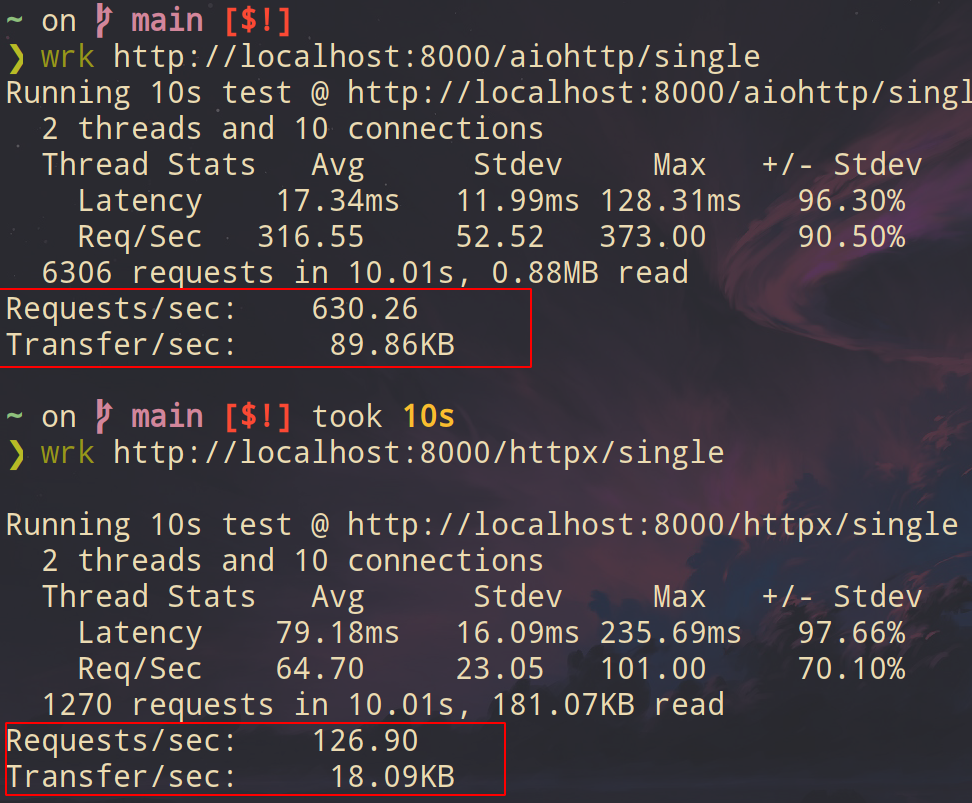
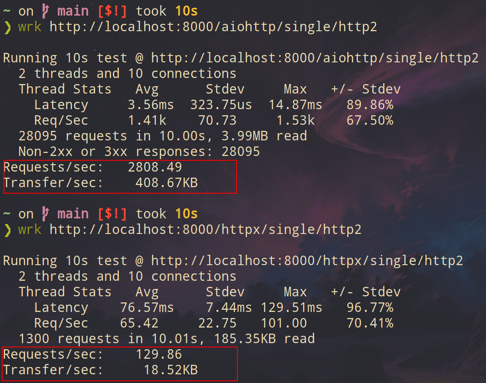
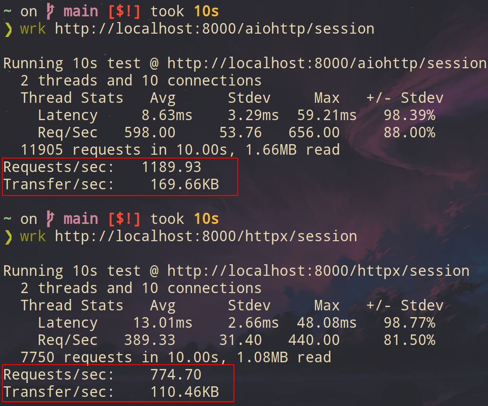

<!-- vim-markdown-toc GFM -->

* [Network](#network)
    * [RPC(远程调用)](#rpc远程调用)
        * [xmlrpc.server.SimpleXMLRPCServer() 实现kv服务器](#xmlrpcserversimplexmlrpcserver-实现kv服务器)
        * [自定义序列化格式](#自定义序列化格式)
    * [http](#http)
        * [requests](#requests)
        * [httpx](#httpx)
            * [httpx vs aiohttp](#httpx-vs-aiohttp)
                * [httpxproxy: 堆栈跟踪, 性能可视化](#httpxproxy-堆栈跟踪-性能可视化)
        * [aiohttp](#aiohttp)
            * [基本使用](#基本使用)
            * [websocket](#websocket)
    * [scapy](#scapy)
        * [基本使用](#基本使用-1)
        * [sr(send and receive)](#srsend-and-receive)
        * [DNS(需要root用户)](#dns需要root用户)
        * [snipp 抓包, 类似tcpdump](#snipp-抓包-类似tcpdump)
        * [其它命令](#其它命令)
        * [自定义数据包](#自定义数据包)
    * [paramiko(ssh)](#paramikossh)
    * [telnetlib](#telnetlib)
    * [事件驱动io](#事件驱动io)
    * [传输层: TCP/UDP](#传输层-tcpudp)
        * [TCP](#tcp)
            * [server](#server)
            * [client](#client)
        * [UDP](#udp)
            * [server](#server-1)
            * [client](#client-1)
    * [网络层](#网络层)
        * [IPy(解析ip地址)](#ipy解析ip地址)

<!-- vim-markdown-toc -->

# Network

> 自顶向下

## RPC(远程调用)

### xmlrpc.server.SimpleXMLRPCServer() 实现kv服务器

- 缺点: 单线程; 所有数据都会序列化为xml(比较慢)

- server:
```py
from xmlrpc.server import SimpleXMLRPCServer


class KeyValueServer:
    # 函数列表
    _rpc_methods_ = ['get', 'set', 'delete', 'exists', 'keys']

    def __init__(self, address):
        self._data = {}
        self._serv = SimpleXMLRPCServer(address, allow_none=True)
        # 注册函数
        for name in self._rpc_methods_:
            self._serv.register_function(getattr(self, name))

    # 函数体
    def get(self, name):
        return self._data[name]

    def set(self, name, value):
        self._data[name] = value

    def delete(self, name):
        del self._data[name]

    def exists(self, name):
        return name in self._data

    def keys(self):
        return list(self._data)

    def serve_forever(self):
        self._serv.serve_forever()


if __name__ == '__main__':
    kvserv = KeyValueServer(('', 15000))
    kvserv.serve_forever()
```

- client:
```py
from xmlrpc.client import ServerProxy
s = ServerProxy('http://localhost:15000', allow_none=True)

# 设置kv
s.set('foo', 'bar')
s.set('spam', [1, 2, 3])

# 查看所有kv
s.keys()

# 通过k获取v
s.get('foo')
s.get('spam')

# 删除k
s.delete('spam')

# 查看k是否存在
s.exists('spam')
```

### 自定义序列化格式

- 以pickle为例. 序列化函数可以换成其它如:json...

- server:
```py
from multiprocessing.connection import Listener
from threading import Thread
import pickle


class RPCHandler:
    # 通过字典保存注册函数
    def __init__(self):
        self._functions = { }

    # 注册函数
    def register_function(self, func):
        self._functions[func.__name__] = func

    # 使用pickle序列化
    def handle_connection(self, connection):
        try:
            while True:
                # Receive a message
                func_name, args, kwargs = pickle.loads(connection.recv())
                # Run the RPC and send a response
                try:
                    r = self._functions[func_name](*args, **kwargs)
                    connection.send(pickle.dumps(r))
                except Exception as e:
                    connection.send(pickle.dumps(e))
        except EOFError:
             pass

def rpc_server(handler, address, authkey):
    sock = Listener(address, authkey=authkey)
    while True:
        client = sock.accept()
        t = Thread(target=handler.handle_connection, args=(client,))
        t.daemon = True
        t.start()

# 函数体
def add(x, y):
    return x + y

def sub(x, y):
    return x - y

if __name__ == '__main__':
    # 注册函数
    handler = RPCHandler()
    handler.register_function(add)
    handler.register_function(sub)

    # 启动rpc服务器
    rpc_server(handler, ('localhost', 17000), authkey=b'passwd')
```

- client:

```py
from multiprocessing.connection import Client
import pickle


class RPCProxy:
    def __init__(self, connection):
        self._connection = connection

    def __getattr__(self, name):
        def do_rpc(*args, **kwargs):
            self._connection.send(pickle.dumps((name, args, kwargs)))
            result = pickle.loads(self._connection.recv())
            if isinstance(result, Exception):
                raise result
            return result
        return do_rpc


if __name__ == '__main__':
    c = Client(('localhost', 17000), authkey=b'passwd')
    proxy = RPCProxy(c)
    proxy.add(2, 3)
```

## http

### requests

- [官方文档](https://requests.readthedocs.io/en/master/)

| 属性方法          | 内容                         |
|-------------------|------------------------------|
| r.headers         | 响应报文                     |
| r.request.headers | 请求报文                     |
| r.content         | byte类型的text(可以decode()) |
| r.text            | str类型的text(中文为unicode) |
| r.json()          | 如果text是json,查看text      |
| r.cookies         | cookies                      |

```py
import requests

# get
r = requests.get('https://www.baidu.com/')

# params 设置参数
p = {'s?wd': '123'}
r = requests.get('https://www.baidu.com/', params=p)

# headers 设置请求头部
url = 'https://www.baidu.com/'
headers={'User-Agent': 'Mozilla/5.0 (X11; Linux x86_64)' 'AppleWebKit/537.36 (KHTML, like Gecko)' 'Chrome/90.0.4430.85 Safari/537.36'}

r = requests.get(url=url, headers=headers)
r.request.headers

# post方法的测试网站
url = 'https://httpbin.org/post'

# dict
data1 = {'test': [1, 2]}
# or
data1 = [('test', 1), ('test', 2)]

# 参数data,但实际上是form
r = requests.post(url, data = data1)

# post muti file
# 建议使用二进制模式打开文件
url = 'https://httpbin.org/post'
multiple_files = [
     ('images', ('foo.png', open('foo.png', 'rb'), 'image/png')),
     ('images', ('bar.png', open('bar.png', 'rb'), 'image/png'))]
 r = requests.post(url, files=multiple_files)
 r.text

# cookies
url = 'https://httpbin.org/cookies'
cookies = dict(cookies_are='working')
r = requests.get(url, cookies=cookies)
r.json()

# session
# requests.get()会为每个请求新建session.而使用session再get()可以重用cookies, tcp 链接
# 好比于: 每次都需要打开新的浏览器再打开site; 而session, 则是在同一个浏览器打开site
s = requests.Session()
r = s.get('https://httpbin.org/cookies/set/sessioncookie/123456789')
r.json()

# 确认session是否关闭
with requests.Session() as s:
    s.get('https://httpbin.org/cookies/set/sessioncookie/123456789')

# stream=True时只下载响应头,和保持链接.因此需要使用with关闭链接
with requests.get('https://httpbin.org/get', stream=True) as r:
    # Do things with the response here.

# hook
def print_url(r, *args, **kwargs):
    print(r.url)

requests.get('https://httpbin.org/', hooks={'response': print_url})

# hook multpie
def record_hook(r, *args, **kwargs):
    r.hook_called = 'my name is tz'
    return r

r = requests.get('https://httpbin.org/', hooks={'response': [print_url, record_hook]})
r.hook_called

# session hook
s = requests.Session()
s.hooks['response'].append(print_url)
s.get('https://httpbin.org/')

# proxy
proxies = {
  'http': 'http://10.10.1.10:3128',
  'https': 'http://10.10.1.10:1080',
}

requests.get('http://example.org', proxies=proxies)
```

### httpx

> 语法类似`requests`.支持同步, 异步, HTTP2

- [官方文档](https://www.python-httpx.org/)

- 向同一主机发出多个请求时，客户端将重用底层TCP连接(HTTP keep-alive)，而不是为每个请求重新创建一个

- 默认 `encoding` 为 `utf-8`, 而requests的 `encoding` 为 `ISO-8859-1`

```py
import httpx
import asyncio

# async

async with httpx.AsyncClient() as client:
    r = await client.get(url)

# unix domain socket
transport = httpx.HTTPTransport(uds="/var/run/docker.sock")
client = httpx.Client(transport=transport)
response = client.get("http://docker/info")
response.json()

# http2
client = httpx.AsyncClient(http2=True)
r = await client.get(url)
r.http_version
```

- log

```py
# test.py
import httpx

url = 'https://www.baidu.com'

with httpx.Client() as client:
    r = client.get(url)
```

```bash
HTTPX_LOG_LEVEL=debug python3 test.py
DEBUG [2021-03-27 11:45:16] httpx._client - HTTP Request: GET http://www.baidu.com "HTTP/1.1 200 OK"
```

```bash
HTTPX_LOG_LEVEL=trace python3 test.py
TRACE [2021-03-27 11:47:18] httpx._config - load_ssl_context verify=True cert=None trust_env=True http2=False
TRACE [2021-03-27 11:47:18] httpx._config - load_verify_locations cafile=/home/tz/.local/lib/python3.9/site-packages/certifi/cacert.pem
...
```

#### httpx vs aiohttp

- [reference](https://github.com/encode/httpx/issues/838)

- 代码:双线程, 10个链接

```py
from starlette.applications import Starlette
from starlette.routing import Route
from starlette.responses import PlainTextResponse
import httpx
import aiohttp


HOST, PORT = "localhost", 8000
URL = f"http://{HOST}:{PORT}/"


async def index(request):
    return PlainTextResponse("world")


async def aiohttp_single(request):
    async with aiohttp.ClientSession() as client:
        async with client.get(URL) as r:
            return _response(await r.text())


async def aiohttp_session(request):
    async with aiohttp_session.get(URL) as r:
        return _response(await r.text())


async def httpx_single(request):
    async with httpx.AsyncClient() as client:
        r = await client.get(URL)
        return _response(r.text)


async def httpx_session(request):
    r = await httpx_session.get(URL)
    return _response(r.text)


async def httpx_single_http2(request):
    async with httpx.AsyncClient(http2=True) as client:
        r = await client.get(URL)
        return _response(r.text)


async def httpx_session_http2(request):
    r = await httpx_session_http2.get(URL)
    return _response(r.text)


def _response(name):
    return PlainTextResponse("Hello, " + name)


routes = [
    Route("/", endpoint=index),
    Route("/aiohttp/single", endpoint=aiohttp_single),
    Route("/aiohttp/session", endpoint=aiohttp_session),
    Route("/httpx/single", endpoint=httpx_single),
    Route("/httpx/session", endpoint=httpx_session),
    Route("/httpx/single/http2", endpoint=httpx_single_http2),
    Route("/httpx/session/http2", endpoint=httpx_session_http2),
]


async def on_startup():
    global aiohttp_session, httpx_session, httpx_session_http2
    aiohttp_session = aiohttp.ClientSession()
    httpx_session = httpx.AsyncClient()
    httpx_session_http2 = httpx.AsyncClient(http2=True)


app = Starlette(debug=True, routes=routes, on_startup=[on_startup])


if __name__ == "__main__":
    import uvicorn

    uvicorn.run(app, host=HOST, port=PORT)
```

- 测试:

```sh
# single
wrk http://localhost:8000/aiohttp/single
wrk http://localhost:8000/httpx/single

# single http2
wrk http://localhost:8000/aiohttp/single/http2
wrk http://localhost:8000/httpx/single/http2

# session
wrk http://localhost:8000/aiohttp/session
wrk http://localhost:8000/httpx/session
```

- 结果:三个测试,都是`aiohttp`更快
    - single
    
    - single-http2
    
    - session
    

##### [httpxproxy: 堆栈跟踪, 性能可视化](https://github.com/florimondmanca/httpxprof)

- 安装

```sh
pip install -e git+https://github.com/florimondmanca/httpxprof#egg=httpxprof
```

- httpx

```sh
httpxprof run async_single
httpxprof view async_single
```

- aiohttp

```py
# aiohttp_single.py
import asyncio
import aiohttp
import httpxprof

async def main() -> None:
    for _ in httpxprof.requests():
        async with aiohttp.ClientSession() as session:
            async with session.get(httpxprof.url):
                pass

asyncio.run(main())
```

```sh
httpxprof run aiohttp_single.py
httpxprof view aiohttp_single.py
```

### [aiohttp](https://github.com/aio-libs/aiohttp)

> 异步requests

- [官方文档](https://docs.aiohttp.org/en/stable/)

- 注意: 最好为每个site建立一个session, 而不是每个request建立一个session

- 注意: `read()`, `json()`, `text()` 这些session方法, 是加载到内存里的, 要小心大文件

- aiohttp session 允许100个链接. 这里指的是链接而不是web site

#### 基本使用

- get

```py
import aiohttp
import asyncio

async def get(url):

    async with aiohttp.ClientSession() as session:
        async with session.get(url) as response:

            print("Status:", response.status)
            print("Content-type:", response.headers['content-type'])

            html = await response.text()
            print("Body:", html[:15], "...")
            return html

# loop 相当于消息循环
loop = asyncio.get_event_loop()
url = 'http://www.baidu.com'
html = loop.run_until_complete(get(url))
```

- 配合 `asyncio.wait()`, 实现多任务:

```py
async def get(url):

    async with aiohttp.ClientSession() as session:
        async with session.get(url) as response:

            print("Status:", response.status)
            print("Content-type:", response.headers['content-type'])

            html = await response.text()
            print("Body:", html[:15], "...")
            return html

loop = asyncio.get_event_loop()

# 任务列表
task = [get('http://www.baidu.com') , get('http://www.bilibili.com')]

# asyncio.wait()执行任务
result = loop.run_until_complete(asyncio.wait(task))

# 将结果保存到列表. 注意这里是result[0]
htmls = []
for html in result[0]:
    htmls.append(html.result())

len(htmls)
```

- 重用session

```py
import aiohttp
import asyncio

async def fetch(session, url):
    async with session.get(url) as response:
        return await response.text()

async def get():
    async with aiohttp.ClientSession() as session:
        htmls = []
        htmls.append(await fetch(session, 'http://www.baidu.com'))
        htmls.append(await fetch(session, 'http://www.bilibili.com'))
        return htmls

loop = asyncio.get_event_loop()
htmls = loop.run_until_complete(get())
len(htmls)
```

- custom cookies

```py
async def ck(url, cookies):

    async with aiohttp.ClientSession(cookies=cookies) as session:
        async with session.get(url) as resp:
            return await resp.json()

loop = asyncio.get_event_loop()
url = 'http://httpbin.org/cookies'
cookies = {'cookies_are': 'working'}

resp_cookies = loop.run_until_complete(ck(url, cookies))
print(resp_cookies)
```

- `await resp.content.read()` 写入文件. 不会像 `read()`, `json()`, `text()` 方法占用内存

```py
async def get(url, file):

    async with aiohttp.ClientSession() as session:
        async with session.get(url) as resp:
            with open(file, 'wb') as fd:
                while True:
                    chunk = await resp.content.read(chunk_size)
                    if not chunk:
                        break
                    fd.write(chunk)

loop = asyncio.get_event_loop()
url = 'https://api.github.com/events'
file = '/tmp/test'
chunk_size = 10
result = loop.run_until_complete(get(url, file))
```

#### websocket

- [阮一峰的WebSocket 教程](http://www.ruanyifeng.com/blog/2017/05/websocket.html)

- 写入文件websocket_test.sh

```sh
#!/bin/bash
# websocket_test.sh

echo hello
sleep 1

echo tz
sleep 1

echo close
```

- 开启websocketd, 并执行websocket_test.sh

```sh
websocketd --port=8080 bash websocket_test.sh
```

- websokcet client

```py
import aiohttp
import asyncio

async def websocket(url):

    async with aiohttp.ClientSession() as session:
        async with session.ws_connect(url) as ws:
            async for msg in ws:
                if msg.type == aiohttp.WSMsgType.TEXT:
                    # 数据为close就close()
                    if msg.data == 'close':
                        await ws.close()
                        break
                    else:
                        print(msg.data)
                        # 发送answer
                        await ws.send_str(msg.data + '/answer')
                elif msg.type == aiohttp.WSMsgType.ERROR:
                    break

loop = asyncio.get_event_loop()
url = 'http://127.0.0.1:8080'
html = loop.run_until_complete(websocket(url))
```

## [scapy](https://github.com/secdev/scapy)

- [官方文档](https://scapy.readthedocs.io/en/latest/)

- 注意:发送数据需要`root`权限

- `_` 代表上一个包

### 基本使用

```py
from scapy import *

# 查看所有命令
ls()

# 设置layout
explore()

# 查看IP包
ls(IP)

# 设置数据包. 注意: 数据包的网络层从左到右递增, 以 / 进行区分
pkt = Ether()/IP(dst="www.baidu.com")/TCP(dport=80)/"GET /index.html HTTP/1.0 \n\n"

# show() 查看包
pkt.show()

# hexdump 以16进制显示
hexdump(pkt)

# 二进制显示
raw(pkt)

# 查看包内各个层的数据. 注意: 下层包是包含上层包的数据. 也就是说: Ether层包含IP层包含TCP层的数据
Raw(raw(pkt))
TCP(raw(pkt))
IP(raw(pkt))
Ether(raw(pkt))
```

- 读取, 写入tcpdump , wireshark抓取的`pcap`文件

```py
# tcpdump抓包
sudo tcpdump -ni eth0 -w packet.pcap

# rdpcap() 读取pcap文件
pkt = rdpcap("packet.pcap")

# wrpcap() 写入pcap文件
wrpcap("temp.cap",pkts)
```

- 保存当前变量
```py
# 查看当前变量
dir()

# 保存文件
save_session("session.scapy")

# 加载文件
load_session("session.scapy")
```

- 保存pdf文件, 需要 `pyx` 模块
```
??
pkt.pdfdump(layer_shift=1)
pkt.psdump("/tmp/isakmp_pkt.eps",layer_shift=1)
```

- 利用元组, 列表快速设置数据包

```py
# 定义ip包
a=IP(dst="www.baidu.com",ttl=[1,2,(5,9)])

# 定义tcp包
c=TCP(dport=[80,443])

# 查看一共多少个包
[p for p in a/c]

# send() 发送
pkt=send(Ether()/a/c, return_packets=True)

# show() 查看
pkt.show()
```

### sr(send and receive)

> send()   : 只发送
> sr1()    : 发送并接受
> sr()     : 发送并接受(包含Unanswered)
> srloop() : 循环发送并接受

```py
# ip 扫描
ans, unans = sr(IP(dst="192.168.1.1",proto=(0,255))/"SCAPY",retry=2)

# arp 扫描
ans, unans = srp(Ether(dst="ff:ff:ff:ff:ff:ff")/ARP(pdst="192.168.1.0/24"),timeout=2)
ans.summary(lambda s,r: r.sprintf("%Ether.src% %ARP.psrc%") )

# 对网段进行端口扫描
ans, unans = sr( IP(dst="192.168.1.*")/TCP(dport=80,flags="S") )
ans.summary( lambda s,r : r.sprintf("%IP.src% is alive") )

# 端口扫描
res, unans = sr( IP(dst="target")/TCP(flags="S", dport=(1,1024)) )
res.nsummary( lfilter=lambda s,r: (r.haslayer(TCP) and (r.getlayer(TCP).flags & 2)) )

# 发送tcp syn(也就是第一次握手)
sr(IP(dst="www.baidu.com")/TCP(sport=RandShort(),dport=[80,443],flags="S"))

# 循环发送接受
srloop(IP(dst="www.baidu.com")/TCP(sport=RandShort(),dport=[80,443],flags="S"))

# _代表上一个包
_

# 赋值
answer, unanswer = _

# 查看返回值
answer.summary()
```

配合`tcpdump`抓包:

    ```sh
    tcpdump -ni enp27s0 dst www.baidu.com and "tcp[tcpflags] & (tcp-syn) != 0"
    ```

    

- tcp traceroute
```py
ans, unans = sr(IP(dst="www.bilibili.com", ttl=(4,10),id=RandShort())/TCP(flags=0x2))

for snd,rcv in ans:
    print(snd.ttl, rcv.src, isinstance(rcv.payload, TCP))
```

### DNS(需要root用户)

| 属性 | 操作 |
|------|------|
| ra   | 递归 |

```py
from scapy.all import *

dns = '114.114.114.114'
d = DNS(rd = 1,qd=DNSQR(qname='www.baidu.com'))
packet = sr1(IP(dst=dns)/UDP()/d)
packet[DNS].show()
```

可以搭配 [dnspeep](https://github.com/jvns/dnspeep)进行dns监控

### snipp 抓包, 类似tcpdump

```py
sniff(filter="icmp and host 192.168.1.1", count=2)

# 查看刚才抓的包
pkt = _
pkt.summary()

# 抓取所有包
sniff(prn=lambda x: x.summary())

# 显示所有包
sniff(prn=lambda x: x.show())

# 显示网卡
sniff(prn=lambda x: x.sniffed_on+": "+x.summary())

# 显示指定端口, 输出源和目录端口,tcp flag, payload(数据段)
sniff(filter="tcp and ( port 80 or port 443 )",
 prn=lambda x: x.sprintf("%IP.src%:%TCP.sport% -> %IP.dst%:%TCP.dport%  %2s,TCP.flags% : %TCP.payload%"))

# 只显示源和目标ip, 应用层文本
sniff(prn=lambda x:x.sprintf("{IP:%IP.src% -> %IP.dst%\n}{Raw:%Raw.load%\n}"))
```

- 异步

```py
t = AsyncSniffer()
t.start()
results = t.stop()
```

- tcp连接, 以及http请求

```py
s=socket.socket()
s.connect(("127.0.0.1", 80))
ss=StreamSocket(s,Raw)
ss.sr1(Raw("GET /\r\n"))
```

### 其它命令

```py
traceroute(["www.yahoo.com","www.altavista.com","www.wisenut.com","www.copernic.com"],maxttl=20)

res, unans = traceroute(["www.microsoft.com","www.cisco.com"],dport=[80,443],maxttl=20,retry=-2)
# 使用imagemagick生成图片
res.graph()
# 保存svg图片
res.graph(target="> /tmp/graph.svg") 
# 3d图形
res.trace3D()

# 路由表
conf.route
conf.route.add(net="0.0.0.0/0",gw="192.168.8.1")
conf.route.delt(net="0.0.0.0/0",gw="192.168.8.1")
conf.route.resync()
```

### 自定义数据包

- XByteField()   : 1 byte的整型
- ShortField()   : 2 byte的整型
- IntEnumField() : 类似dict

- scapy的UDP数据包

```py
ls(UDP)

class UDP(Packet):
    name = "UDP"
    fields_desc = [ ShortEnumField("sport", 53, UDP_SERVICES),
                    ShortEnumField("dport", 53, UDP_SERVICES),
                    ShortField("len", None),
                    XShortField("chksum", None), ]
```

- 自定义数据包

```py
# 定义test1, 2, 3字段, 并分配默认值1, 2, 3

class Test(Packet):
    name = "Test packet"
    fields_desc = [ XByteField("test1", 1),
                    ShortField("test2", 2),
                    IntEnumField("test3" , 3 ,
                      { 1: "happy", 2: "cool" , 3: "angry" } ) ]

# 查看数据包
ls(Test)

# 设置数据包
def make_test(x, y, z):
    return Ether()/IP()/Test(test1=x,test2=y,test3=z)

# test3如果大于3, 就是值等于参数, 不会报错
make_test(42, 666, 3)
make_test(42, 666, 4)
```

## paramiko(ssh)

- 执行命令

```py
import paramiko

def exec(ip, cmd):
    with paramiko.SSHClient() as client:
        client.set_missing_host_key_policy(paramiko.AutoAddPolicy())
        client.connect(ip, 22, 'root')

        stdin, stdout, stderr = client.exec_command(cmd)
        # stdout类似文件类
        print(stdout.read().decode())

centos7='192.168.100.208'
exec(centos7, 'ls -l')
```

- sftp文件操作

```py
import paramiko

def sftp(ip):
    with paramiko.SSHClient() as client:
        client.set_missing_host_key_policy(paramiko.AutoAddPolicy())
        client.connect(ip, 22, 'root')

        with client.open_sftp() as ftp:
            # 上传文件
            ftp.put('/tmp/test', '/tmp/test')
            # 修改权限
            ftp.chmod('/tmp/test', 0o755)
            # 改名
            ftp.rename('/tmp/test', '/tmp/rename')
            # 下载回来
            ftp.get('/tmp/rename', '/tmp/rename')

centos7='192.168.100.208'
sftp(centos7)
```

## telnetlib

> 端口搜索

```py
from telnetlib import Telnet
ip = '192.168.1.221'

for port in range(65535):
    try:
       if Telnet(ip, port, timeout=1):
            print(f'{port}  success')
    except ConnectionRefusedError:
        print(f'{port}  fail')
        pass
```

## 事件驱动io

- 当数据在某个socket上被接受后，它会转换成一个 receive 事件

- server
```py
import select
import socket
import time

# 事件循环, 使用select()
def event_loop(handlers):
    while True:
        can_recv, can_send, _ = select.select(handlers, handlers, [])
        for h in can_recv:
            h.handle_receive()


class UDPServer():
    def __init__(self, address):
        self.sock = socket.socket(socket.AF_INET, socket.SOCK_DGRAM)
        self.sock.bind(address)

    def fileno(self):
        return self.sock.fileno()

    def wants_to_receive(self):
        return True


class UDPTimeServer(UDPServer):
    def handle_receive(self):
        msg, addr = self.sock.recvfrom(1)
        self.sock.sendto(time.ctime().encode('ascii'), addr)


class UDPEchoServer(UDPServer):
    def handle_receive(self):
        msg, addr = self.sock.recvfrom(8192)
        self.sock.sendto(msg, addr)


if __name__ == '__main__':
    handlers = [ UDPTimeServer(('',14000)), UDPEchoServer(('',15000))  ]
    event_loop(handlers)
```

- client:
```py
from socket import *

s = socket(AF_INET, SOCK_DGRAM)
s.sendto(b'', ('localhost',14000))

s.recvfrom(128)
s.sendto(b'Hello', ('localhost',15000))

s.recvfrom(128)
```

## 传输层: TCP/UDP

### TCP

#### server

- socket库实现
```py
from socket import socket, SOCK_STREAM, AF_INET


def main(ip, port):
    server = socket(family=AF_INET, type=SOCK_STREAM)
    server.bind((ip, port))
    # 512队列大小
    server.listen(512)
    print("listen...")

    while True:
        # 有连接就输出信息
        client, addr = server.accept()
        print(str(addr) + ' connect')

        # 接受客户端的消息
        msg = client.recv(1024).decode('utf-8')
        print("received message: %s" % msg)

        # 发送消息给客户端
        client.send(b"hello client")
        client.close()


if __name__ == '__main__':
    ip = '127.0.0.1'
    port = 6666
    main(ip, port)
```

- socketserver库实现tcpserver(单线程)
```py
from socketserver import BaseRequestHandler, TCPServer


class EchoHandler(BaseRequestHandler):
    def handle(self):
        print(self.client_address, ' connect')

        while True:
            # 接受客户端的消息
            msg = self.request.recv(1024).decode('utf-8')
            print(msg)

            if not msg:
                break

            # 发送消息给客户端
            self.request.send(b"hello client")


if __name__ == '__main__':
    serv = TCPServer(('', 6666), EchoHandler)
    print("listen...")
    serv.serve_forever()
```

- 多线程: `TCPServer` 改为 `ThreadingTCPServer`
```py
from socketserver import BaseRequestHandler, ThreadingTCPServer
serv = ThreadingTCPServer(('', 6666), EchoHandler)
```

#### client

- socket库实现
```py
from socket import socket


def main(ip, port, msg):
    client = socket()
    client.connect((ip, port))

    # 发送消息给服务器
    client.send(msg)
    # 接受服务器的消息
    print('server: ' + client.recv(1024).decode('utf-8'))

    client.close()


if __name__ == '__main__':
    ip = '127.0.0.1'
    port = 6666
    msg = b"I'm a client"
    main(ip, port, msg)
```

### UDP

#### server

- socket库实现
```py
import socket


def main(ip, port):

    sock = socket.socket(socket.AF_INET, # Internet
                         socket.SOCK_DGRAM) # UDP
    sock.bind((ip, port))

    print("listen...")
    while True:
        # 接受客户端消息
        msg, addr = sock.recvfrom(1024) # buffer size is 1024 bytes
        print("received message: %s" % msg)

        # 发送消息给客户端
        sock.sendto(b'hello client', addr)


if __name__ == '__main__':
    ip = '127.0.0.1'
    port = 5005
    main(ip, port)
```

- socketserver库实现
```py
from socketserver import BaseRequestHandler, UDPServer


class EchoHandler(BaseRequestHandler):
    def handle(self):
        # 有连接就输出信息
        print(self.client_address, ' connect')

        # 接受客户端消息
        msg, sock = self.request
        print("received message: %s" % msg)

        # 发送消息给客户端
        sock.sendto(b'hello client', self.client_address)


if __name__ == '__main__':
    serv = UDPServer(('', 5005), EchoHandler)
    print("listen...")
    serv.serve_forever()
```

- 多线程: `UDPServer` 改为 `ThreadingUDPServer`
```py
from socketserver import BaseRequestHandler, ThreadingUDPServer
serv = ThreadingUDPServer(('', 5005), EchoHandler)
```

#### client

- socket库实现
```py
import socket


def main(ip, port, msg):
    sock = socket.socket(socket.AF_INET, # Internet
                         socket.SOCK_DGRAM) # UDP
    # 发送消息给服务器
    sock.sendto(msg, (ip, port))

    # 接受服务器的消息
    print(sock.recvfrom(1024))


if __name__ == '__main__':
    ip = '127.0.0.1'
    port = 5005
    msg = b"I'm a client"
    main(ip, port, msg)
```

## 网络层

### IPy(解析ip地址)

- 列出网段内的所有ip

```py
from IPy import IP
ip = IP('192.168.1.0/24')

for i in ip:
    print(i)
```
